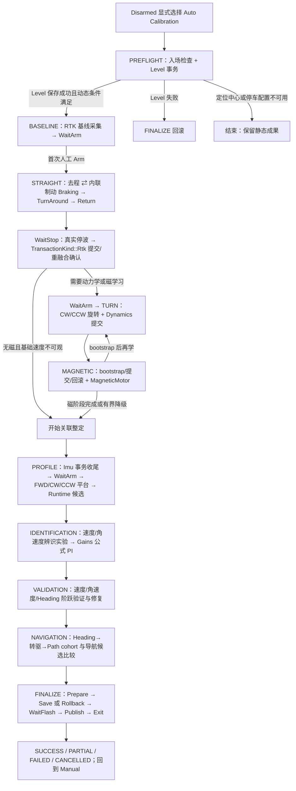
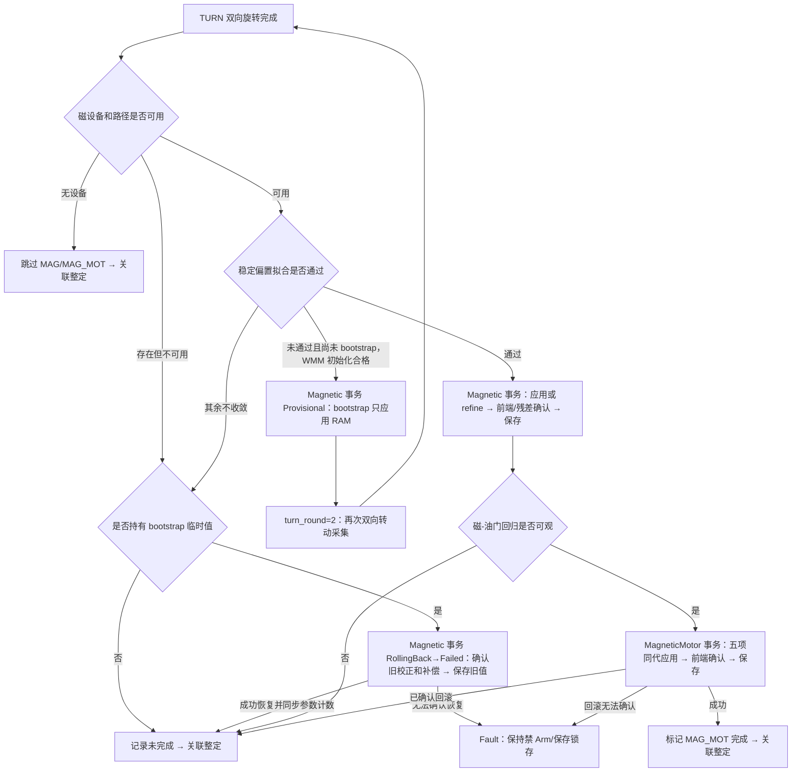
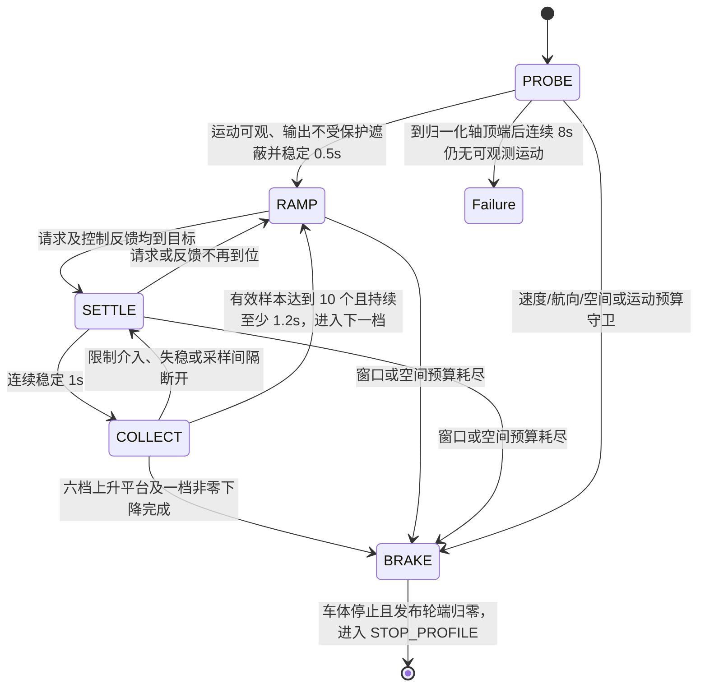
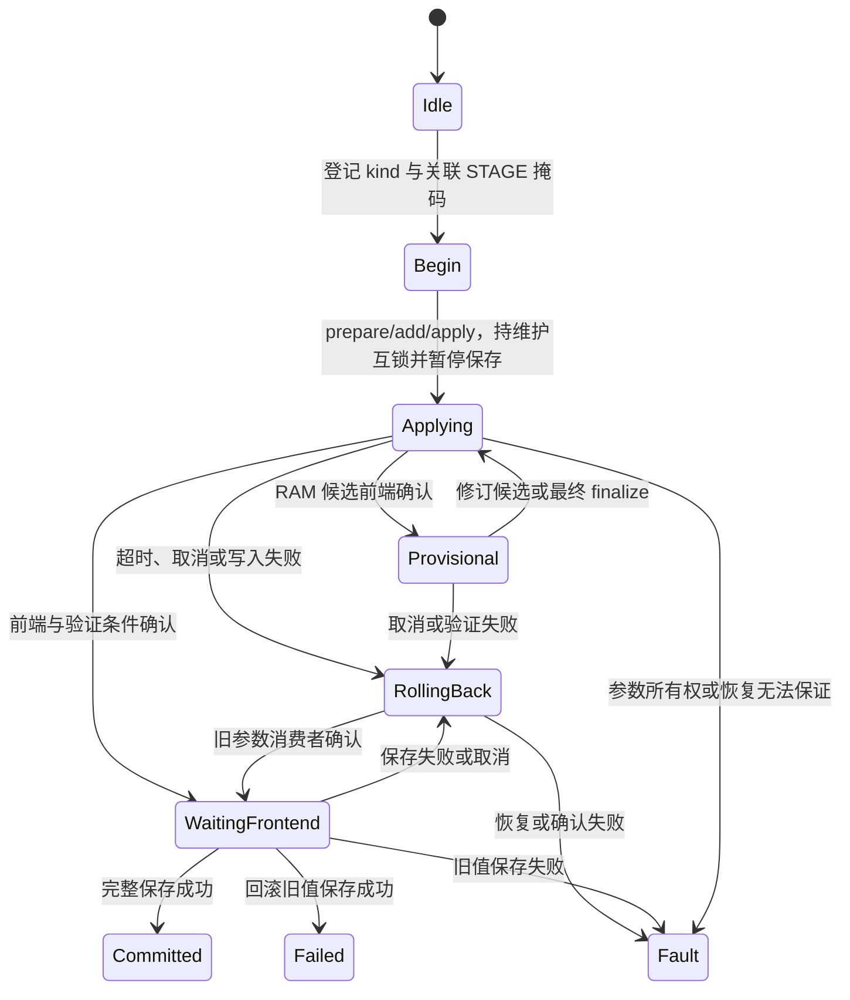

# 当前 Rover 自动校准详细状态机

> 2026-09-28 精简：内部子状态7种（删除Entry）；PREFLIGHT以Evaluate准备，FINALIZE以WaitStop直接收尾且不走普通运动停车门。StepResult的Evaluate别名并入Advance，停车意图Braking统一按观测计数/减速度确认位完成提交与恢复；删除abort_pending镜像，只以abort_reason非NONE判断待回滚。公开uORB阶段不变。

当前设计以 [模式运行契约](../Dima/rover/modes/README.md#运行契约) 的 2026-09-23 用户确认版本为准：进入前已完成六面校准；每次从头重跑；巡航速度是唯一全局速度上限且不由整定改写；制动模型在停车窗口确认交接；全部参数留在 RAM，最终持锁保存一次；IMU 是可选项；取消固定前馈比例门及会话累计时间限制。下文为历史审查记录，其中旧速度折扣、分组保存、时间预算与必需 IMU 的描述已被上述合同替代。

每次进入固定从 `PREFLIGHT`（预检、Level）开始，清空上轮进度与完成证据并重跑完整流程；没有跨轮断点恢复。`resume_phase/resume_substate` 仅供本轮掉头、返程后继续实验，新会话会重置。上一轮退出收尾完成前不接受新会话。

> 最新子流程复核：TURN 直接 WaitArm，不再额外等待3 s重融合；PROFILE 的IMU与Runtime统一在Evaluate确认；FINALIZE不再执行Entry→Running→Evaluate→WaitStop的中转链，改为决策后直接推进保存/回滚并发布终态。其余采样、运动、停车与前端确认职责保留。以下早期映射按其历史版本理解，当前入口以模式README“子流程必要性复核”为准。

> 2026-09-23 流程与语义修复：PROFILE→Runtime Evaluate→IDENTIFICATION 的连接已补齐。运行期依赖改读 provisional_validated_stages，completed_stages 仅由 FINALIZE 最终保存成功置位；回滚返回 Failed 并清除失效证据。自动模式无磁/IMU六面流程，保留 Level 和 offset-only 校准。当前行为以模式 README 的“自动校准范围与保存语义”为准。

> 2026-09-23 子流程更新：Level 接收与配置确认合并；BASELINE/STRAIGHT 直接 Running，MAGNETIC 直接 Evaluate；辨识/验证准备后直接进入目标子状态。Return/WaitStop 由 step() 共用处理。删除的是空入口和重复调度，双向实验、停车与前端确认保留；具体入口见模式 README 的“大阶段内部子流程精简”。

> 2026-09-23 实验判据更新：平台逐帧信噪比交由最终拟合筛选；删除噪声均值复制门、制动两轮 2× 散布拒绝、额外 0.05 m/s 停车完成门，以及内环/Heading 额外 1 s/1.5 s 稳定等待。制动取两轮有效候选的较小值；闭环误差仍由现有验证器判定。具体归属见模式 README 的“实验判据删减”。

## 2026-09-22 状态机整体替换（当前生效，取代下文全部旧状态描述）

本轮整体替换自动校准状态机：`AutoCalibrationStatus.msg` 状态区压平为 **11 个顶层阶段**并重新编号
（`STATE_IDLE=0` … `STATE_FINALIZE=10`），删除其余全部旧状态常量（`WAIT_ARM_*`/`STOP_*`/`COMMIT_*`/
`APPLY_*`/`RESTORE_*`/`PROFILE_REVERSE`/`PROFILE_FULL` 及独立 Return/Braking/Deceleration 状态；
原 47 个主状态 → 11 个阶段）。**不保留旧数值兼容、别名、映射层或日志转换层**；消息版本递增为
`MESSAGE_VERSION=1`（msg 注释标注版本日期 2026-09-22），版本证据为重新生成后的 topic hash 与
logger contract，全部由终态正式生成链产出，不手写生成物。

阶段内部推进属于内部调度合同（非 uORB），由 `AutoCalibrationMode.hpp` 的 `SessionController`
集中维护：`PhaseSubstate`（WaitArm/Running/TurnAround/Return/Braking/WaitStop/Evaluate）、
`TransactionKind`（None/Level/Rtk/Dynamics/Magnetic/MagneticMotor/Imu/Runtime/Gains/
SessionSave/SessionRollback），进度直接读取 `CalibrationParameters::Phase`。任何代码不得再用 `status_.state` 判断事务类型；阶段文件
不再调用 `transition()`，只向调度器返回 `StepResult`（Busy/Advance/Evaluate/WantArm/WantTurn/
WantBrake/WantReturn/WantStop/Failed/Abort）；所有状态跳转只存在于 `AutoCalibrationMode.cpp`。

STRAIGHT 阶段新包络：纵向 `[0, 冻结 MOT_THR_MAX]`、转向 `[-1,1]`（删除校准专属 0.35 静态上限）；
预测速度 >0.65×会话上限→限流，>0.90×→制动，包络顶端 8 秒无运动→`FAILURE_DRIVE_ENVELOPE`
（`AutoCalibrationMode.cpp` 包络注释与实现）。PI 仅公式法 `P=τ/[K(λ+delay)]`；FF 余量不足=组如实
失败，禁止比例法候选。

删除能力确认：倒退校准（`PROFILE_REVERSE`/反向速度证据）、`PROFILE_FULL`、参数
`RO_CAL_THR_MAX`/`RO_CAL_TURN_MAX`/`RO_CAL_VMAX`（已在 commit `3b06c29` 从
`module_rover_control_params.yaml` 删除；本轮全库复查无定义与代码引用残留）。注意：制动观测的
瞬时反向轮端输出不是倒退校准，保留。

### 11 个顶层阶段（当前状态表）

| 顶层阶段 | 编号 | 行为与正常出口 | 局部约束/失败出口 |
|---|---:|---|---|
| `STATE_IDLE` | 0 | 无活动会话；显式入场建立新 session → PREFLIGHT | 不创建运动授权 |
| `STATE_PREFLIGHT` | 1 | 入场检查（Evaluate）与 Level 事务：请求/结果均在本阶段（`TransactionKind::Level`）→ BASELINE | Level 失败→FINALIZE 回滚（不可跳过组，force_rollback）；Flash 保存失败→`FAILURE_STORAGE` 统一回滚 |
| `STATE_BASELINE` | 2 | RTK 基线静态采集（WaitStop 真实停波→Running 采集→Evaluate 拟合），随后进入首个统一 Arm gate（WaitArm）→ STRAIGHT | 停车必须等真实 Neutral/Stopped 证据；质量丢失重置累计；拟合/空间不合格退出 |
| `STATE_STRAIGHT` | 3 | 直线往返动力学辨识：去程（Running）→ 内联制动观测（Braking，两轮协议）→ 掉头（TurnAround）→ 返程（Return，不参与拟合）→ WaitStop（`RtkCommit` → `TransactionKind::Rtk` 提交） | 纵向 [0,E]、转向 [-1,1]；预测 >0.65×V_session 限流、>0.90× 制动；顶端 8 s 无运动→`FAILURE_DRIVE_ENVELOPE` |
| `STATE_TURN` | 4 | 原地 CW/CCW 旋转：角速度辨识、磁覆盖采集与动力学提交（WaitStop `DynamicsCommit` → `TransactionKind::Dynamics`） | 每向 75 s 截止；缺基础 FF 不伪造参数 |
| `STATE_MAGNETIC` | 5 | 磁评估/提交：bootstrap 应用/恢复、硬铁 offset-only、磁-油门逐轴回归、只读观测参数写入（`Magnetic`/`MagneticMotor`） | 同设备新校准使补偿失效逻辑保留；回滚无法确认→Fault |
| `STATE_PROFILE` | 6 | IMU 偏置收尾（`Imu`）+ 稳态响应采集（前进/CW/CCW 平台，EXCITATION_* 子状态）与运行候选（`Runtime`） | 转动空间杆臂检查；端点证据 `observed_output_max`，不是 RPM |
| `STATE_IDENTIFICATION` | 7 | 闭环辨识实验（速度/角速度激励）与内环增益候选计算（`Gains`；公式法 PI `P=τ/[K(λ+delay)]`） | 模型/激励/残差不合格→组失败；FF 余量不足=组如实失败，禁止比例法候选 |
| `STATE_VALIDATION` | 8 | 内环/航向增益的闭环阶跃验证、修复与 cohort 推进 | 失败进组失败或 FINALIZE，不伪装成功；每组修复预算最多两次 |
| `STATE_NAVIGATION` | 9 | 转驱与路径试验：导航候选比较、确认圈与最终选择（`Navigation`；cohort 固定顺序 Heading→转驱→Path） | Heading 失败不进转驱/Path；转驱失败 Path 不运行；Path 失败只结束 cohort，不抹已保存核心动力学 |
| `STATE_FINALIZE` | 10 | 统一收尾：Prepare→Save 或 Rollback→WaitFlash→Publish→Exit；只有一次最终保存决策与一次回滚决策（`SessionSave`/`SessionRollback`） | `FAILURE_STORAGE`/Flash fault/回滚失败不得降级为实验失败；回滚无法确认→FAILED+禁 Arm 锁存 |

不变量在压平后逐条保持：Manual/校准 Arm 安全边界与外部 Disarm/Kill 后不自动重新授权；停车必须等
真实 Neutral/Stopped 证据；0.65×限流与 0.90×制动、yaw-rate/加速度/slew/围栏/会话超时；磁/IMU/RTK
前端确认；provisional 不得越过最终事务持久化；Flash 保存失败必须进统一回滚/`FAILURE_STORAGE`；
失败组依赖传播与 unavailable/skipped/completed 位语义。

### 内部调度合同（不进入 uORB）

| `PhaseSubstate` | 含义 |
|---|---|
| `WaitArm` | 统一 Arm gate：条件齐备后等待人工 Arm（授权只属于 Commander，外部 Disarm/Kill 后不自动重新授权） |
| `Running` | 运动或采集进行中（是否发布运动意图见 `is_motion_state()`） |
| `TurnAround` | 直线族掉头子状态 |
| `Return` | 返程子状态：按入场 GNSS 点返回，返程不参与任何拟合 |
| `Braking` | 内联制动观测：有界比例反向制动（瞬时反向轮端输出不是倒退校准） |
| `WaitStop` | 真实停波确认：stopped() + 后端 maintenance 停波证据（出口意图见 `StopIntent`：Braking/RtkCommit） |
| `Evaluate` | 评估与事务机：候选计算、事务推进、组调度分发 |

| `TransactionKind` | 覆盖的旧事务/状态 |
|---|---|
| `Level` | 旧 PREFLIGHT_CHECK/LEVEL_HOLD/COMMIT_LEVEL 的水平事务 |
| `Rtk` | 旧 COMMIT_RTK/WAIT_RTK_RELOCK 的基线/航向事务（重融合等待=WaitingFrontend） |
| `Dynamics` | 旧 COMMIT_DYNAMICS 与制动模型/减速度保存 |
| `Magnetic` / `MagneticMotor` | 旧 APPLY_MAG_BOOTSTRAP/COMMIT_MAG/RESTORE_MAG 与 COMMIT_MAG_MOT |
| `Imu` | 旧 COMMIT_IMU/WAIT_IMU_RELOCK |
| `Runtime` | 旧 APPLY_RUNTIME |
| `Gains` | 旧 APPLY_GAINS/SAVE_GAINS/RESTORE_GAINS |
| `SessionSave` / `SessionRollback` | FINALIZE 的唯一一次保存/回滚决策 |

事务进度直接读取 `CalibrationParameters::Phase`，不维护调度侧镜像。
前端确认及原有稳定窗保留；Level 使用 worker 结果，FINALIZE 使用单一回滚决策位。
转驱/路径与内环/航向共用 Gains 事务及 `step_validation()`，实验与候选比较分别保留。

### 旧状态 → 新状态能力映射（47 → 11：删除的是状态，不是行为）

依据：旧 43 个状态常量见 HEAD 提交 `3b06c29` 的 `AutoCalibrationStatus.msg`；另有 4 个
2026-09-21 内联制动批次状态（`BRAKING_PROBE`/`STOP_BRAKING`/`COMMIT_DECELERATION`/
`RETURN_START`，未提交基线，见本文原 2026-09-21 条目），合计 47。逐项映射如下。

| 旧状态（旧编号） | 新归宿 | 行为保留说明 |
|---|---|---|
| `STATE_IDLE` (0) | `STATE_IDLE` | 原样 |
| `STATE_PREFLIGHT_CHECK` (1) | `STATE_PREFLIGHT`（Evaluate） | 检查项不变 |
| `STATE_LEVEL_HOLD` (2) | `STATE_PREFLIGHT` + `TransactionKind::Level` | 请求/结果处理留在 PREFLIGHT |
| `STATE_COMMIT_LEVEL` (3) | `STATE_PREFLIGHT`（Level 事务保存） | Flash 失败→`FAILURE_STORAGE` 统一回滚 |
| `STATE_RTK_BASELINE_COLLECT` (4) | `STATE_BASELINE`（WaitStop→Running→Evaluate） | 100 历元稳健拟合不变 |
| `STATE_WAIT_ARM_FIRST` (5) | `STATE_BASELINE` 的 `PhaseSubstate::WaitArm` | 首个统一 Arm gate |
| `STATE_STRAIGHT_OUT` (6) | `STATE_STRAIGHT`（Running，straight_outward） | 新 0.65/0.90 包络 |
| `STATE_TURN_AROUND` (7) | `STATE_STRAIGHT` 的 `TurnAround` | 掉头动作，不倒车 |
| `STATE_STRAIGHT_BACK` (8) | `STATE_STRAIGHT`（Running，straight_outward=false） | 返程独立证据 |
| `STATE_BRAKING_PROBE`（2026-09-21 批次） | `STATE_STRAIGHT` 的 `Braking` | 两轮制动协议不变；瞬时反向轮端输出不是倒退校准 |
| `STATE_STOP_BRAKING`（2026-09-21 批次） | `STATE_STRAIGHT` 的 `WaitStop`（Braking） | 真实停波+代次确认不变 |
| `STATE_COMMIT_DECELERATION`（2026-09-21 批次） | `TransactionKind::Dynamics`（WaitStop `Braking（第二轮完成且减速度未确认）`） | 保守候选独立保存；失败进统一回滚 |
| `STATE_RETURN_START`（2026-09-21 批次） | `STATE_STRAIGHT` 的 `Return` | 返程不参与拟合 |
| `STATE_STOP_DISARM_FIRST` (9) | `STATE_STRAIGHT` 的 `WaitStop`（RtkCommit 前置） | 真实停波证据；不再内部 Disarm |
| `STATE_COMMIT_RTK` (10) | `TransactionKind::Rtk` | 原子提交+保存不变 |
| `STATE_WAIT_RTK_RELOCK` (11) | `TransactionKind::Rtk` 的 `WaitingFrontend` | GNSS yaw 连续融合确认不再是顶层状态 |
| `STATE_WAIT_ARM_SECOND` (12) | `STATE_TURN` 前的 `WaitArm` | 同一 Arm gate 合同 |
| `STATE_TURN_CW` (13) / `STATE_TURN_CCW` (14) | `STATE_TURN`（turn_direction ±1） | 每向覆盖与截止不变 |
| `STATE_STOP_DISARM_SECOND` (16) | `STATE_TURN` 的 `WaitStop`（DynamicsCommit 前置） | 真实停波证据 |
| `STATE_COMMIT_DYNAMICS` (18) | `TransactionKind::Dynamics` | 速度上限/yaw 修正同组提交不变 |
| `STATE_APPLY_MAG_BOOTSTRAP` (17) | `STATE_MAGNETIC`（`Magnetic`，bootstrap/RAM） | 有界 WMM 初始化一次 |
| `STATE_COMMIT_MAG` (20) | `STATE_MAGNETIC`（`Magnetic`） | offset-only+前端/残差确认 |
| `STATE_RESTORE_MAG` (21) | `STATE_MAGNETIC`（`CalibrationParameters::Phase::Rollback`→`Failed`） | 计数同步与不误报外部改参保留 |
| `STATE_COMMIT_MAG_MOT` (55) | `STATE_MAGNETIC`（`MagneticMotor`） | 五项只读观测参数独立事务 |
| `STATE_COMMIT_IMU` (48) / `STATE_WAIT_IMU_RELOCK` (49) | `STATE_PROFILE`（`Imu`，relock=`WaitingFrontend`） | offset-only，不改 scale |
| `STATE_WAIT_ARM_PROFILE` (43) | `STATE_PROFILE` 的 `WaitArm` | 同一 Arm gate 合同 |
| `STATE_PROFILE_FORWARD` (44) / `STATE_PROFILE_RATE_CW` (51) / `STATE_PROFILE_RATE_CCW` (52) | `STATE_PROFILE`（Running + EXCITATION_*） | FWD→CW→CCW 平台与六档激励不变 |
| `STATE_STOP_PROFILE` (47) | `STATE_PROFILE` 的 `WaitStop` | 停车/停波确认不变 |
| `STATE_APPLY_RUNTIME` (53) | `TransactionKind::Runtime` | 运行/FF 候选只进 RAM |
| `STATE_WAIT_ARM_IDENTIFICATION` (30) | `STATE_IDENTIFICATION` 的 `WaitArm` | 同一 Arm gate 合同 |
| `STATE_IDENTIFY_SPEED` (31) / `STATE_IDENTIFY_RATE` (32) | `STATE_IDENTIFICATION`（Running，激励实验） | 两次前进+CW/CCW 不变 |
| `STATE_STOP_IDENTIFICATION` (33) | `STATE_IDENTIFICATION` 的 `WaitStop`/`Evaluate` | 停车后计算公式 PI |
| `STATE_APPLY_GAINS` (34) | `TransactionKind::Gains` | 公式法 `P=τ/[K(λ+delay)]`，无比例法候选 |
| `STATE_WAIT_ARM_VALIDATION` (35) | `STATE_VALIDATION` 的 `WaitArm` | 同一 Arm gate 合同 |
| `STATE_VALIDATE_SPEED` (36) / `STATE_VALIDATE_RATE` (37) | `STATE_VALIDATION`（Running） | 半幅/全幅/下降阶跃与修复预算不变 |
| `STATE_VALIDATE_HEADING` (38) | `STATE_VALIDATION` | cohort 顺序 Heading→转驱→Path 保持为跨 VALIDATION→NAVIGATION 的推进次序 |
| `STATE_STOP_VALIDATION` (40) | `WaitStop`/`Evaluate`（组修复/回退决策） | 修复预算与回滚条件不变 |
| `STATE_VALIDATE_DRIVING` (54) | `STATE_NAVIGATION`（转驱） | 双向"前进→停车→转向→前进"闭包不变 |
| `STATE_VALIDATE_PATH` (39) | `STATE_NAVIGATION`（路径比较） | 瘦三角/同入口/敏感字段门槛不变 |
| `STATE_SAVE_GAINS` (41) | `STATE_FINALIZE`（`SessionSave`/`Gains` 最终保存） | 整组 finalize 一次性决策 |
| `STATE_RESTORE_GAINS` (42) | `STATE_FINALIZE` 回滚（`SessionRollback`） | 失败整组恢复最初值 |

已删除且不恢复的能力（状态删除=能力删除，非改名）：`STATE_PROFILE_REVERSE`（旧 45）、
`STATE_PROFILE_FULL`（旧 46）、`STATE_VALIDATE_REVERSE`（旧 50）——倒退校准/满输出独立探测段；
`PROFILE_FULL` 的端点证据职责由 PROFILE 平台的 `observed_output_max`（命令端点，非 RPM）承担。
参数 `RO_CAL_THR_MAX`/`RO_CAL_TURN_MAX`/`RO_CAL_VMAX` 已随 commit `3b06c29` 从
`module_rover_control_params.yaml` 删除，本轮全库 grep 确认定义与代码零残留。

## 2026-09-21 当前实现合同

当前版本使用三类收尾：组级 `MANEUVER_ABORT`、成功/部分成功的 `FINALIZE` 和
会话级 `ABORT`。组级样本、残差、验证或目标角速度失败只回滚当前 provisional
组并标记其后继依赖；围栏、失鲜、Kill、failsafe、MotorOutput、参数并发和存储
故障才终止会话。`INNER_GAINS` 的公开 bit 只有在速度侧和 yaw-rate 侧均有证据
时才置位；速度侧依赖 SPEED，yaw-rate 侧依赖 TURN，完整 INNER 才能进入
HEADING，完整 INNER+HEADING 才能进入 PATH。

TURN 目标角速度不可观测不阻断 MAG。MAG 以开环旋转、RTK/EKF 姿态和样本覆盖
采集；只有旋转执行链本身故障才阻断 MAG。`STAGE_MOTOR_PROFILE` 为退役 bit，
不计入结果。正式制动模型完成后，首轮 0.8 m/s 限速在同一会话解除，解除前样本
不参与 `RO_MAX_THR_SPEED`。

2026-09-21 内联制动与失败局部化（当前生效）：直行实验是动力学辨识主载体，`WAIT_ARM_FIRST → STRAIGHT_OUT`，制动观测从直行稳定平台内联触发——首个连续 3 秒稳定平台且剩余里程覆盖 `3 + v²/0.6` m 时进入 `BRAKING_PROBE` 有界比例制动（`-clamp(0.5×(v−v_stop), 0, 0.30)` 随速度渐退），真实停波后 `STOP_BRAKING` 恢复原直行段，下一平台做第二次观测，两次取保守值经 `COMMIT_DECELERATION` 保存后恢复直行。专用低速初探、Ustart 锁定、BRAKING_SPEED_LIMIT 零输出握手、临时模型、观测重试与段首目标冻结全部退役；`BRAKING_SPEED_LIMIT` 相位值保留在消息合同中但模式不再发布。无旧 `RO_DECEL_LIM` 时首个平台之前由 0.8 m/s 首跑限速加 0.3 m/s² 保守停车假设准入，首个平台即触发首次观测。制动组失败（15 s 停车窗超时/反向过冲/观测拒绝/两轮不一致）只标记 `STAGE_DECELERATION` 不可用并以限速直行继续（限速样本不进速度拟合）；Level 失败同理只标记本组并继续静态 RTK/IMU。同上电会话跨轮复用缓存 `reused_stages_` 已删除，每轮全量重测。Commander 的完成型/失败型 Disarm 分类（REQUEST_EXIT：SUCCESS/PARTIAL→`COMMAND_INTERNAL`、FAILED→`FAILURE_DETECTOR`）保持不变。

2026-09-20 增益验证与初探输出修订：速度/角速度/Heading 验证先做容差可行性和恢复预算检查；速度组恢复经 `RETURN_START`，目标下调受可观测地板约束，Heading 饱和降低 `RO_YAW_P`。BRAKING_PROBE 正向加速只保留模式侧 ramp，控制器仍保留包络和无效周期硬停波。预算不足、事务/传感器/输出故障不重试；普通编译证据不替代制动初探和实车验收。

初探目标在段首按 `minimum=max(0.15,8×sacc)` 与 `target=max(min(0.30,0.5×V_session), minimum+max(0.05,8×sacc))` 冻结；目标超过 `0.5×V_session` 时报告测速精度不足，不进入运动，也不伪装为 timeout。超速恢复与目标保留 `max(0.05,8×sacc)` 回差并夹在 minimum 之上；反向滑行须连续两个新速度历元为负，换向瞬态单个抖动样本不终止。

第三版边界：初探正向加速固定 `steering=0`，普通开环校准由 RoverDifferential 直接复用 Manual 的混控和轮端应用路径；只保留 RTK 航向偏差超过 5° 的既有硬终止。不加入 1°/3°/5° 起步纠偏，也不加入 Manual/Calibration parity 检查。RC/Kill/Failsafe、参数和 PWM 后端故障分别由 Commander、RoverDifferential、MotorOutput 处置，协调器只推进实验状态并记录全局安全层终止。

运行时分级：硬安全条件立即退出；质量条件连续 300 ms 才退出；阶段激励/稳态只在对应状态评估。主动制动只在显式制动、超速接管和停车/返程状态运行。Level/磁事务回滚必须完成或进入 Fault，不能停留在 Provisional；回滚 Hard Safe Off 只允许在有界收尾窗内维持系统健康。

2026-09-18 初探调速更新：run=0 在 BRAKING_ACCELERATE 中以 0.10/s 起步，首次达到有效采样速度后冻结 Ustart。预测超限减油；实际超速或控制器提前接管反馈进入 BRAKING_SPEED_LIMIT，先撤正向力再有界反向制动。降至采样区间中点、预测不再超限且后端确认本次零请求已应用后返回 BRAKING_ACCELERATE，在 Ustart 内恢复正向调节并重新累计稳态样本。此循环不重置每轮时限、不推进制动观测或模型代次，也不因超速程度终止会话。原 0.45 m/s／入场速度不再阻断初探减速许可；完整制动停车与已有独立故障/距离/时限优先。BRAKING_SPEED_LIMIT 和控制器接管反馈由正式 .msg 生成，详细公式见 AUTO_CALIBRATION_PLAN_ZH.md。

2026-09-15 制动流程更新：`WAIT_ARM_FIRST → BRAKING_PROBE(run=0 低速初探) → STOP_BRAKING → RETURN_START → BRAKING_PROBE(run=1 全输出制动) → STOP_BRAKING → RETURN_START → BRAKING_PROBE(run=2 全输出制动) → STOP_BRAKING → COMMIT_DECELERATION → RETURN_START → 原 RTK 往返`。每轮返回后都经过既有等待/运动许可入口。低速仅建立 RAM 模型，正式两轮从最大工作输出的实测稳定车速主动反向制动，允许超过 RO_SPEED_LIM；其他阶段仍受该上限约束。`braking_phase`、轮次、观测次数及模型代次均由 .msg 正式生成。

- `BRAKING_PROBE`：每轮 80 s，段首先按 `minimum=max(0.15,8×sacc)` 和带 `max(0.05,8×sacc)` 余量的目标计算；目标超过入场限速一半报告测速精度不足，不启动运动。之后最多前 60% 距离/65 s 加速；未达稳态先停车再失败。正式轮需要两份与实际反向轮端输出重叠的正向速度样本。
- `STOP_BRAKING`：15 s，真实停止/停波且控制器确认同一 RAM 模型代次后，返回起点或进入提交。
- `COMMIT_DECELERATION`：现有事务的应用/保存/回滚截止，独立保存 RO_DECEL_LIM，成功设置 STAGE_DECELERATION；未知初值不再阻止该流程。

> 2026-09-15 Armed 行为更新：Disarmed 显式进入后即可人工 Arm；Level、RTK 基线采集、停车、应用和保存全程保持 Armed。下文历史状态名中的 `WAIT_ARM_*` 是运动就绪等待，`STOP_DISARM_*` 仅保留枚举标识，已不执行 Disarm。所有内部阶段 Disarm/自动 Arm 请求已停止；真实 Disarm、Kill、故障或模式切出仍取消会话。静态/提交使用独立物理停波锁及消费者租约，事务结束并满足运动条件后才恢复输出。

更新：2026-09-22（状态机整体替换）。本文描述当前源码中的行为与边界；枚举及消息布局的唯一权威源为 `Dima/messages/schemas/AutoCalibrationStatus.msg`（11 个顶层阶段），头文件、标签和日志契约由正式工具生成。

本模式状态分两层公开、一层内部：顶层 `state`（11 个阶段）、响应采集 `excitation_phase`（EXCITATION_*，保留）；阶段内 Arm 等待/掉头/返程/制动/停车/事务推进由内部 `SessionController`（`PhaseSubstate`/`TransactionKind`）维护，不进入 uORB。Commander 维护真实 Armed，协调器只记录授权诊断镜像，没有独立的阶段续行授权缓存。`result` 是结果，不是另一个可运动主状态。

## 1. 总体流程

图中的每次阶段续行均保持真实 Armed，并继续检查 RC、安全状态、参数代次与运动就绪条件；失去 Armed 或退出模式就取消会话，不通过内部请求重新解锁。阶段内的 Arm 等待、掉头、返程、制动观测、停车确认与事务推进是 `SessionController` 的子状态推进，不改变顶层 11 阶段。

## 2. 全程不变的安全边界

- 必须在 Disarmed 显式入场。入场冻结 `E=MOT_THR_MAX`、正 `V_session=RO_SPEED_LIM`、全球圆心、定位设备、圆形半径、独立直线距离及正的减速度；不因阶段 Disarm、重融合或试用参数而移动圆心。
- 开环纵向请求 `[0,E]`；差速器入口除以 E 换成原有 `[0,1]` 整形坐标。闭环 PI 保持标准输入坐标，纵向输出受 `[0,E]` 限制；转向请求 `[-1,1]`，最终每轮 `[-E,E]`。
- 校准没有负纵向/负速度航段。CW/CCW 原地转向允许左右轮相反，并保留原有换向保护。
- 最终轮端变化率至多 0.15/s；校准命令超时至多 100 ms。实际速度不超过冻结上限，yaw-rate 不超过 0.6 rad/s，线/角加速度不超过原有 3 m/s²、3 rad/s² 门槛。
- 每个运动周期仍受 180 s 总守卫；整场包含等待、重融合、事务和保存，最长 600 s。阶段局部截止可更短，不能累加局部预算突破整场截止。
- 直线阶段使用入场冻结的 `RO_CAL_DIST`，取消固定 5 m 门槛；关联掉头/返程共用直线范围。转圈及二维路径使用扣除定位、延迟和 v²/(2a) 理论制动余量的 `R_work`。所有阶段逐周期复核原始 GNSS。
- RC loss、Kill、failsafe、估计器/设备/时间异常、围栏否定或外部改参撤销运动；安全消费者包括 Commander、RoverDifferential 与 MotorOutput，各自保留独立门禁。

## 3. 静态入场与 RTK：IDLE → PREFLIGHT → BASELINE（→ STRAIGHT）

| 顶层阶段 | 行为与正常出口 | 局部约束/失败出口 |
|---|---|---|
| `STATE_IDLE` | 模块启动后的空闲状态；显式入场建立新 session 后进入 PREFLIGHT | 不创建运动授权 |
| `STATE_PREFLIGHT` | Evaluate检查真实停波、新鲜IMU/姿态和独立校准空闲并发起Level请求；Running等待Level事务结果（`TransactionKind::Level`，请求/结果均在本阶段）；保存并核对起始计数与自有写入增量 → BASELINE | Level 失败不再可跳过：登记组失败并置 force_rollback，进入 FINALIZE 回滚；Flash 保存失败→`FAILURE_STORAGE` 统一回滚；计数冲突终止 |
| `STATE_BASELINE` | WaitStop 真实停波确认后采集 100 个唯一 RTK 历元（Running），Evaluate 拟合基线并检查直线空间；随后进入首个统一 Arm gate（WaitArm），人工 Arm 后 → STRAIGHT | 质量丢失重置累计；拟合不一致或空间不足退出；等待 Arm 不放行动力 |

旧 `STATE_PREFLIGHT_CHECK/LEVEL_HOLD/COMMIT_LEVEL` 的检查、事务与保存由 PREFLIGHT 内的
Evaluate 子状态与 Level 事务承担；旧 `STATE_RTK_BASELINE_COLLECT/WAIT_ARM_FIRST` 由
BASELINE 的采集与 WaitArm 子状态承担。直线往返结束后的 RTK 提交（旧
`STATE_STOP_DISARM_FIRST/COMMIT_RTK/WAIT_RTK_RELOCK`）现为 STRAIGHT 的 WaitStop（真实停波
证据，不再内部 Disarm）+ `TransactionKind::Rtk` 事务；GNSS yaw 重融合等待属于事务的
`WaitingFrontend` 子相位，不再是顶层状态。

直线阶段的子状态顺序：Running（去程，0.65/0.90 包络）→ Braking（内联制动观测，两轮协议：
`braking_phase`/`braking_run`/`braking_model_generation` 合同不变）→ WaitStop（Braking）→
TurnAround（掉头，不倒车）→ Running（返程）→ Return（对齐入场点 0.5 m 并确认停止，不采辨识
样本）→ WaitStop（RtkCommit）。`TransactionKind::Dynamics` 的减速度保存由 WaitStop 的
`Braking（第二轮完成且减速度未确认）` 意图触发，成功设置 `STAGE_DECELERATION`，失败进统一回滚。

RTK 航段的无运动升档按时间继续，不再需要先行驶出距离。停车判据为地速小于 0.08 m/s、yaw-rate 绝对值小于 0.05 rad/s；它描述可观测停止，不是编码器零转速证明。

## 4. 磁覆盖采集与磁评估/提交：TURN → MAGNETIC

磁样本采集发生在 `STATE_TURN` 的原地双向旋转（`turn_round`：1=动力学+磁覆盖；2=bootstrap 后
残差学习）；磁评估与提交集中在 `STATE_MAGNETIC`，全部以 `TransactionKind::Magnetic` /
`MagneticMotor` 事务表达，不再有独立顶层状态。

- bootstrap 只做一次有界 WMM 初始化，`Magnetic` 事务进入 `Provisional`，保留最初旧值并暂停保存。
- 基础磁提交在 bootstrap 已存在时使用同组 refine；校正确认与停车残差稳定通过后才保存并标记 MAG。
- 事务 `Failed` 表示候选已失败、旧值已恢复并保存。它与 `Committed` 一样先同步
  `expected_set_count_`，再继续整定，不误报外部改参。
- `MagneticMotor` 是独立五项只读观测参数事务。基础磁成功不代表该阶段成功；只有消费者确认和保存完成后才标记 MAG_MOT。
- 回归使用去程/返程各自截距、公共逐轴斜率；至少 100 个样本、每段至少 30 个，输出跨度与方差、0.08 G 残差门槛均保留。最后按 `K_body=R*S*K_sensor` 转换。
- 前端在原始磁场校正到机体系后、窗口累计之前应用 `B−K*u`；仅两轮均非负、设备和代次匹配、输出在磁样本之前 100 ms 内时使用。原地转向及返程低速段不套用直线模型。
- 磁校正/安装角改参在同一参数事务中失效补偿 ID；回滚最后恢复观测组。GEN 正常提交递增，溢出拒绝。干扰率未知为 -1，可超过 100%，大于 30% 给硬件整改提示。

## 5. IMU 与响应剖面：PROFILE

IMU 偏置收尾与稳态响应采集合并在 `STATE_PROFILE`；旧 `STATE_COMMIT_IMU/WAIT_IMU_RELOCK/
WAIT_ARM_PROFILE/PROFILE_FORWARD/PROFILE_RATE_CW/PROFILE_RATE_CCW/STOP_PROFILE/APPLY_RUNTIME`
不再是顶层状态，分别由 Imu 事务、WaitArm、Running+EXCITATION_*、WaitStop 与 `Runtime` 事务承担。

| 子阶段（`PhaseSubstate`/事务） | 正常行为与出口 | 约束 |
|---|---|---|
| `Evaluate` + `TransactionKind::Imu` | 根据实际前端快照和 EKF 稳定偏置提交候选；初次确认（`WaitingFrontend` 等待 EKF 新代残差连续 3 s 合格）后最终保存 | 不改变 accel scale；不合格/关闭则记录未完成并继续；超时回滚 |
| `WaitArm` | 首段先采至少 5 s、50 个未零区化噪声样本；FWD 检查直线空间，CW/CCW 检查转动空间；人工 Arm 后 → 对应采集段 | 每次等待 30 s；会话已超过 390 s 不启动该段；首次开始 Profile 不晚于会话 300 s |
| `Running`（FWD） | 前进响应：起步探测、六档平台和一档非零下降 → WaitStop | 纵向非负；实际速度、航向、空间守卫优先 |
| `Running`（CW/CCW） | 正/反向角速度响应 → WaitStop | 使用转向空间，不要求五米直线；校准纵向仍为零 |
| `WaitStop` | 真实停波+维护就绪确认；序号 0→1→2，FWD 后至少三个有效平台才能进入 CW；CCW 后计算运行候选 | 停车窗 15 s；序号 3 为收尾，不是新的运动阶段 |
| `Evaluate` + `TransactionKind::Runtime` | 运行/FF 候选只应用到 RAM，前端同代确认 → 进入 IDENTIFICATION | 同一 32 槽事务保留最初旧值；不包含全局电机整形/SLEW 参数 |

转动入场需满足 `R_work−d > 0.5+2*L`，`L` 为配置 GPS/IMU 三维杆臂长度之和；旋转对定位点的最坏位移按两倍杆臂保守估计。它不重置圆心，也不取消每周期围栏判断。

### 响应采集子状态

所有子状态均优先执行全局安全守卫；图中的局部超时并不保证其他条件不会更早结束运动。

| 子状态 | 详细行为 |
|---|---|
| `EXCITATION_NONE` | 不在响应运动中，或已结束；子状态目标/剩余时间为零 |
| `EXCITATION_PROBE` | 等待 Arm ramp 后从零缓慢提高请求。前进运动门槛为 `max(0.08m/s,5σ)`，转向为 `max(0.03rad/s,5σ)`；初见运动立即保持请求，连续稳定 0.5 s 后锁定下界。只有到顶仍无可观测运动才计 8 s |
| `EXCITATION_RAMP` | 六档目标等距分布在已证实能动的下界与允许上界之间；第七档回到区间中点，仍为非零输入。前进请求 slew 0.05/s、转向 0.04/s，按实际 dt 计算；轮端独立保留 0.15/s |
| `EXCITATION_SETTLE` | 请求及反馈到位误差至多 0.001 标准输入；保护未遮蔽、MOT slew 已结束、实际加速度足够小且响应超过噪声门槛，连续满足 1 s |
| `EXCITATION_COLLECT` | 前进按至少 100 ms、转向按至少 20 ms 取唯一反馈。至少 10 点且覆盖 1.2 s 才完成当前平台；间隔超过 150 ms/40 ms、限制或失稳清当前平台并重新稳定 |
| `EXCITATION_BRAKE` | 请求零输入，直到车体停止且 `applied_longitudinal/applied_steering` 均接近零；随后由 PROFILE 的 WaitStop 子状态确认真实停波 |

每个响应运动最多 90 s，且不晚于会话 585 s 开始停车，为最终停止保留 15 s。单平台预算按请求 slew、电机 slew、末端 slew 中最慢者加 8 s 稳定/采样余量计算，再受运动硬截止约束；已到位后才开始稳态累计，不再固定四秒跳档。

前进顶档只有在 COLLECT 的有效样本中观测到后端实际输出达到 `0.995E` 才一次性报告端点。高档遇到速度/空间限制可以保留此前合格平台停车，随后是否继续由原有至少三档、噪声和拟合门槛决定。未取得足够输出跨度不伪造全域能力。

过渡历史固定 256 槽；容量满时原位二倍抽稀并保留真实时间戳，避免慢斜坡覆盖不全，同时不增加无界内存。

## 6. 辨识、验证、导航与最终收尾：IDENTIFICATION → VALIDATION → NAVIGATION → FINALIZE

| 顶层阶段 | 行为/后继 |
|---|---|
| `STATE_IDENTIFICATION` | `WaitArm`（前两次速度辨识启动前预留 200 s，其余辨识预留 110 s；等待最多 120 s）→ `Running`：exercise 0、1 为前进独立响应试验（每次约 16 s，单段硬截止 90 s），exercise 2/3 为 CW/CCW（每次约 16 s，单向硬截止 75 s）→ `WaitStop`/`Evaluate`：真实停波后 exercise=4 计算公式 PI → `TransactionKind::Gains` 在同一 provisional 事务内修订当前增益组，消费者/可运行配置稳定确认约 1 s → VALIDATION |
| `STATE_VALIDATION` | `WaitArm`（参数代次与前端必须确认，等待最多 120 s，预留后续 110 s）→ `Running`：速度 exercise 0..2（半幅上升、全幅上升、非零半幅下降）→ 角速度 exercise 3..5（CW）/6..8（CCW）→ Heading 双方向；起步前先检查噪声/死区容差可行性，运动中稳态/超调/饱和/空间不足才进入有界自动修复（每组最多两次，饱和降低 Heading P）→ `WaitStop`/`Evaluate` 组决策 |
| `STATE_NAVIGATION` | 单一 navigation cohort 固定顺序 Heading→转驱→Path 的推进收口：转驱双向“前进→停车→转向→恢复前进”验证核对转驱滞回与候选真实生效；固定圆中闭合瘦三角 RAM 路径比较（同一入口、相同首边，记录误差、耗时、样本数和各字段生效证据）→ 导航候选最终选择。Heading 失败不进转驱/Path，转驱失败 Path 不运行；Path 失败只结束 cohort，不抹已保存核心动力学 |
| `STATE_FINALIZE` | 统一收尾：Prepare→Save（`SessionSave`：对最终选中、已经实跑验证的关联参数整体 finalize；前端再确认、保存成功后将 RAM 证据转为已保存成果）或 Rollback（`SessionRollback`：恢复整组最初参数、确认旧前端并保存旧值，不能留下新 FF 与旧未验证 PI 的混合）→ WaitFlash → Publish → Exit。只有一次最终保存决策与一次回滚决策 |

验证组的速度修复恢复：待修复候选时先以返程子状态（`Return`）回到固定入场点，再在 450/600 s 及直线距离预算内通过同一 Provisional 事务重新应用并等待消费者代次确认，然后从该增益组第一段重跑。预算不足、目标低于可观测地板或耗尽后回滚并报告 PARTIAL/失败；无待修复时按 exercise 顺序推进角速度、Heading、转驱、路径与有限候选比较/最终选回确认。

内环运行时计数守卫拒绝速度组外的 0..2 和角速度组外的 3..8 请求。修复后的正常验证顺序明确为：`速度三段 → WaitStop → CW 三段 → CCW 三段 → WaitStop → Heading`。

PI 仅来自模型公式（`P=τ/[K(λ+delay)]`）；速度/角速度 FF 必须分别小于 `min(0.35,E)`、`min(0.30,E)`，不可行就报告未完成，不生成替代来源的降级 PI。单次验证段按 ramp、模型时间常数和稳态时间计算，样本/激励不足的自动修复最多将窗口扩大到原值 1.25 倍且仍受 15 s 上限；恢复前按九段内环/两段 Heading、停波、参数确认和返程（Return）预留时间，速度组三段还须满足完整直线距离预算。速度/角速度主验证状态及路径各保留 75 s 硬截止，Heading 单方向默认 30 s、样本不足修复后最多 37.5 s，转驱状态保留 60 s 截止。传感器失鲜、围栏越界、输出后端和参数代次故障不进入重试，运动中 FENCE_SPACE 才能走回起点重验。

路径至少跑基线；只有敏感且有预算的字段才比较 0.8/1.25 等有限候选。420 s 后不启动新比较候选，510 s 后不启动新的路径/选回确认。胜出须改善超过基线 10% 与测量噪声门槛；选回另一组参数时还要应用并重新实跑。相关字段缺少生效证据，保留原值或整组回滚。

## 7. 参数事务与异常出口（TransactionKind/CalibrationParameters::Phase）

事务类型由 `SessionController.kind`（`TransactionKind`）表达，推进相位由
`CalibrationParameters::phase()`表达；判断事务一律读 `kind`，不得读
`status_.state`。旧 `CalibrationParameters::Phase` 的 Saving/Done 分别对应 `WaitingFrontend`
确认后的 `Committed`。

- `Provisional` 释放阶段运动所需的维护互锁，但仍暂停所有物理保存；候选仅在 RAM，不得越过最终事务持久化。
- `Applying` 和 `RollingBack` 各使用 20 s 确认截止；`WaitingFrontend` 内的保存使用 20 s 截止，存储忙按现有异步接口推进。
- `Committed` 是新值保存成功；`Failed` 是候选失败但旧值已恢复并保存。两者结束当前事务代次，继续下一阶段前同步计数。`Fault` 是不能证明回滚完成，不能当作可继续的普通失败。
- Flash 保存失败（含 Level/FINALIZE 的存储不可用）必须进统一回滚并以 `FAILURE_STORAGE` 报告，不得降级为实验失败或静默丢弃。
- 外部 Disarm、切 Manual、Kill/故障和全局守卫先撤销运动并请求退出，Commander 清授权、Disarm 并切 Manual；协调器随后完成仍在进行的参数回滚。
- 运动中失败可能保留原阶段，由会话终止路径驱动同一回滚；FINALIZE 的 `SessionRollback` 是唯一最终回滚决策点，并非所有回滚的入口。
- 回滚无法确认时保持 `FAILED`、active/维护锁存及明确报错，禁止重新 Arm/开始新会话；不会静默放弃事务。

## 8. 完成、跳过与最终结果

| 字段/结果 | 当前含义 |
|---|---|
| `completed_stages` | 已确认并保存的完整阶段；RAM 验证不能直接进入此集合 |
| `provisional_validated_stages` | 本次候选已实跑验证但整组尚未保存的证据，失败/退出后清除 |
| `unavailable_stages` | 本模式支持但证据、条件或验证不足的项目，影响最终完整性 |
| `skipped_stages` | 能力范围外或无设备，不尝试、不声称完成。当前全局电机整形/SLEW 为 MOTOR_PROFILE 跳过；无磁时跳过 MAG/MAG_MOT |
| `SUCCESS` | 必需阶段已完成，无 unavailable、无失败原因、非用户取消；存在磁设备时还必须完成 MAG 与 MAG_MOT。只代表当前模式适用范围成功 |
| `PARTIAL` | 已有保存成果，但某个支持项目未完成或存在失败原因；例如磁偏置成功而补偿未学成 |
| `FAILED` | 没有成功成果的失败，或无法确认回滚导致的故障锁存 |
| `CANCELLED` | 用户取消，正常停止及回滚后结束；若回滚发生 Fault，则故障优先 |

结果没有专门的成功/失败主状态。正常结束保留最后顶层阶段用于诊断，`active=false`、`result` 给出结果；返回 Manual。新会话由新的显式模式动作建立并从 STATE_PREFLIGHT 开始，旧授权不恢复。

全局电机整形/SLEW 的跳过不会让 SUCCESS 永远不可达，也不会让这些项目伪装为已校准；对应参数未纳入本模式写入事务。IMU、运行/导航等支持项目仍按各自观测/配置门槛报告完成或未完成。

## 9. 日志、离线建议与验收范围

- 入场产生 `session=<id> begin`，周期状态及终态携带会话号；`skipped` 与 `unavailable` 分别报告。
- 每五秒报告主状态、激励子状态/档位/目标/有效样本数/运动剩余预算，以及端点、磁干扰率、补偿完成和磁设备存在的证据快照。
- 周期文本仅在仍选中自动校准且会话活动时输出；切离或结束后不再重报旧 state/失败原因，finish 保留一次结果消息，内部状态 Topic 继续保留终态。回滚与互锁收尾独立运行。新会话号/明确 begin 才隔离离线证据，旧日志中的周期终态仍可解析；退出后重连不再主动重放上一会话文本。
- 本轮使用 Linux 原生正常构建和工具内存/临时输入冒烟，不新增测试文件/框架或测试基础设施。没有执行烧录、串口或车辆动作。
- 源码、生成、编译和工具检查不能证明真实车辆已完成校准。起步阈值、真实停止距离、磁补偿效果、掉电恢复、QGC 显示以及控制器性能仍属于板端验收。

## 10. 本轮验收记录

2026-09-14 最终执行 `make PYTHON=python3 BUILD_DIR=build-linux dima_rover`，exit 0，耗时 103.52 s。正式生成链更新消息、标签与日志合同。36 项生产解析器/CLI 内存及临时输入冒烟通过，包含周期终态重复、会话切换、重连证据、QGC 两列/五列参数及错误输入；输入文件哈希保持不变。源码空白检查通过。

文档覆盖核对：43 个主状态及 6 个激励子状态全部对应权威 schema，无遗漏或不存在的状态名。应用 Flash 601460/782336 B（76.9%），DTCM 静态 60896 B，D2 数据 200416 B。

| 制品 | 字节数 | SHA-256 |
|---|---:|---|
| `build-linux/H743_FreeRTOS.elf` | 11078512 | `d5314b59ee1463f1200e3e17afc3ebeb74471c52f91eb328971715b3972367f2` |
| `build-linux/H743_FreeRTOS.bin` | 601460 | `173c4974fe67fbbe0e04e9b4e97cd0ab1b82c66f791bd2260f1cee23a7c9053e` |
| `build-linux/H743_FreeRTOS_signed.bin` | 602636 | `cf110c27bdb76ecd73533111795be250c7125417ef530a5b276e3e8b09bbf5bf` |
| `build-linux/H743_FreeRTOS_factory.hex` | 1547664 | `c1b77f890e8ace18ca76b898dac003728ea880403ab4a2d24441a44111152468` |

以上为本机源码/生成/构建和离线工具证据；没有新增测试文件/框架，没有执行独立 verify、刷机、串口或车辆测试。完整动态流程、QGC 显示、断电恢复和真实控制性能仍需板端验收。

### Manual 维护互锁与校准续行修复（2026-09-14）

- 普通启动/改参的参数保存、SD 镜像或驱动配置持有 Runtime maintenance，期间禁止 Arm 属于正常保护。拒绝日志现报告占用方、等待阶段、年龄及撤销原因；维护结束后就绪投影自动恢复，Manual 必须重新发出 Arm。
- BootHealth 已修正复制前取时造成的“未来帧”误判，并允许新鲜、无故障 Disarmed 三 Topic 在短暂让出调度后收齐；等待期间不签发健康代次，不扩大原有看门狗、输出或维护超时边界。
- 校准保存使用 External1 的健康 Disarmed 维护许可，不再被仅适用于 MCUboot 镜像确认的 Manual 条件阻塞。授权续行在维护结束后仍要求下一条新鲜请求，并复验会话、参数代次、预检及原子 Arm 门。
- 启动新增 `Boot reset` 记录，保留 Board 捕获的原始复位标志及上次 fault/PC。源码实现不等于已复现用户设备上的重启原因；须用更新后的板端日志确认。
- 本轮 `make PYTHON=python3 BUILD_DIR=build-linux dima_rover` 通过（exit=0，140.82 s）；应用 BIN 602548 B，签名镜像 603724 B，DTCM 静态 60896 B。未新增测试基础设施，未执行独立 verify 或设备操作。启动/改参后 Manual 恢复解锁、校准保存后续行、实际 IWDG/异常复位原因显示仍为板端待验收。
