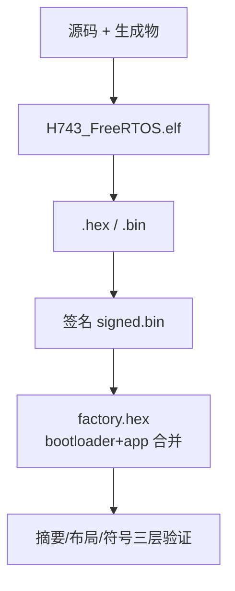

# 构建与验证

## 速查表

| 目标 | 做什么 | Source |
|------|--------|--------|
| `make verify` | **验收门**：fast 架构门禁 + 构建 + 签名/镜像校验 + ELF 校验 | [GNUmakefile:48](https://github.com/a1600778959/H743_FreeRTOS/blob/main/GNUmakefile#L48) |
| `make firmware` | 仅固件构建（验证是显式目标，不隐式跑） | [GNUmakefile](https://github.com/a1600778959/H743_FreeRTOS/blob/main/GNUmakefile) |
| `make dima_rover` | 完整发布产物（纯构建） | [GNUmakefile](https://github.com/a1600778959/H743_FreeRTOS/blob/main/GNUmakefile) |
| `make check-architecture` | full 档全量架构审计 | [check_architecture.py:4](https://github.com/a1600778959/H743_FreeRTOS/blob/main/tools/check_architecture.py#L4) |
| `make mcuboot` | MCUboot 引导程序 | [GNUmakefile](https://github.com/a1600778959/H743_FreeRTOS/blob/main/GNUmakefile) |
| `make upload` | mcumgr OTA 上传 | [release.mk:57](https://github.com/a1600778959/H743_FreeRTOS/blob/main/make/release.mk#L57) |
| `make intellisense` | IDE 跳转数据库 | [GNUmakefile](https://github.com/a1600778959/H743_FreeRTOS/blob/main/GNUmakefile) |

## 双层 Make 架构

<!-- Sources: GNUmakefile:48, make/project.mk:1141, make/release.mk:57 -->

## 构建性能特性

| 特性 | 控制 | 行为 |
|------|------|------|
| 计划化进度 | `DIMA_PROGRESS=off` 逃生门 | 默认干跑一次依赖图，按 `[N/M] 文件名` 逐文件显示 |
| ccache | `DIMA_CCACHE=on/auto/off` | 默认 `on`，缓存不可用**立即失败**（防止"以为在缓存其实在裸编"）；`auto` 才降级 |
| LTO | `DIMA_LTO=off` 逃生门 | 跨编译单元折叠，省 33.8 KiB；ELF 验证器兜底符号合同 |
| 并行度 | 内存自适应 | 内存紧张自动降单任务（`[BUILD] jobs=` 可见） |
| OTA 窗口 | `MCUMGR_MAX_WINDOW` | 生产默认 3（板测期可回退） |

## 每次构建产物

<!-- Sources: make/release.mk:57, tools/elf_support/layout.py -->

## 常见坑

1. **Git Bash 直跑架构检查器会有 `make -pn` 伪违规**——必须走 `make.cmd`。
2. MAVLink C 库是生成物不入库，权威位置 `build/generated/mavlink/`；改参数定义后必须从 Make 入口重新生成。
3. `verify` 中的 fast 门禁只跑 4 项关键检查（依赖方向、include 所有权、硬件操作边界）；**改了模块边界/构建规则要显式跑 `make check-architecture`**。

## Related Pages

| Page | Relationship |
|------|-------------|
| [快速参考](./quick-reference.md) | 常用命令与参数速查 |
| [架构门禁与验证工具](../10-tooling/tooling.md) | 门禁的检查项明细 |
| [构建、签名与 OTA](../09-build-release/build-release.md) | 发布产物与升级链 |
