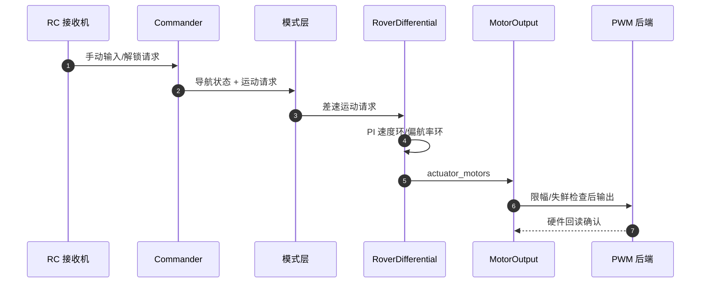

# 项目总览

Dima 是运行在 STM32H743VIT6 上的 FreeRTOS 差速漫游车固件。它存在的核心理由：把 PX4 成熟的"消息总线 + WorkQueue"飞控骨架，改造成一台弱动力地面车辆的控制系统，并让车辆能**自动测出自己的动力特性**（弱动力车手工调参极其困难，这是自动校准存在的第一性原因）。

## 30 秒速览

| 组件 | 职责 | 关键文件 | Source |
|------|------|----------|--------|
| application | 启动壳、C ABI 入口 | `Dima/application/` | [AGENTS.md](https://github.com/a1600778959/H743_FreeRTOS/blob/main/AGENTS.md#L25) |
| rover | 控制域：模式、差速控制 | `Dima/rover/` | [AutoMode.cpp:328](https://github.com/a1600778959/H743_FreeRTOS/blob/main/Dima/rover/modes/auto/AutoMode.cpp#L328) |
| modules | 运行模块（电机/安全/日志…） | `Dima/modules/` | [MotorOutput.cpp:15](https://github.com/a1600778959/H743_FreeRTOS/blob/main/Dima/modules/motor/MotorOutput.cpp#L15) |
| middleware | 参数、uORB、存储、日志服务 | `Dima/middleware/` | [flashfs.cpp:434](https://github.com/a1600778959/H743_FreeRTOS/blob/main/Dima/middleware/parameters/flashfs.cpp#L434) |
| platform | capability 契约 + RTOS/MCU 后端 | `Dima/platform/` | [AtomicFileStore.hpp:14](https://github.com/a1600778959/H743_FreeRTOS/blob/main/Dima/platform/api/AtomicFileStore.hpp#L14) |
| Boards/H743 | 板级初始化 + 唯一组合根 | `Boards/H743/Src/platform_composition.cpp` | [platform_composition.cpp:1](https://github.com/a1600778959/H743_FreeRTOS/blob/main/Boards/H743/Src/platform_composition.cpp#L1) |

## 数据流大图

<!-- Sources: Dima/modules/safety/CommanderAutoCalibration.cpp:34, Dima/rover/control/RoverDifferential.hpp:115, Dima/modules/motor/MotorOutput.cpp:15 -->

## 技术血缘

| 来源 | 拿来了什么 | 本地化改造 |
|------|-----------|-----------|
| PX4 v1.17.0 | uORB、WorkItem 调度、模块骨架、MAVLink | 重命名 `dima` 命名空间，裁剪到车辆场景 |
| ArduPilot Rover | 差速车行为参考（转向/制动语义） | 不直接移植代码 |
| MCUboot | 安全启动与 OTA | 自研签名/镜像验证工具链 |
| 自研 | 自动校准、参数事务、架构门禁工具链 | `docs/` 下有完整方案文档 |

## 资源水位（当前基线）

| 资源 | 占用 | 上限 | 使用率 |
|------|------|------|--------|
| Flash | 586,528 B | 782,336 B | 75.0% |
| DTCM | 60,928 B | 131,072 B | 46.5% |
| SRAM | 576,768 B | 884,736 B | 65.2% |
| D2 data | 216,544 B | 262,144 B | **82.6%（告警区）** |

数据来自最近一次 `make verify` 构建汇总，随代码演进实时变化。

## Related Pages

| Page | Relationship |
|------|-------------|
| [构建与验证](./build-and-verify.md) | 如何编译与验收 |
| [分层架构与依赖规则](../02-architecture/layered-architecture.md) | 目录边界的合同细节 |
| [贡献者指南](../onboarding/contributor-guide.md) | 渐进式上手路径 |
