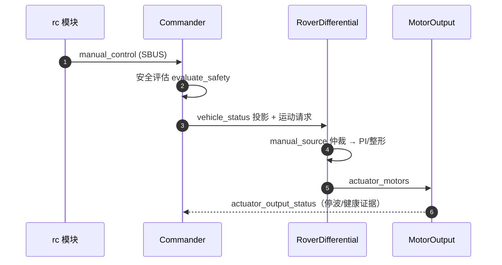
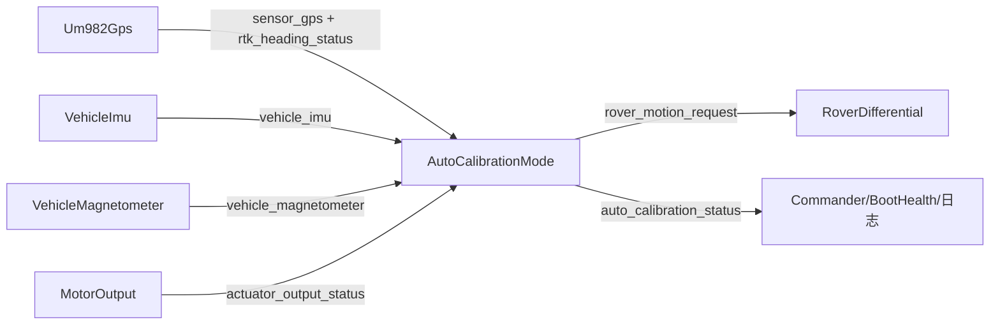

# 话题与数据流

## 为什么先看数据流

本仓库模块间**只通过 uORB 说话**（调用关系被架构门禁限制在依赖方向内）。读懂 Topic 拓扑 = 读懂整个系统。

## Topic 生产/消费矩阵

| Topic | 定义 | 生产者 | 消费者 | Source |
|-------|------|--------|--------|--------|
| `actuator_motors` | 电机归一化输出 | RoverDifferential | MotorOutput | [RoverDifferential.cpp:871](https://github.com/a1600778959/H743_FreeRTOS/blob/main/Dima/rover/control/RoverDifferential.cpp#L871) |
| `actuator_output_status` | 输出运行状态/停波证据 | MotorOutput | Commander、BootHealth、校准 | [MotorOutput.cpp:15](https://github.com/a1600778959/H743_FreeRTOS/blob/main/Dima/modules/motor/MotorOutput.cpp#L15) |
| `vehicle_status` / `armed` | 安全状态投影 | Commander | 全仓库 | [Commander.cpp:143](https://github.com/a1600778959/H743_FreeRTOS/blob/main/Dima/modules/safety/Commander.cpp#L143) |
| `auto_calibration_status` | 11 状态 + 证据字段 | AutoCalibrationMode | Commander、BootHealth、MotorOutput | [AutoCalibrationStatus.msg](https://github.com/a1600778959/H743_FreeRTOS/blob/main/Dima/messages/schemas/AutoCalibrationStatus.msg) |
| `auto_calibration_request` | 启停/取消请求 | Commander / QGC | AutoCalibrationMode | [AutoCalibrationRequest.msg](https://github.com/a1600778959/H743_FreeRTOS/blob/main/Dima/messages/schemas/AutoCalibrationRequest.msg) |
| `rover_motion_request` | 归一化运动意图 | 各模式 | RoverDifferential | [RoverMotionRequest.msg](https://github.com/a1600778959/H743_FreeRTOS/blob/main/Dima/messages/schemas/RoverMotionRequest.msg) |
| `rover_control_status` | 控制内部状态（speed_integral 等） | RoverDifferential | 校准、日志 | [RoverControlStatus.msg](https://github.com/a1600778959/H743_FreeRTOS/blob/main/Dima/messages/schemas/RoverControlStatus.msg) |
| `sensor_gps` / `rtk_heading_status` | GNSS 位置/速度/基线航向 | Um982Gps | EKF2、校准、MAVLink | [Um982Gps.cpp:532](https://github.com/a1600778959/H743_FreeRTOS/blob/main/Dima/drivers/gps/um982/Um982Gps.cpp#L532) |
| `vehicle_imu` / `vehicle_magnetometer` | 传感器数据 | VehicleImu / VehicleMagnetometer | EKF2、校准 | [VehicleImu.cpp](https://github.com/a1600778959/H743_FreeRTOS/blob/main/Dima/modules/sensors/imu/VehicleImu.cpp) |
| `parameter_update` | 参数变更通知 | ParameterService | MotorOutput 等需冻结快照的模块 | [RoverDifferential.cpp:105](https://github.com/a1600778959/H743_FreeRTOS/blob/main/Dima/rover/control/RoverDifferential.cpp#L105) |

## 主数据流：手动驾驶一拍

<!-- Sources: Dima/modules/safety/Commander.cpp:143, Dima/rover/control/RoverDifferential.cpp:124, Dima/modules/motor/MotorOutput.cpp:15 -->

## 主数据流：校准观测一拍

<!-- Sources: Dima/rover/modes/auto_calibration/AutoCalibrationGates.cpp:16, Dima/drivers/gps/um982/Um982Gps.cpp:532, Dima/modules/motor/MotorOutput.cpp:15 -->

## 消息契约演进规则

| 规则 | 出处 |
|------|------|
| 契约只放 schema（类型/常量/注释版本日期），不放逻辑 | [messages/README.md](https://github.com/a1600778959/H743_FreeRTOS/blob/main/Dima/messages/README.md) |
| MAVLink 按当前能力裁剪，禁止全量方言 | [AGENTS.md](https://github.com/a1600778959/H743_FreeRTOS/blob/main/AGENTS.md#L63) |
| 优先删减字段； MESSAGE_VERSION = 重新生成 hash/logger contract | [AutoCalibrationStatus.msg](https://github.com/a1600778959/H743_FreeRTOS/blob/main/Dima/messages/schemas/AutoCalibrationStatus.msg) |

日志侧的 Topic 登记：[logger_topics.yaml](https://github.com/a1600778959/H743_FreeRTOS/blob/main/Dima/modules/logging/logger_topics.yaml)（49 Topics，经生成工具校验）。

## Related Pages

| Page | Relationship |
|------|-------------|
| [分层架构与依赖规则](./layered-architecture.md) | 依赖方向的合同本体 |
| [线程与调度](./threading-scheduling.md) | 这些 Topic 在哪些队列上流转 |
| [模块全景](../05-modules/modules.md) | 生产者/消费者模块的实现 |
