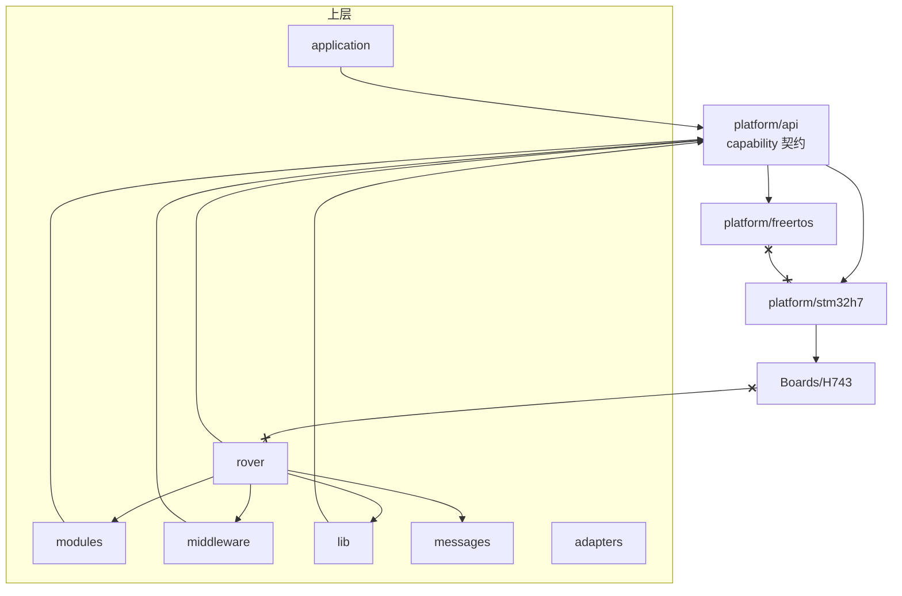
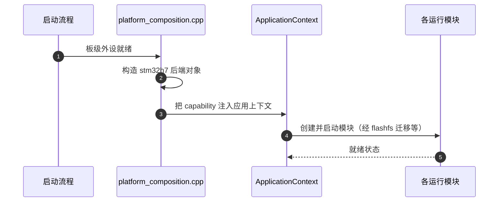
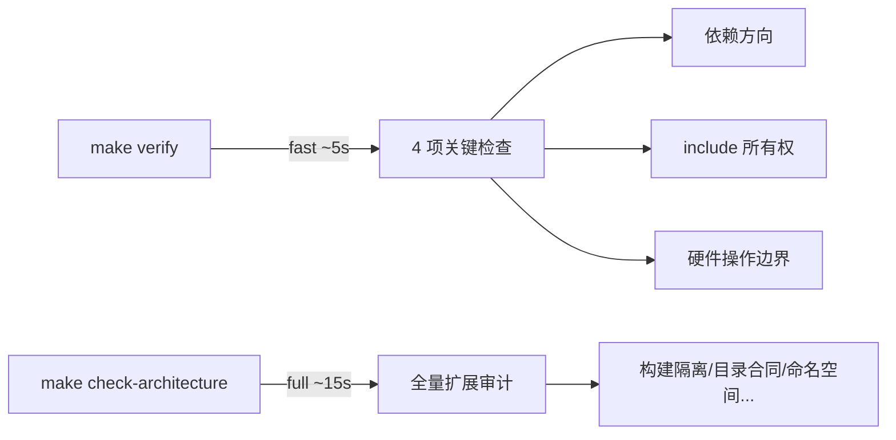

# 分层架构与依赖规则

## 为什么存在这份合同

无人车固件最常见的腐烂路径：某个模块图省事直接 include 了 HAL 或别的模块的头，三个月后没人能画出依赖图，改一处崩一片。本仓库的做法是**把依赖规则做成构建期门禁**——违规代码根本编译不过，而不是靠 code review 记住。

## 依赖方向（硬合同）

<!-- Sources: AGENTS.md:52, docs/ARCHITECTURE_ZH.md:1 -->

规则逐条（[AGENTS.md](https://github.com/a1600778959/H743_FreeRTOS/blob/main/AGENTS.md#L52)）：

| 规则 | 强制手段 |
|------|----------|
| `rover → modules / middleware / messages / lib / platform/api` | dependency.py 依赖图检查 |
| `modules / middleware → platform/api`，**禁止反向依赖 rover** | 同上 |
| `platform/freertos` 与 `platform/stm32h7` **互不包含** | fast 门禁 |
| `Boards/H743` 不依赖上层控制模块 | full 审计 |
| 上层禁止 include FreeRTOS/HAL/CMSIS/Core/Board/USB 生成头 | include 所有权检查 |
| `platform_composition.cpp` 是唯一组合根 | full 审计（构建隔离） |

## 目录职责

| 目录 | 职责 | 明确禁止 |
|------|------|----------|
| `Dima/rover/` | 唯一 Rover 产品域：`control/`（差速控制）+ `modes/`（模式编排） | 放非算法代码到 lib |
| `Dima/modules/` | 独立生命周期运行模块 | 互相 import 内部细节 |
| `Dima/middleware/` | Parameter、uORB、WorkQueue、Event、Perf、Log | 感知业务语义 |
| `Dima/messages/` | 共享消息契约（.msg） | 写逻辑 |
| `Dima/lib/` | 平台无关算法 | 依赖任何硬件上下文 |
| `Dima/adapters/` | 外部协议适配（USB Console、MAVLink） | 反向调用业务 |
| `Dima/platform/` | `api/`（契约）、`freertos/`、`stm32h7/`（后端） | api 依赖具体后端 |
| `Boards/H743/` | 板级初始化、Flash 布局、组合根 | 依赖上层控制模块 |
| `Core/` | CubeMX/HAL 生成区 | 写任何业务逻辑 |

## 组合根：唯一的装配点

<!-- Sources: Boards/H743/Src/platform_composition.cpp:1, Dima/rover/ApplicationContext.cpp:285 -->

组合根唯一性的价值：比如 DNA 分配表迁移（ADR 0006）这类涉及多个存储域交接的变更，只需要在组合根/应用上下文一条链路上做（[ApplicationContext.cpp:285](https://github.com/a1600778959/H743_FreeRTOS/blob/main/Dima/rover/ApplicationContext.cpp#L285) 的 `invalidate_records` 调用），不会出现第二个装配点漂移。

## 门禁两档

<!-- Sources: tools/check_architecture.py:4, GNUmakefile:48 -->

## Related Pages

| Page | Relationship |
|------|-------------|
| [Capability 契约与组合根](../07-platform/platform.md) | 契约层的实现细节 |
| [架构门禁与验证工具](../10-tooling/tooling.md) | 门禁如何机器化 |
| [差速控制栈](../03-rover-domain/control-stack.md) | rover 域的内部结构 |
