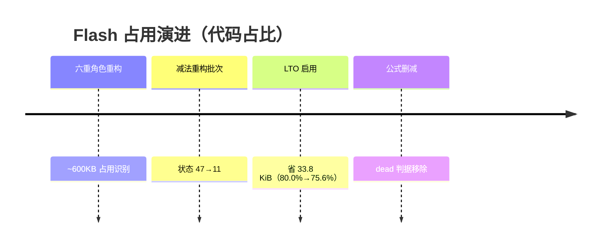
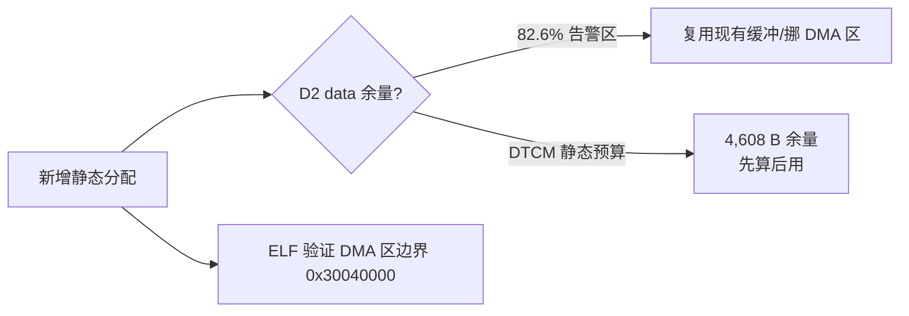

# 资源预算

## 四本账（当前基线）

| 账本 | 占用 | 上限 | 使用率 | 风险位 |
|------|------|------|--------|--------|
| Flash | 586,528 B | 782,336 B | 75.0% | 健康 |
| DTCM | 60,928 B | 65,536 B 静态预算 | 93% of budget | **紧张**（总 46.5% 但有专用静态预算） |
| SRAM D1 | 352,256 B | 524,288 B | 67.2% | 健康 |
| SRAM D2 data | 216,544 B | 262,144 B | **82.6%** | **告警区** |
| DMA 区 | 7,744 B | 32,768 B | 23.6% | 健康 |

数据来自 `make verify` 构建汇总（每次构建实时输出）；DTCM 另有 MSP 保留 64KB 未计入运行峰值。

## Flash 优化战役

<!-- Sources: make/project.mk:1141, docs/AUTO_CALIBRATION_FORMULA_REMOVAL_ZH.md:1 -->

| 优化 | 手段 | 效果 | Source |
|------|------|------|--------|
| LTO | `-flto` 全量 + 符号合同兜底 | -33.8 KiB | [project.mk:1141](https://github.com/a1600778959/H743_FreeRTOS/blob/main/make/project.mk#L1141) |
| used 属性修复 | LTO 下的 io_stats/初始化数组保活 | 防 LTO 误删 | [tools/elf_support/layout.py](https://github.com/a1600778959/H743_FreeRTOS/blob/main/tools/elf_support/layout.py) |
| 公式删减 | 删 8 类无消费者判据/候选设计器 | 见删减清单 | [AUTO_CALIBRATION_FORMULA_REMOVAL_ZH.md](https://github.com/a1600778959/H743_FreeRTOS/blob/main/docs/AUTO_CALIBRATION_FORMULA_REMOVAL_ZH.md) |
| 行数门 | autocal 模块 <5890 行硬门 | 拆分+减法 | [rover/modes/README.md](https://github.com/a1600778959/H743_FreeRTOS/blob/main/Dima/rover/modes/README.md) |

## RAM 纪律

<!-- Sources: tools/elf_support/layout.py, make/release.mk:17 -->

- **D2 SRAM 是当前最紧的账**：新增大数组前先看构建汇总水位。
- DMA 区域由 ELF 验证器强制（`0x30040000, 32768 bytes maximum`）——DMA 可达缓冲必须放对段。
- 栈：MSP 保留 64KB（运行峰值未测量），任务栈静态给定。

## 预算护栏机制

1. 构建汇总每次输出全部分区水位 + 历史基线文档（[DIMA_RESOURCE_BASELINE_ZH.md](https://github.com/a1600778959/H743_FreeRTOS/blob/main/docs/DIMA_RESOURCE_BASELINE_ZH.md)）。
2. ELF 验证器校验向量/DMA/符号合同，越界即失败。
3. 阶段资源基线（PHASE3/4/5）记录每次功能波动的增量验收。

## Related Pages

| Page | Relationship |
|------|-------------|
| [构建与验证](../01-getting-started/build-and-verify.md) | 水位在构建汇总中查看 |
| [构建、签名与 OTA](../09-build-release/build-release.md) | Flash 布局细节 |
| [架构门禁与验证工具](../10-tooling/tooling.md) | ELF 层护栏实现 |
