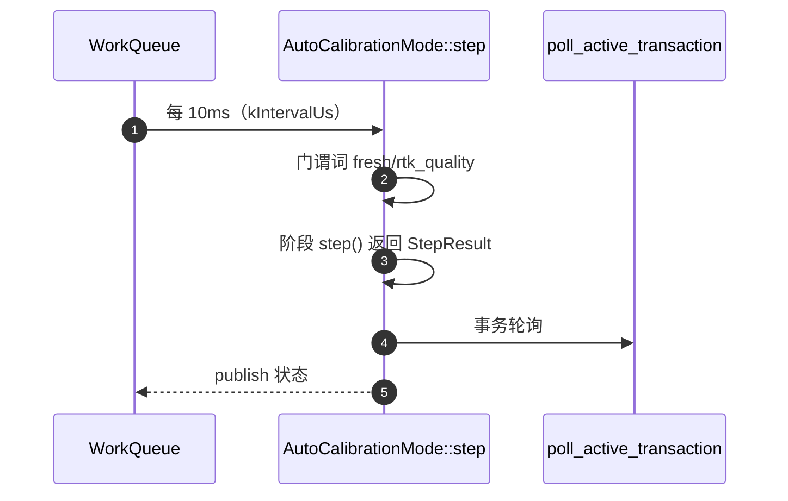
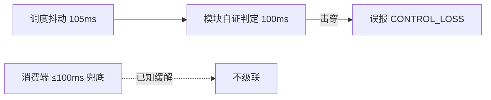

# 线程与调度

## 调度模型

本仓库采用 PX4 式 **WorkItem**：模块不是线程，而是挂在 WorkQueue 上的可调度单元——按周期或订阅事件排队执行。收益：单队列内天然串行（无锁化）、优先级分级清晰、避免"每模块一线程"的栈开销。

| 队列角色 | 典型驻留 | 约束 |
|----------|----------|------|
| 实时控制 | RoverDifferential、MotorOutput | 禁阻塞调用；失鲜检查兜底 |
| 传感器 | VehicleImu、VehicleMagnetometer、Um982Gps | 高频、小延迟 |
| 通信 | Commander、MAVLink、UsbConsole | 中频；日志下载批量发送 |
| 存储 | SdLogWriter、参数持久化 | 慢速大块 IO，独立队列避免拖垮控制 |
| 低优先级 | 校准模式、日志契约 | 大计算（拟合）放低队列 |

## 校准调度的周期选择

<!-- Sources: Dima/rover/modes/auto_calibration/AutoCalibrationMode.hpp:94 -->

校准从 20ms 收紧到 **10ms**（[AutoCalibrationMode.hpp:94](https://github.com/a1600778959/H743_FreeRTOS/blob/main/Dima/rover/modes/auto_calibration/AutoCalibrationMode.hpp#L94)）的原因：制动观测需要足够的 GNSS 历元密度与输出帧分辨率。

## 失鲜检查：跨队列的时间合同

跨队列通信没有锁，靠**时间戳新鲜度**兜底。各消费者独立定义失鲜窗，例如：

| 判据 | 窗口 | Source |
|------|------|--------|
| `fresh(timestamp, now, limit)` 通用谓词 | 逐调用指定 | [Gates.cpp:16](https://github.com/a1600778959/H743_FreeRTOS/blob/main/Dima/rover/modes/auto_calibration/AutoCalibrationGates.cpp#L16) |
| actuator_output 失鲜 | 750ms（校准维护判定） | [Finalize.cpp:15](https://github.com/a1600778959/H743_FreeRTOS/blob/main/Dima/rover/modes/auto_calibration/AutoCalibrationFinalize.cpp#L15) |
| vehicle_status 新鲜度 | 3s（EKF2 静止约束） | [Ekf2Inputs.cpp:113](https://github.com/a1600778959/H743_FreeRTOS/blob/main/Dima/modules/ekf2/Ekf2Inputs.cpp#L113) |
| RTK 航向缓存 | 300ms | [Um982Gps.cpp:532](https://github.com/a1600778959/H743_FreeRTOS/blob/main/Dima/drivers/gps/um982/Um982Gps.cpp#L532) |

重要细节：**新鲜度一律按"处理时刻"的单调时钟判定，不能拿两个消息的采样时间戳互比**——`vehicle_status` 可以晚于当前 IMU 采样到达，直接比较会把正常 Disarmed 反复判成过期（这是修过的真实 bug，见 [Ekf2Inputs.cpp:113](https://github.com/a1600778959/H743_FreeRTOS/blob/main/Dima/modules/ekf2/Ekf2Inputs.cpp#L113) 注释）。

## 调度抖动的防御

<!-- Sources: docs/ 与实车日志分析结论；防御点见 Dima/rover/modes/auto_calibration/AutoCalibrationDiagnostics.cpp:14 -->

实车曾出现 105ms 调度抖动击穿 100ms 自证判定的事件（无人干预）；防御原则是**消费端对瞬态失鲜有兜底**，单次抖动不得直接升级为失败——新增自证判定时必须同时给出消费端兜底。

## Related Pages

| Page | Relationship |
|------|-------------|
| [话题与数据流](./data-flow.md) | 在队列间流转的内容 |
| [自动校准状态机](../04-auto-calibration/state-machine.md) | 最大周期用户 |
| [BootHealth 喂狗策略](../05-modules/boot-health.md) | 调度健康的最终权衡者 |
