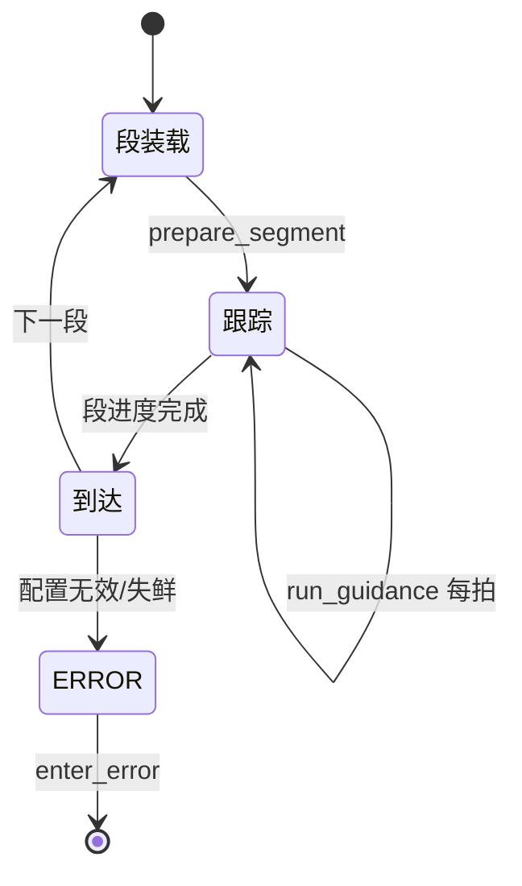
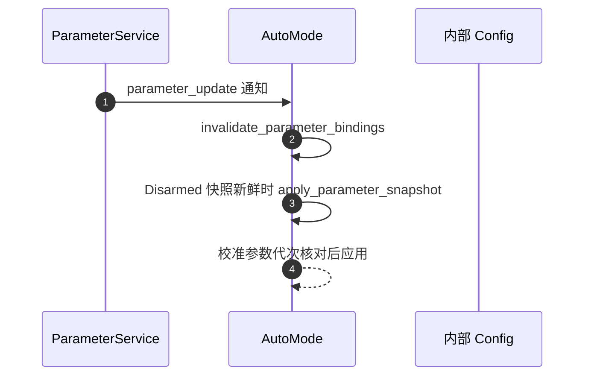

# AutoMode 航段任务

## 定位

AutoMode 是 Mission（自主航段）模式：把任务拆成 STRAIGHT/TURN 等段，用共享引导原语跟踪，产出 `rover_motion_request` 交给差速层。它与自动校准**共享同一套引导原语**（这是官方调参计划的关键决策：校准不另造导航）。

## 组件表

| 组件 | 职责 | Source |
|------|------|--------|
| AutoMode | 段推进、参数快照绑定、错误入口 | [AutoMode.cpp:328](https://github.com/a1600778959/H743_FreeRTOS/blob/main/Dima/rover/modes/auto/AutoMode.cpp#L328) |
| PurePursuit | 纯跟踪横向制导 | [PurePursuit.cpp:132](https://github.com/a1600778959/H743_FreeRTOS/blob/main/Dima/lib/rover/PurePursuit.cpp#L132) |
| SegmentGuidance | 航段几何：到达速度、进度更新 | [SegmentGuidance.hpp:18](https://github.com/a1600778959/H743_FreeRTOS/blob/main/Dima/lib/rover/SegmentGuidance.hpp#L18) |
| Heading/Driving 控制器 | 航向环 + 驱动环（公共内环） | [RoverControl.hpp](https://github.com/a1600778959/H743_FreeRTOS/blob/main/Dima/lib/rover/RoverControl.hpp) |

## 段推进

<!-- Sources: Dima/rover/modes/auto/AutoMode.cpp:328 -->

`run_guidance` 每拍产出 GuidanceOutput（期望速度+偏航率）；段几何（`update_segment`、到达速度）由 SegmentGuidance 提供——校准的路径验证复用同一实现（[AutoCalibrationPath.cpp:276](https://github.com/a1600778959/H743_FreeRTOS/blob/main/Dima/rover/modes/auto_calibration/AutoCalibrationPath.cpp#L276) 直接调用 `dima::lib::rover::update_segment`）。

## 参数快照绑定

<!-- Sources: Dima/rover/modes/auto/AutoMode.cpp:328 -->

与全仓库一致的规则：**Armed 运行中不应用参数**；快照在安全窗口应用，且校准相关参数需核对代次（`calibration_parameters_applied`）防止旧代次覆盖新会话。

## 与校准的共享边界

| 共享 | 不共享 |
|------|--------|
| PurePursuit / SegmentGuidance / Heading / Driving | 模式层编排（校准有自己的 SessionController） |
| 公共速度/偏航率内环 | 候选事务（仅校准有） |
| 围栏/安全链 | 电机直接发布权（校准永不直接发 PWM） |

## Related Pages

| Page | Relationship |
|------|-------------|
| [差速驱动与控制环](./differential-drive.md) | 请求的最终执行者 |
| [自动校准状态机](../04-auto-calibration/state-machine.md) | 复用同一引导原语的另一模式 |
| [话题与数据流](../02-architecture/data-flow.md) | rover_motion_request 契约 |
