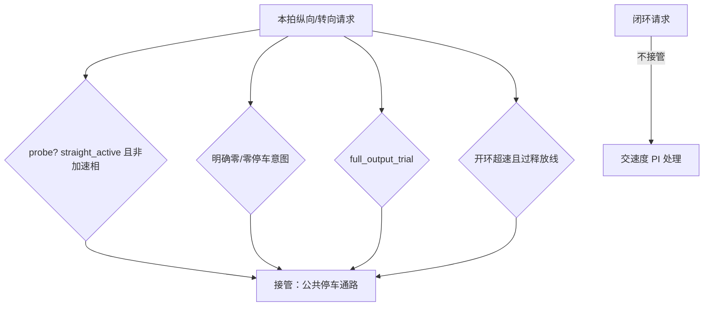
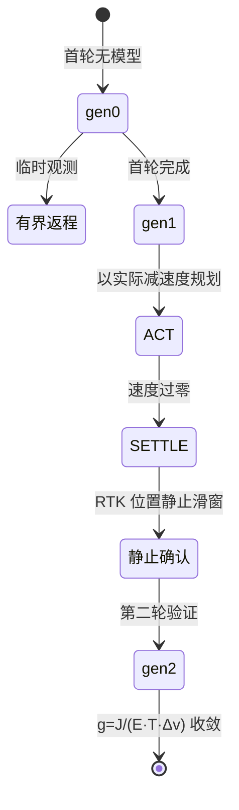
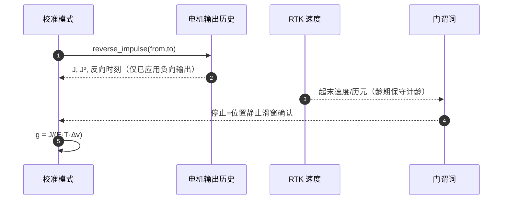

# 制动接管

## 背景：为什么制动是专页

弱动力车的制动曾连续多轮实车失败（倒退误判、指数尾不可辨识、振铃污染），最终收敛为当前设计：**有界反向驱动制动 + 两轮自校准比例律 + 位置法候选**。执行层落在 `RoverDifferentialBraking.cpp`（从 RoverDifferential 拆出的独立文件）。

## 组件表

| 组件 | 职责 | Source |
|------|------|--------|
| `calibration_braking_command` | 制动接管执行入口 | [RoverDifferentialBraking.cpp:8](https://github.com/a1600778959/H743_FreeRTOS/blob/main/Dima/rover/control/RoverDifferentialBraking.cpp#L8) |
| `stopping_distance` / 比例律 | 停距与增益数学 | [CalibrationBraking.hpp:5](https://github.com/a1600778959/H743_FreeRTOS/blob/main/Dima/lib/rover/CalibrationBraking.hpp#L5) |
| `MagMotorOutputHistory::reverse_impulse` | 反向冲量 J 积分 | [MagMotorOutputHistory.hpp:17](https://github.com/a1600778959/H743_FreeRTOS/blob/main/Dima/modules/sensors/magnetometer/MagMotorOutputHistory.hpp#L17) |
| 校准锁存 | 两轮制动验证协议 | [RoverDifferentialCalibration.cpp](https://github.com/a1600778959/H743_FreeRTOS/blob/main/Dima/rover/control/RoverDifferentialCalibration.cpp) |

## 接管判据（执行层五路）

<!-- Sources: Dima/rover/control/RoverDifferentialBraking.cpp:8 -->

合同要点（源码注释即合同）：
- **零/零请求 = 停车意图**：不等 `motion_allowed=false`（那时请求已被上游撤销）。
- **闭环不覆盖 PI**：巡航限速只服务未标定开环；PI 之后不得再覆盖纵/转向。
- **回带迟滞**：释放线 = 限速 − max(0.08, 测量阈值)；超速立即接管，回下边界才释放。
- **GNSS 速度龄期保守计龄**：速度落后时计入历元差，不向未来外推。

## 比例律与两轮协议

<!-- Sources: Dima/rover/modes/auto_calibration/AutoCalibrationBraking.cpp:14, Dima/rover/control/RoverDifferentialCalibration.cpp -->

第一轮用有界返程提供临时观测；第二轮验证新策略并使用其实际减速度。停距 = 名义距离 + v×delay（`MOT_REV_DELAY` 是已知等待，后端首次反向时间补充真实等待——不固定假设 0.3s）。

## 观测证据链

<!-- Sources: Dima/modules/sensors/magnetometer/MagMotorOutputHistory.hpp:17, Dima/rover/modes/auto_calibration/AutoCalibrationRtk.cpp:230 -->

反向制动不可辨识（滑停主导）时的退化行为与失败分类见 [自动校准状态机](../04-auto-calibration/state-machine.md) 的 FINALIZE 族。

## Related Pages

| Page | Relationship |
|------|-------------|
| [自动校准状态机](../04-auto-calibration/state-machine.md) | 制动观测的调度方 |
| [差速驱动与控制环](./differential-drive.md) | 被接管的正常通路 |
| [UM982 链路](../08-drivers/um982.md) | 速度龄期的生产端 |
