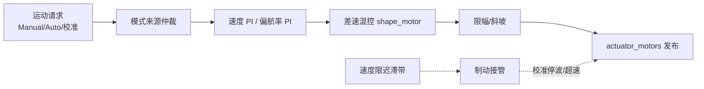
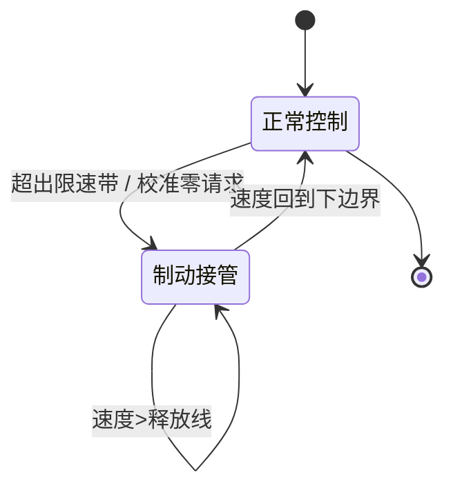
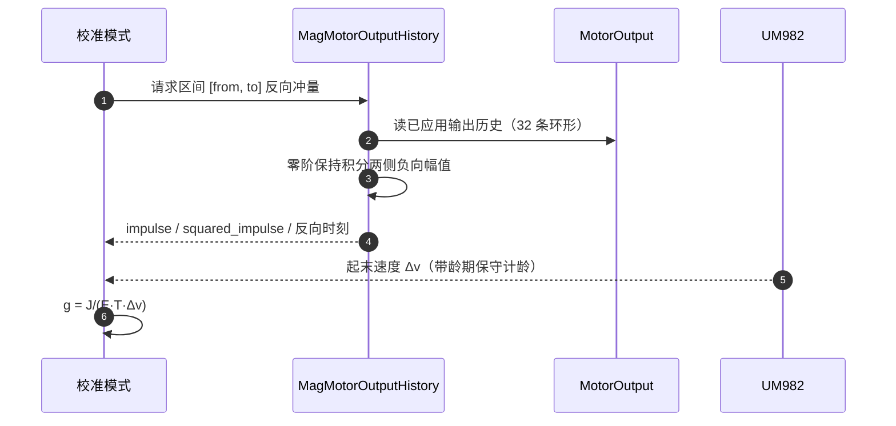

# 差速控制栈

## 概览

| 组件 | 职责 | 关键文件 | Source |
|------|------|----------|--------|
| RoverDifferential | 差速控制核心：模式路由、PI 环、模式来源仲裁 | `Dima/rover/control/RoverDifferential.cpp` | [RoverDifferential.hpp:115](https://github.com/a1600778959/H743_FreeRTOS/blob/main/Dima/rover/control/RoverDifferential.hpp#L115) |
| RoverDifferentialBraking | 校准制动接管：比例律制动、限速迟滞带 | `RoverDifferentialBraking.cpp` | [RoverDifferentialBraking.cpp:8](https://github.com/a1600778959/H743_FreeRTOS/blob/main/Dima/rover/control/RoverDifferentialBraking.cpp#L8) |
| RoverDifferentialCalibration | 校准锁存协议（两轮制动验证） | `RoverDifferentialCalibration.cpp` | [RoverDifferentialCalibration.cpp:1](https://github.com/a1600778959/H743_FreeRTOS/blob/main/Dima/rover/control/RoverDifferentialCalibration.cpp#L1) |
| lib/rover 公共算法 | 混控、纯跟踪、段引导、校准数学 | `Dima/lib/rover/` | [CalibrationBraking.hpp:5](https://github.com/a1600778959/H743_FreeRTOS/blob/main/Dima/lib/rover/CalibrationBraking.hpp#L5) |
| AutoMode | 航段任务模式（Mission） | `Dima/rover/modes/auto/AutoMode.cpp` | [AutoMode.cpp:328](https://github.com/a1600778959/H743_FreeRTOS/blob/main/Dima/rover/modes/auto/AutoMode.cpp#L328) |

## 控制管线

<!-- Sources: Dima/rover/control/RoverDifferential.hpp:115, Dima/rover/control/RoverDifferentialBraking.cpp:8 -->

## 制动接管（Braking takeover）

`RoverDifferential::calibration_braking_command` 是校准制动的执行层。设计要点（全部可在源码注释与逻辑中追溯）：

- **零请求即停车意图**：正常有效零/零请求直接进入停车通路，不等 `motion_allowed=false`（那时请求已被上游安全检查撤销）。
- **限速迟滞带**：超速立即接管；释放须回到下边界（`release_speed`），避免在同一限速线上反复换向。
- **闭环不覆盖 PI**：巡航限速只服务未标定的开环输入；闭环已有速度 PI，不得在 PI 计算后再覆盖纵向/转向（否则候选验证混入另一套控制器）。
- **GNSS 速度龄期保守计龄**：速度落后时把历元差计入年龄，不向未来外推。

<!-- Sources: Dima/rover/control/RoverDifferentialBraking.cpp:8 -->

## lib/rover 公共算法

| 算法 | 用途 | Source |
|------|------|--------|
| `DifferentialDrive` | 差速混控 + 起步下限（弱动力车死区跳过） | [DifferentialDrive.cpp](https://github.com/a1600778959/H743_FreeRTOS/blob/main/Dima/lib/rover/DifferentialDrive.cpp) |
| `PurePursuit` / `SegmentGuidance` | 路径跟踪与航段推进（校准与 AutoMode 共享） | [SegmentGuidance.cpp](https://github.com/a1600778959/H743_FreeRTOS/blob/main/Dima/lib/rover/SegmentGuidance.cpp) |
| `CalibrationBraking` | 停距 + 比例制动输入增益数学 | [CalibrationBraking.hpp:5](https://github.com/a1600778959/H743_FreeRTOS/blob/main/Dima/lib/rover/CalibrationBraking.hpp#L5) |
| `CalibrationIdentification` | 一阶+延迟模型辨识，PI 候选用 Skogestad 解析公式 | [CalibrationIdentification.cpp](https://github.com/a1600778959/H743_FreeRTOS/blob/main/Dima/lib/rover/CalibrationIdentification.cpp) |
| `CalibrationResponse` | 响应统计：平台判据、低速下界 | [CalibrationResponse.cpp](https://github.com/a1600778959/H743_FreeRTOS/blob/main/Dima/lib/rover/CalibrationResponse.cpp) |
| `CalibrationMath::CircularMean` | 圆均值（带浓度判据，用于 RTK 航向一致性） | [CalibrationMath.hpp](https://github.com/a1600778959/H743_FreeRTOS/blob/main/Dima/lib/rover/CalibrationMath.hpp) |
| `CalibrationFence` | 圆形围栏评估 | [CalibrationFence.cpp](https://github.com/a1600778959/H743_FreeRTOS/blob/main/Dima/lib/rover/CalibrationFence.cpp) |

## 制动输入的测量闭环

校准制动增益 g = J/(E·T·Δv) 的 J（反向冲量）来自电机输出历史的反向积分：

<!-- Sources: Dima/modules/sensors/magnetometer/MagMotorOutputHistory.hpp:17, Dima/lib/rover/CalibrationBraking.hpp:5, Dima/rover/control/RoverDifferentialBraking.cpp:8 -->

关键约束：只积分**已应用**的负向输出，未知区间拒绝——不能把未执行的请求当成制动力。

## Related Pages

| Page | Relationship |
|------|-------------|
| [自动校准状态机](../04-auto-calibration/state-machine.md) | 制动观测的调度方 |
| [模块全景](../05-modules/modules.md) | MotorOutput 输出链 |
| [驱动与传感器链路](../08-drivers/drivers.md) | RTK 速度/航向来源 |
