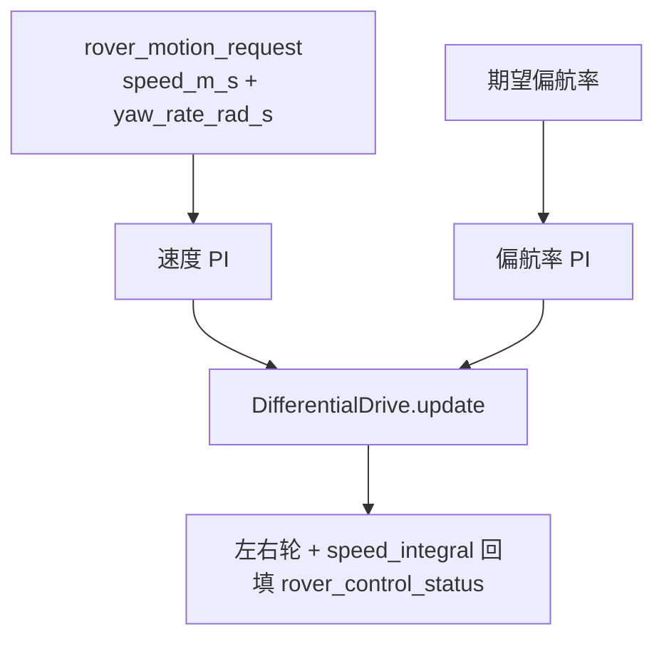
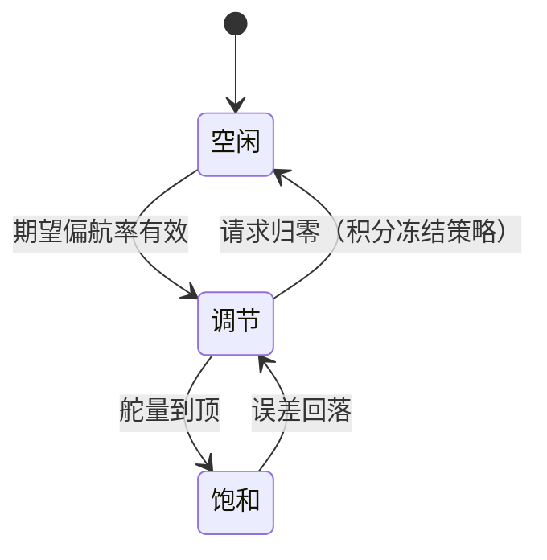

# 差速驱动与控制环

## 组件表

| 组件 | 职责 | Source |
|------|------|--------|
| `DifferentialDrive` | 输入整形（死区/起步下限/EXPO）→ 左右轮输出 | [DifferentialDrive.cpp:149](https://github.com/a1600778959/H743_FreeRTOS/blob/main/Dima/lib/rover/DifferentialDrive.cpp#L149) |
| `SpeedController` | 前向速度 PI（车体系） | [RoverControl.hpp](https://github.com/a1600778959/H743_FreeRTOS/blob/main/Dima/lib/rover/RoverControl.hpp) |
| `YawRateController` | 偏航率 PI | [RoverControl.hpp:144](https://github.com/a1600778959/H743_FreeRTOS/blob/main/Dima/lib/rover/RoverControl.hpp#L144) |
| `RoverDifferential` | 模式来源仲裁 + 环路组装 + `actuator_motors` 发布 | [RoverDifferential.cpp:124](https://github.com/a1600778959/H743_FreeRTOS/blob/main/Dima/rover/control/RoverDifferential.cpp#L124) |

## 一拍控制流水线

<!-- Sources: Dima/rover/control/RoverDifferential.cpp:124, Dima/lib/rover/DifferentialDrive.cpp:149 -->

## 起步下限（弱动力车关键设计）

弱动力车实测单轮约 0.15、双轮约 0.20 归一化输出才起步——死区内只有 cogging 摆振与大电流。`shape_motor` 的处理：

| 输入 | 行为 | Source |
|------|------|--------|
| 精确零 | 不加补偿，直出零 | [DifferentialDrive.cpp:149](https://github.com/a1600778959/H743_FreeRTOS/blob/main/Dima/lib/rover/DifferentialDrive.cpp#L149) |
| 手动正向杆量越死区 | 抬到起步下限（参数化） | 同上 |
| 校准起步加速分支 | 同样保底 | [params yaml](https://github.com/a1600778959/H743_FreeRTOS/blob/main/Dima/middleware/parameters/definitions/module_rover_actuator_params.yaml) |
| 倒退/闭环调速/减速 | 不受下限影响 | 同上 |

历史教训：校准专属轮端限速 + 无效周期归零曾把前进削成脉动爬升，导致单轮破摩阻原地枢转——起步下限与"无效周期不归零"是这一教训的结构化修复。

## 偏航率 PI

<!-- Sources: Dima/lib/rover/RoverControl.hpp:144, Dima/lib/rover/RoverControl.cpp -->

`valid_yaw_rate_config` 在配置加载时把关（死区/限幅/积分限一致），坏配置拒绝启用而不是带病运行。

## 参数冻结与租约

RoverDifferential 订阅 `parameter_update`，在 Disarmed 快照新鲜时应用参数（[RoverDifferential.cpp:105](https://github.com/a1600778959/H743_FreeRTOS/blob/main/Dima/rover/control/RoverDifferential.cpp#L105)）； Armed 行驶期间参数冻结——这是所有"运行中改参"模块的统一模式。

## Related Pages

| Page | Relationship |
|------|-------------|
| [差速控制栈](./control-stack.md) | 本页的上级总览 |
| [制动接管](./braking-takeover.md) | 覆盖本页输出的校准路径 |
| [手动模式语义](./manual-mode.md) | manual_source 的上游 |
