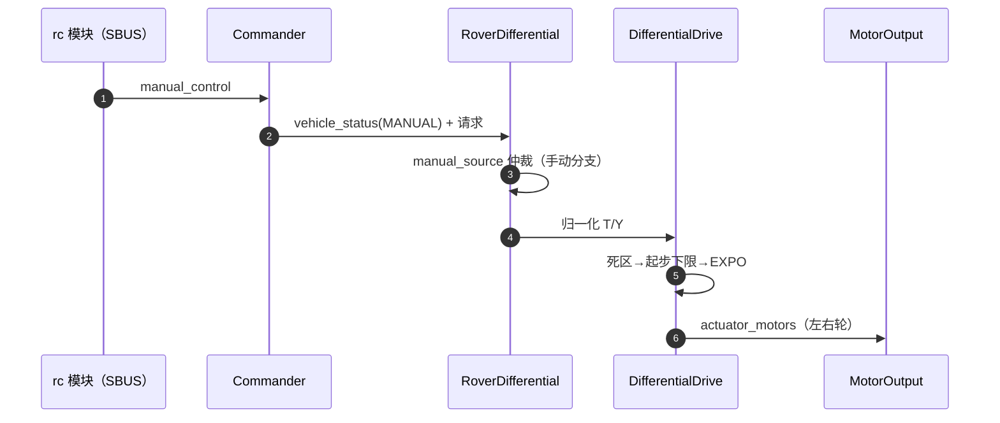
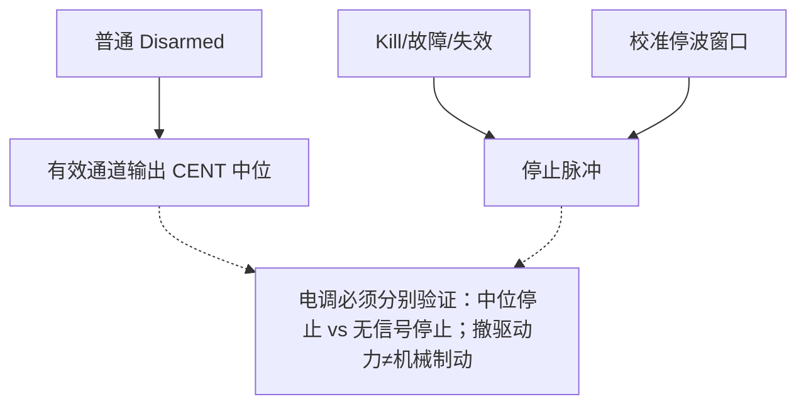

# 手动模式语义

## 为什么值得单独一页

"同一根遥控杆在不同模式下行为不一致"是本仓库历史上被反复审计的主题（[MANUAL_DRIVE_DIRECTION_AUDIT_ZH.md](https://github.com/a1600778959/H743_FreeRTOS/blob/main/docs/MANUAL_DRIVE_DIRECTION_AUDIT_ZH.md)）。RC/PWM 反转都在共享层，但 DifferentialDrive 的 manual_source 曾有四处分叉——审计合并后统一了语义。

## 手动链路

<!-- Sources: Dima/rover/control/RoverDifferential.cpp:124, Dima/lib/rover/DifferentialDrive.cpp:149, Dima/modules/rc/README.md -->

## 语义合同（审计定稿）

| 事项 | 合同 | Source |
|------|------|--------|
| 电机左右侧别 | 以站在**车尾、面朝车头**的视角定义（与前进方向一致） | [actuator params yaml](https://github.com/a1600778959/H743_FreeRTOS/blob/main/Dima/middleware/parameters/definitions/module_rover_actuator_params.yaml) |
| RD_REV_STEER | **已退役**——倒车转向不再有反转开关，保持单侧 PWM 方向合同 | [params yaml](https://github.com/a1600778959/H743_FreeRTOS/blob/main/Dima/middleware/parameters/definitions/module_rover_actuator_params.yaml) |
| MOT_THR_MIN 地板 | 仅手动享有（AUTO 停走的第一嫌疑曾在此） | [rc/README.md](https://github.com/a1600778959/H743_FreeRTOS/blob/main/Dima/modules/rc/README.md) |
| 起步下限 | 覆盖手动正向杆量与校准起步分支 | [DifferentialDrive.cpp:149](https://github.com/a1600778959/H743_FreeRTOS/blob/main/Dima/lib/rover/DifferentialDrive.cpp#L149) |
| 上锁输出 | Disarmed 输出 CENT 中位；Kill/故障/停波窗口停止脉冲 | [commissioning doc](https://github.com/a1600778959/H743_FreeRTOS/blob/main/docs/H743_VEHICLE_COMMISSIONING_ZH.md) |

## 安全语义差异

<!-- Sources: docs/H743_VEHICLE_COMMISSIONING_ZH.md:1, Dima/platform/api/Flash.hpp:59 -->

上车验收必须覆盖这两种停止方式的差异——坡面上"中位停止"与"无信号停止"的溜车行为不同（指南明确写了边界）。

## 电机诊断流的退役

原 `MavlinkDriveDiagnostics`（手动 Armed 时每秒四条 STATUSTEXT 输出 `[drive in]` 诊断）已删除——诊断职责回归日志与地面站遥测，避免低速率诊断通道与实时控制争资源（[mavlink README](https://github.com/a1600778959/H743_FreeRTOS/blob/main/Dima/modules/mavlink/README.md)）。

## Related Pages

| Page | Relationship |
|------|-------------|
| [差速驱动与控制环](./differential-drive.md) | 整形与环路实现 |
| [Commander 安全链](../05-modules/commander.md) | 手动模式的状态门 |
| [MotorOutput 输出链](../05-modules/motor-output.md) | 物理输出的最后一级 |
