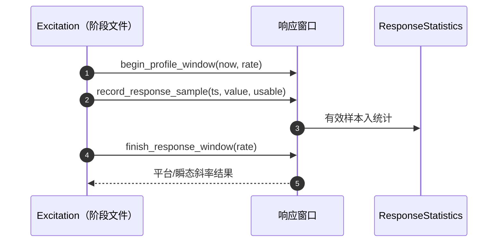
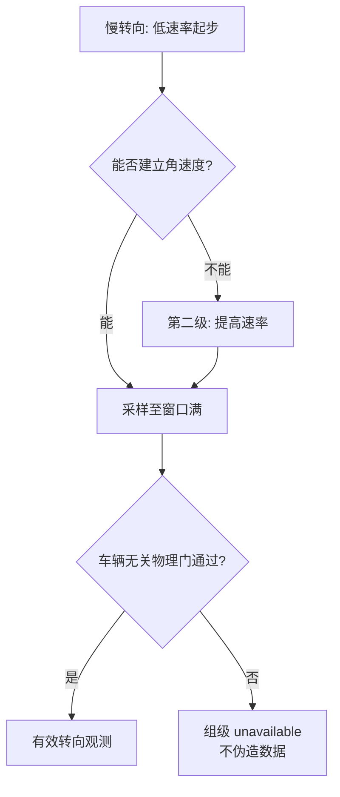

# 激励与剖面观测

## 激励设计原则

校准的可观测性来自**激励**。本仓库的激励合同：初始直线为开环激励（不做闭环假设）、观测窗口有明确的开始/结束边界、动力学量不做先验硬门（两类门公理）。

## 响应窗口机制

<!-- Sources: Dima/rover/modes/auto_calibration/AutoCalibrationExcitation.cpp:18, Dima/lib/rover/CalibrationResponse.cpp -->

窗口函数族（[Excitation.cpp](https://github.com/a1600778959/H743_FreeRTOS/blob/main/Dima/rover/modes/auto_calibration/AutoCalibrationExcitation.cpp)）：`begin_profile_window`（区分速度/角速度窗）→ 逐样本 `record_response_sample`（可标记不可用）→ `reset_response_tail` → `finish_response_window`。观测数学在 `lib/rover/CalibrationResponse`（平台判据 + 低速下界）。

## 慢转向两级激励

<!-- Sources: Dima/rover/modes/auto_calibration/AutoCalibrationGates.cpp:16, docs/AUTO_CALIBRATION_STATE_MACHINE_ZH.md:1 -->

两级激励是对"激励锁定即冻结"教训的修复：第一级速率不够时允许行为升档（这不是动力学硬门，是激励调节）；仍然不满足时组如实失败。

## PROFILE 窗

| 项 | 合同 | Source |
|----|------|--------|
| 目的 | 固定速度平台下的响应剖面（速度/角速度阶跃响应） | [Profile.cpp](https://github.com/a1600778959/H743_FreeRTOS/blob/main/Dima/rover/modes/auto_calibration/AutoCalibrationProfile.cpp) |
| 圈数 | 每向 1 圈 + bias 窗跑满 45s 帽（设计行为：PROFILE 从旋转终点起跑） | [rover/modes/README.md](https://github.com/a1600778959/H743_FreeRTOS/blob/main/Dima/rover/modes/README.md) |
| 航向修正 | 三套私有航向修正已删（真实围栏+公共安全链执行） | [FORMULA_REMOVAL](https://github.com/a1600778959/H743_FreeRTOS/blob/main/docs/AUTO_CALIBRATION_FORMULA_REMOVAL_ZH.md) |
| TURN→PROFILE | 无回场步骤属设计行为（正常 2 圈 / 最多 4） | [rover/modes/README.md](https://github.com/a1600778959/H743_FreeRTOS/blob/main/Dima/rover/modes/README.md) |

## 观测去向

| 观测 | 消费者 | 产出 |
|------|--------|------|
| 速度响应 | 速度模型辨识 | 一阶+延迟候选 |
| 角速度响应 | 转向模型辨识 | 偏航率模型候选 |
| 电机响应剖面 | MotorResponseProfile | 平台下界（低速不可辨识保护） |
| 磁场样本 | 磁校准（另页） | 椭球/油门补偿 |

## Related Pages

| Page | Relationship |
|------|-------------|
| [会话生命周期](./session-lifecycle.md) | 窗口挂在哪个阶段 |
| [辨识与 PI](./identification-pi.md) | 窗口数据的下游 |
| [RTK 与导航](./rtk-navigation.md) | 直线段的 GNSS 观测 |
