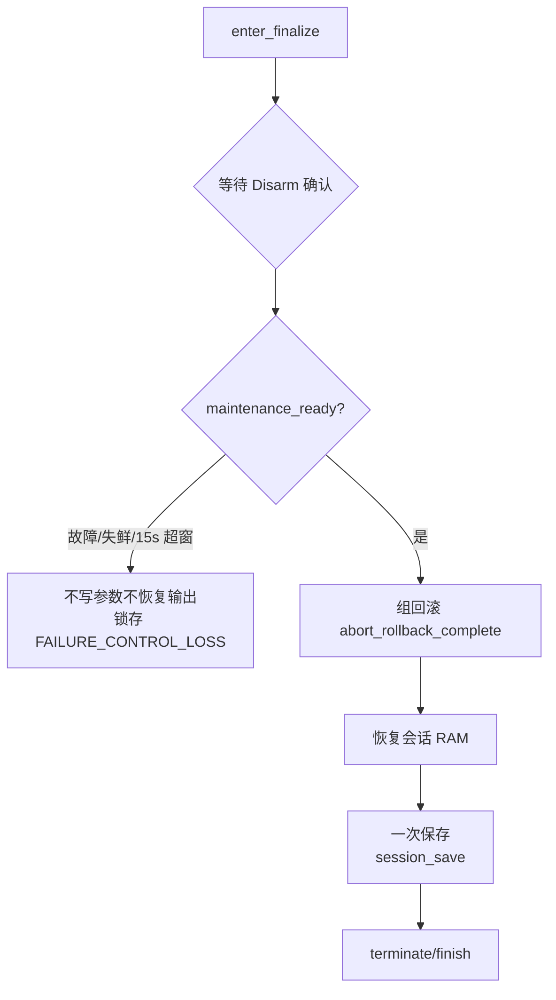
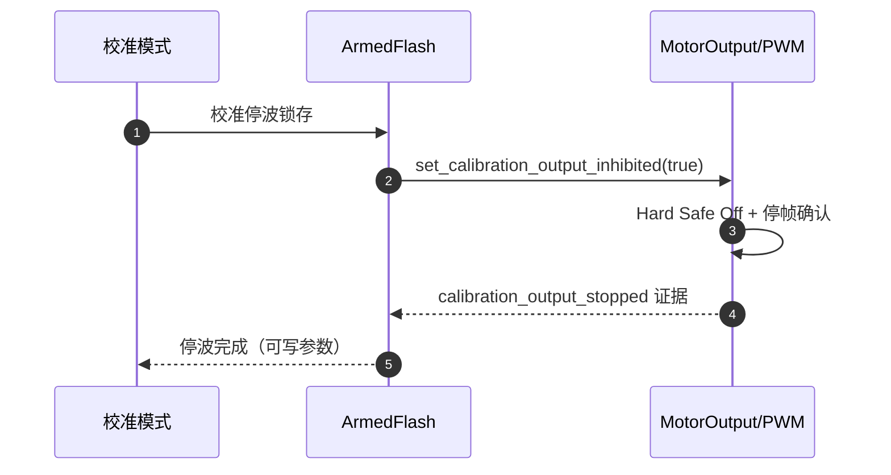
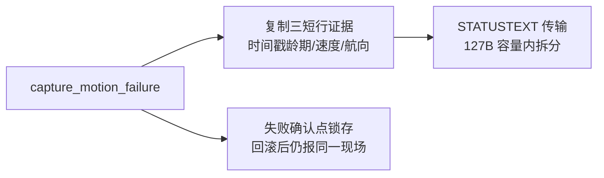

# 收尾与失败分类

## FINALIZE 族：一次收尾，三种结局

候选提交、用户取消、会话失败共用同一条收尾链：**停波/Disarm → 组回滚 → 按需恢复会话 RAM → 一次保存**。

<!-- Sources: Dima/rover/modes/auto_calibration/AutoCalibrationFinalize.cpp:15 -->

决策锁与握手链条不变（自 Mode.cpp 原样迁入）；`maintenance_ready` 要求 ArmedFlash 维护锁 + 输出后端确认。

## 停波确认链

<!-- Sources: Dima/platform/api/Flash.hpp:59, Dima/modules/motor/MotorOutput.cpp:15, Dima/modules/boot_health/BootHealthService.cpp:305 -->

Commander 故障 Disarm 会把 External1 切回 Manual，但**校准回滚仍需完成**——BootHealth 的 `calibration_rollback_safe` 例外窗口（30s、要求停波锁仍有效 + Hard Safe Off 证据）允许继续发行 Runtime 健康代次喂 IWDG，**绝不允许任何 PWM 恢复**（[BootHealthService.cpp:305](https://github.com/a1600778959/H743_FreeRTOS/blob/main/Dima/modules/boot_health/BootHealthService.cpp#L305)）。

## 失败枚举（uORB 契约）

| 枚举 | 含义 | 典型根因 |
|------|------|----------|
| `FAILURE_SENSOR_STALE` | 传感器失鲜 | GNSS/IMU 断流 |
| `FAILURE_FENCE_SPACE` | 越围栏 | 场地不足 |
| `FAILURE_PATH_UNOBSERVABLE` | 路径不可观测 | 参数钳位/前视圆过大 |
| `FAILURE_CONTROL_LOSS` | 控制丢失 | 105ms 调度抖动击穿自证（有消费端兜底） |
| `RESULT_CANCELLED` | 用户/上游取消 | 手动切模式（曾有误记为 FAILED 的通道，已防） |

完整枚举见 [AutoCalibrationStatus.msg](https://github.com/a1600778959/H743_FreeRTOS/blob/main/Dima/messages/schemas/AutoCalibrationStatus.msg)。

## 诊断报告

<!-- Sources: Dima/rover/modes/auto_calibration/AutoCalibrationDiagnostics.cpp:14 -->

`capture_motion_failure` 只在**失败确认点**复制证据（不新增周期采样）；年龄编码 -1=无样本、9999=约 10 秒封顶，防止失鲜时间撑爆 STATUSTEXT 正文。

## saved=0 是设计

保存成功后参数计数为 0（`saved=0x0`）是**统一保存设计**——所有变更已应用到活动层并由统一保存落盘，不是丢失。

## Related Pages

| Page | Relationship |
|------|-------------|
| [事务与组调度](./transactions-groups.md) | 回滚的执行者 |
| [Capability 契约与组合根](../07-platform/platform.md) | 停波窗口的契约层 |
| [BootHealth 喂狗策略](../05-modules/boot-health.md) | 回滚窗口的例外判定 |
