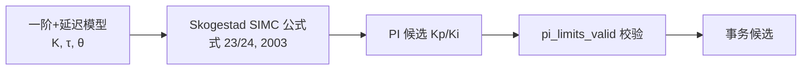
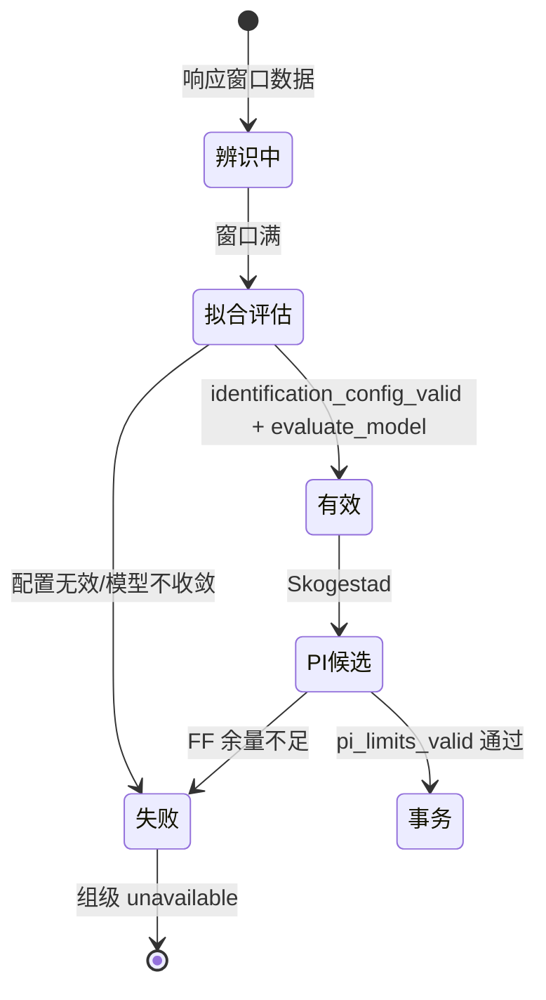

# 辨识与 PI 公式

## 辨识模型

被控对象建模为**一阶带延迟**：`G(s) = K·exp(-θs)/(τs+1)`。辨识器为 `FirstOrderDelayIdentifier`（ARX-RLS 带延迟 bank），输入是控制器整形前的归一化输入到车体响应——**单位与公共 PI 一致，E 只由公共混控施加一次**（第二套线性拟合与 PI 坐标换算已删）。

| 组件 | 职责 | Source |
|------|------|--------|
| `FirstOrderDelayIdentifier` | ARX-RLS 延迟 bank 拟合 K/τ/θ | [CalibrationIdentification.cpp](https://github.com/a1600778959/H743_FreeRTOS/blob/main/Dima/lib/rover/CalibrationIdentification.cpp) |
| `StepResponseValidator` | 阶跃响应有效性（超时/超调/平台） | 同上 |
| `calculate_inner_gains` | 由模型计算内环增益候选 | [AutoCalibrationIdentification.cpp:137](https://github.com/a1600778959/H743_FreeRTOS/blob/main/Dima/rover/modes/auto_calibration/AutoCalibrationIdentification.cpp#L137) |

## Skogestad 解析 PI

<!-- Sources: Dima/lib/rover/CalibrationIdentification.cpp, docs/AUTO_CALIBRATION_FORMULA_REMOVAL_ZH.md:1 -->

公式来源（有出处的替换，非发明）：Sigurd Skogestad, *Simple analytic rules for model reduction and PID controller tuning*, J. Process Control 13 (2003) 291–309，第 295 页式 (23)(24)；来源与勘误链接记录在 [FORMULA_REMOVAL 文档](https://github.com/a1600778959/H743_FreeRTOS/blob/main/docs/AUTO_CALIBRATION_FORMULA_REMOVAL_ZH.md)与 [DIMA_SOURCE_MANIFEST.md](https://github.com/a1600778959/H743_FreeRTOS/blob/main/docs/DIMA_SOURCE_MANIFEST.md)。FF 余量不足时组如实失败，**禁比例法**（不允许用经验比例凑 FF 缺口）。

## 候选校验链

<!-- Sources: Dima/lib/rover/CalibrationIdentification.cpp, Dima/rover/modes/auto_calibration/AutoCalibrationIdentification.cpp:137 -->

## 删除清单（防回潮）

| 已删除 | 理由 | Source |
|--------|------|--------|
| 控制器输入→电机输入第二套线性拟合 | 单位二义；直接辨识归一化输入到车体 | [FORMULA_REMOVAL](https://github.com/a1600778959/H743_FreeRTOS/blob/main/docs/AUTO_CALIBRATION_FORMULA_REMOVAL_ZH.md) |
| 斜率 0.1..10 门、能量残差 0.25% 门 | 无产品运行证据的先验硬门 | 同上 |
| PI 二次坐标换算 | 与公共 PI 单位合同冲突 | 同上 |
| 首轮转向/前馈/动态模型三处 20% 双向增益差门 | 妨碍有效样本利用；保留两方向各自有效性 | 同上 |

## 增益验证

候选经事务写入后由 [GainValidation](https://github.com/a1600778959/H743_FreeRTOS/blob/main/Dima/rover/modes/auto_calibration/AutoCalibrationGainValidation.cpp) 闭环验证（inner/heading 分窗），验证失败的组按依赖传播回滚——见 [事务与组调度](./transactions-groups.md)。

## Related Pages

| Page | Relationship |
|------|-------------|
| [激励与剖面观测](./excitation-profiling.md) | 辨识的数据来源 |
| [事务与组调度](./transactions-groups.md) | 候选的提交路径 |
| [RTK 与导航](./rtk-navigation.md) | 减速度候选的并行法则 |
