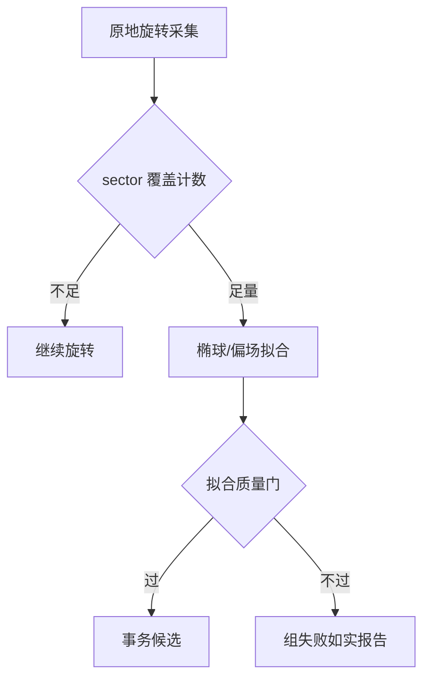
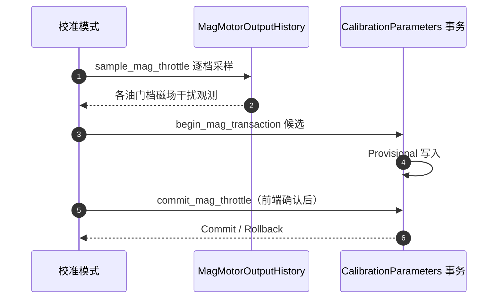

# 磁校准与磁油门补偿

## 两个目标

磁校准阶段回答两件事：① 磁力计本身准不准（偏场/椭球/扇区覆盖）；② 电机电流对磁场的干扰有多大（磁油门补偿）。

## 扇区采集

<!-- Sources: Dima/rover/modes/auto_calibration/AutoCalibrationMag.cpp:90 -->

`collect_mag(now, direction)` 按旋转方向采集（[AutoCalibrationMag.cpp:90](https://github.com/a1600778959/H743_FreeRTOS/blob/main/Dima/rover/modes/auto_calibration/AutoCalibrationMag.cpp#L90)），`sectors(mask)` 统计扇区覆盖；`finish_mag(bootstrap)` 判定采集完整性。

## 磁油门补偿事务

<!-- Sources: Dima/rover/modes/auto_calibration/AutoCalibrationMag.cpp:215, Dima/rover/modes/auto_calibration/AutoCalibrationMag.cpp:256, Dima/rover/modes/auto_calibration/AutoCalibrationTransactions.cpp:14 -->

合同：`begin_mag_transaction`/`commit_mag_throttle` 建立事务候选，**事务身份由调度器统一登记**——阶段文件不自行管理事务生命周期（[Mag.cpp:49](https://github.com/a1600778959/H743_FreeRTOS/blob/main/Dima/rover/modes/auto_calibration/AutoCalibrationMag.cpp#L49) 注释）。

## 反向冲量的双用途历史

`MagMotorOutputHistory` 的 32 条环形输出历史服务两个观测：

| 消费 | 用途 | Source |
|------|------|--------|
| 磁油门补偿 | 各油门档的磁场干扰曲线 | [Mag.cpp:215](https://github.com/a1600778959/H743_FreeRTOS/blob/main/Dima/rover/modes/auto_calibration/AutoCalibrationMag.cpp#L215) |
| 制动输入增益 | `reverse_impulse` 反向冲量 J | [MagMotorOutputHistory.hpp:17](https://github.com/a1600778959/H743_FreeRTOS/blob/main/Dima/modules/sensors/magnetometer/MagMotorOutputHistory.hpp#L17) |

## 模式内磁参数与全局参数的边界

| 参数 | 归属 | 说明 |
|------|------|------|
| 磁偏场/椭球 | 传感器校准域 | 由 [VehicleMagnetometer](https://github.com/a1600778959/H743_FreeRTOS/blob/main/Dima/modules/sensors/magnetometer/VehicleMagnetometer.cpp) 与 SensorCalibration 管理 |
| 磁油门补偿 | 校准会话事务 | 候选制，失败回滚 |
| 电机 MIN/EXPO/ASYM | **不归校准管**——候选设计器已删（无产品运行调用） | [FORMULA_REMOVAL](https://github.com/a1600778959/H743_FreeRTOS/blob/main/docs/AUTO_CALIBRATION_FORMULA_REMOVAL_ZH.md) |

## 磁身份统一

磁场来源节点号不再走 `MAG1_CAN_NODE` 参数——由首个合法磁场广播推断（[middleware/parameters/README.md](https://github.com/a1600778959/H743_FreeRTOS/blob/main/Dima/middleware/parameters/README.md)），DroneCAN 设备身份见 [DroneCAN 链路](../08-drivers/dronecan.md)。

## Related Pages

| Page | Relationship |
|------|-------------|
| [事务与组调度](./transactions-groups.md) | 事务机细节 |
| [UM982 链路](../08-drivers/um982.md) | 航向替代来源（磁失效时） |
| [会话生命周期](./session-lifecycle.md) | MAGNETIC 阶段的位置 |
