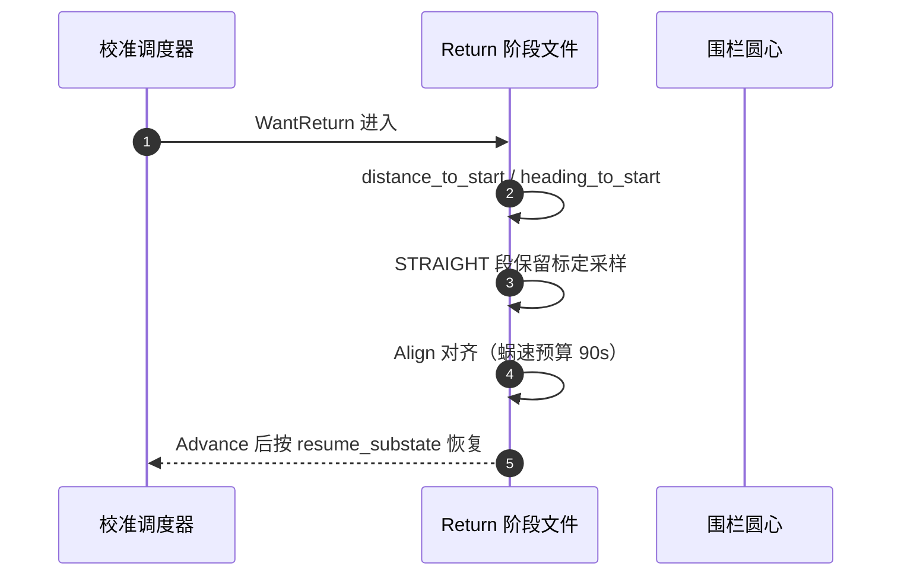

# RTK 与校准导航

## RTK 在校准里的三个角色

| 角色 | 内容 | Source |
|------|------|--------|
| 速度观测 | 停车确认（位置静止滑窗）、减速度候选 | [AutoCalibrationRtk.cpp:480](https://github.com/a1600778959/H743_FreeRTOS/blob/main/Dima/rover/modes/auto_calibration/AutoCalibrationRtk.cpp#L480) |
| 能力观测 | 最大速度候选（上界通过=删失观测，不反解等式） | [AutoCalibrationRtk.cpp:230](https://github.com/a1600778959/H743_FreeRTOS/blob/main/Dima/rover/modes/auto_calibration/AutoCalibrationRtk.cpp#L230) |
| 航向基准 | rtk_yaw_fused 一致性 + 返场基准 | [Gates.cpp:16](https://github.com/a1600778959/H743_FreeRTOS/blob/main/Dima/rover/modes/auto_calibration/AutoCalibrationGates.cpp#L16) |

## 速度解振铃教训（位置法唯一法则）

实车曾连续两天出现"制动倒退 -0.35 m/s"假象——根因是 GNSS 速度解在急停时振铃（轮端已零、航向稳）。定案修复：

```mermaid
flowchart LR
  V[GNSS 速度解] --> NEG[负历元判据: 已删]
  V --> POS[位置法候选:<br>min(Δv/Δt, v0²/2d)]
  POS --> STOP[停稳门: 位置静止滑窗]
  STOP --> OK[减速度候选]
```
<!-- Sources: Dima/rover/modes/auto_calibration/AutoCalibrationRtk.cpp:480, docs/AUTO_CALIBRATION_STATE_MACHINE_ZH.md:1 -->

时间法被实证虚高 2×；**位置法（位移交叉校验）是减速度候选的唯一法则**，负历元判据已删。

## rtk_yaw_fused 与旋转自锁

已定案问题：`rtk_yaw_fused` 的 5° 一致性检查在旋转速度下抖动，会清零稳定窗造成自锁（6 圈 = 每向 1 圈 + bias 窗跑满 45s 帽的定案与此相关）。圆均值带浓度判据（[CalibrationMath.hpp](https://github.com/a1600778959/H743_FreeRTOS/blob/main/Dima/lib/rover/CalibrationMath.hpp)）用于野点剔除——返程 rocking（速度矢量 180° 逐历元翻转野点）曾击穿 finish_rtk 的 0.998 圆均值门。

## 返场（Return）


<!-- Sources: Dima/rover/modes/auto_calibration/AutoCalibrationReturn.cpp:13, Dima/rover/modes/auto_calibration/AutoCalibrationNavigation.cpp:11 -->

返场按**入场 GNSS 点（围栏圆心）**返回；超时/传感器失败经 `abort_step` 上抛。实车教训：Align 蜗速 2°/s × 90s 预算耗尽曾导致整场 TIMEOUT（RTK 健康、恒差 16.8° = 安装偏置）。

## 路径验证（官方调参法）

| 项 | 合同 | Source |
|----|------|--------|
| 共享实现 | `update_segment`/PurePursuit/Heading/Driving 与 AutoMode 完全同源 | [AutoCalibrationPath.cpp:276](https://github.com/a1600778959/H743_FreeRTOS/blob/main/Dima/rover/modes/auto_calibration/AutoCalibrationPath.cpp#L276) |
| jerk 观测 | 直接用 EKF 车辆参考点 NED 加速度逐历元投影，不用天线二次差分 | [OFFICIAL_TUNING_PLAN](https://github.com/a1600778959/H743_FreeRTOS/blob/main/docs/AUTO_CALIBRATION_OFFICIAL_TUNING_PLAN_ZH.md) |
| RED 能力 | 上界通过=删失观测；四点路径观察转弯能力 | 同上 |
| 观测不足 | 不进入搜索收缩；超时=未完成（不误判能力边界） | 同上 |

## Related Pages

| Page | Relationship |
|------|-------------|
| [UM982 链路](../08-drivers/um982.md) | 速度/航向的生产端与配对规则 |
| [制动接管](../03-rover-domain/braking-takeover.md) | 减速度候选的消费方 |
| [收尾与失败分类](./finalize-failures.md) | 返场失败的上抛处置 |
