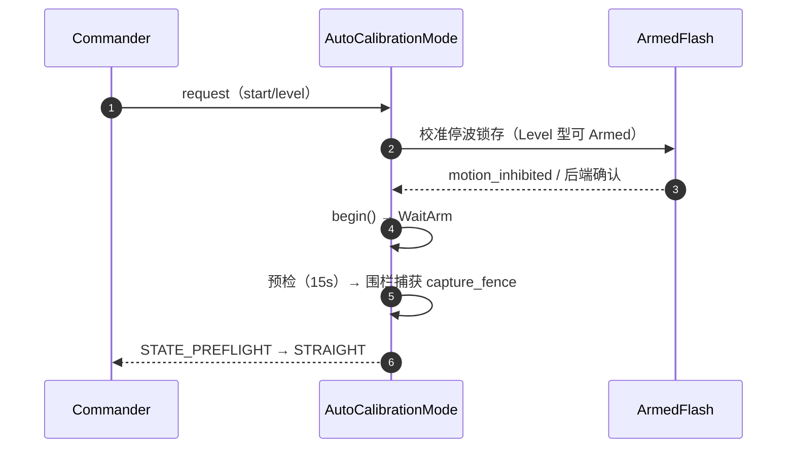
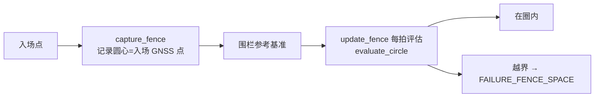

# 会话生命周期

## SessionController：唯一状态属主

校准模式压平后，所有"进行到哪了"的状态收敛进 `SessionController`（内部结构，非 uORB）：子状态、事务身份、停车意图、直行方向、轮次、回滚标记。外部世界只看到 11 个 uORB 状态（[AutoCalibrationStatus.msg](https://github.com/a1600778959/H743_FreeRTOS/blob/main/Dima/messages/schemas/AutoCalibrationStatus.msg)）。

| 字段族 | 内容 | Source |
|--------|------|--------|
| `substate` / `substate_started` | PhaseSubstate{WaitArm,Running,TurnAround,Return,Braking,WaitStop,Evaluate} + 时间戳 | [AutoCalibrationMode.hpp:94](https://github.com/a1600778959/H743_FreeRTOS/blob/main/Dima/rover/modes/auto_calibration/AutoCalibrationMode.hpp#L94) |
| `kind` / `transaction_stages` | 当前事务身份（Level/Rtk/Dynamics/Magnetic/…/Gains） | [Transactions.cpp:14](https://github.com/a1600778959/H743_FreeRTOS/blob/main/Dima/rover/modes/auto_calibration/AutoCalibrationTransactions.cpp#L14) |
| `stop_intent` | None/Braking/RtkCommit | 同上 |
| `straight_outward` / `turn_direction` / `turn_round` | 运动几何记忆 | [Fence.cpp:30](https://github.com/a1600778959/H743_FreeRTOS/blob/main/Dima/rover/modes/auto_calibration/AutoCalibrationFence.cpp#L30) |
| `force_rollback` / `abort_reason` / `abort_group` | 失败会计 | [GroupScheduler.cpp:10](https://github.com/a1600778959/H743_FreeRTOS/blob/main/Dima/rover/modes/auto_calibration/AutoCalibrationGroupScheduler.cpp#L10) |

## 启动序列

<!-- Sources: Dima/rover/modes/auto_calibration/AutoCalibrationMode.hpp:94, Dima/rover/modes/auto_calibration/AutoCalibrationFence.cpp:30, Dima/platform/api/Flash.hpp:59 -->

## WaitArm 四合一

历史上四套 WaitArm 等待逻辑（模式内/Commander 侧/恢复路径/取消路径）合并为一个 `step_wait_arm`——RequestExit 单发、请求不重发、臂态与停波窗统一判定。

## 围栏捕获

<!-- Sources: Dima/rover/modes/auto_calibration/AutoCalibrationFence.cpp:30, Dima/lib/rover/CalibrationFence.cpp:67 -->

围栏语义（上车指南强调过）：`RO_CAL_DIST` 约束直线、`RO_CAL_RADIUS` 约束转圈与二维路径，参考入场固定 GNSS 点——**不是全程物理安全围栏**。

## 会话失败与恢复

| 事件 | 处置 | Source |
|------|------|--------|
| 预检失败 | 终止会话，报告原因 | [Gates.cpp:16](https://github.com/a1600778959/H743_FreeRTOS/blob/main/Dima/rover/modes/auto_calibration/AutoCalibrationGates.cpp#L16) |
| 传感器失鲜 | 组级 unavailable（不中断整场） | [GroupScheduler.cpp:10](https://github.com/a1600778959/H743_FreeRTOS/blob/main/Dima/rover/modes/auto_calibration/AutoCalibrationGroupScheduler.cpp#L10) |
| REQUEST_EXIT | 单发发布；Commander 握手期只 Disarm 不切模式 | [CommanderAutoCalibration.cpp:34](https://github.com/a1600778959/H743_FreeRTOS/blob/main/Dima/modules/safety/CommanderAutoCalibration.cpp#L34) |
| 会话级失败 | enter_finalize → 回滚 → 一次保存 | [Finalize.cpp:15](https://github.com/a1600778959/H743_FreeRTOS/blob/main/Dima/rover/modes/auto_calibration/AutoCalibrationFinalize.cpp#L15) |

## Related Pages

| Page | Relationship |
|------|-------------|
| [状态机总览](./state-machine.md) | 本页是状态机的深读 |
| [事务与组调度](./transactions-groups.md) | 事务身份如何挂到会话上 |
| [收尾与失败分类](./finalize-failures.md) | 会话的最终处置 |
