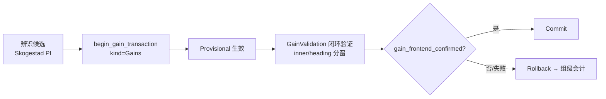

# 阶段深读：GainParameters.cpp

`AutoCalibrationGainParameters.cpp`（54 行）是增益组事务的**接线文件**：事务开启、前端确认、控制器就绪三件事。

## 函数地图

| 函数 | 职责 | Source |
|------|------|--------|
| `begin_gain_transaction(now, group)` | 开启增益组事务（按组位） | [GainParameters.cpp:18](https://github.com/a1600778959/H743_FreeRTOS/blob/main/Dima/rover/modes/auto_calibration/AutoCalibrationGainParameters.cpp#L18) |
| `gain_frontend_confirmed` | 增益前端确认（差速层对新增益的确认） | [GainParameters.cpp:35](https://github.com/a1600778959/H743_FreeRTOS/blob/main/Dima/rover/modes/auto_calibration/AutoCalibrationGainParameters.cpp#L35) |
| `gain_controller_ready` | 增益控制器就绪（验证闭环可用） | [GainParameters.cpp:44](https://github.com/a1600778959/H743_FreeRTOS/blob/main/Dima/rover/modes/auto_calibration/AutoCalibrationGainParameters.cpp#L44) |

## 在增益链中的位置

<!-- Sources: Dima/rover/modes/auto_calibration/AutoCalibrationGainParameters.cpp:18, Dima/rover/modes/auto_calibration/AutoCalibrationGainValidation.cpp:1, Dima/rover/modes/auto_calibration/AutoCalibrationTransactions.cpp:14 -->

## 与组调度的关系

增益组依赖 IMU/磁组（依赖位在 `kGroupSteps` 表）；本文件不感知依赖——依赖由 [GroupScheduler](https://github.com/a1600778959/H743_FreeRTOS/blob/main/Dima/rover/modes/auto_calibration/AutoCalibrationGroupScheduler.cpp) 的 `group_entry_available` 把关（进场门禁：依赖未完成/unavailable 都不许入场）。

**文件小的原因**：v4 重构后"事务推进"全部收敛到 Transactions.cpp 统一事务机，阶段文件只保留本阶段特有的确认判据——这是"阶段文件只返回 StepResult、不自行 transition()"合同的直接体现。

## Related Pages

| Page | Relationship |
|------|-------------|
| [事务与组调度](./transactions-groups.md) | 事务机与组依赖 |
| [辨识与 PI 公式](./identification-pi.md) | 候选来源 |
| [收尾与失败分类](./finalize-failures.md) | 回滚收尾 |
