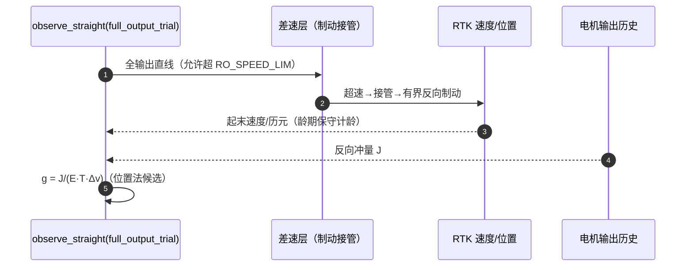

# 阶段深读：Rtk.cpp

`AutoCalibrationRtk.cpp`（569 行）是实验动作的**唯一实现地**：所有直线/制动/转角实验动作都以 `StepResult` 函数形式在这里（[AutoCalibrationRtk.cpp](https://github.com/a1600778959/H743_FreeRTOS/blob/main/Dima/rover/modes/auto_calibration/AutoCalibrationRtk.cpp)）。

## 函数地图

| 函数 | 行 | 职责 | Source |
|------|-----|------|--------|
| `baseline_collect` | 18 | 基线采集（静态观测窗） | [Rtk.cpp:18](https://github.com/a1600778959/H743_FreeRTOS/blob/main/Dima/rover/modes/auto_calibration/AutoCalibrationRtk.cpp#L18) |
| `straight_leg` | 40 | 直线段执行（去程/返程共用） | [Rtk.cpp:40](https://github.com/a1600778959/H743_FreeRTOS/blob/main/Dima/rover/modes/auto_calibration/AutoCalibrationRtk.cpp#L40) |
| `observe_straight` | 88 | 直线观测（含 `full_output_trial` 全输出试验） | [Rtk.cpp:88](https://github.com/a1600778959/H743_FreeRTOS/blob/main/Dima/rover/modes/auto_calibration/AutoCalibrationRtk.cpp#L88) |
| `speed_model_leg` | 144 | 速度模型段 | [Rtk.cpp:144](https://github.com/a1600778959/H743_FreeRTOS/blob/main/Dima/rover/modes/auto_calibration/AutoCalibrationRtk.cpp#L144) |
| `request_turn_rate` / `stop_turn_rate_request` | 257/241 | 转向激励请求 | [Rtk.cpp:257](https://github.com/a1600778959/H743_FreeRTOS/blob/main/Dima/rover/modes/auto_calibration/AutoCalibrationRtk.cpp#L257) |
| `straight_turnaround` | 358 | 直线掉头 | [Rtk.cpp:358](https://github.com/a1600778959/H743_FreeRTOS/blob/main/Dima/rover/modes/auto_calibration/AutoCalibrationRtk.cpp#L358) |
| `turn_spin` | 377 | 原地转圈 | [Rtk.cpp:377](https://github.com/a1600778959/H743_FreeRTOS/blob/main/Dima/rover/modes/auto_calibration/AutoCalibrationRtk.cpp#L377) |
| `finish_rtk` | 480 | RTK 组收口判定 | [Rtk.cpp:480](https://github.com/a1600778959/H743_FreeRTOS/blob/main/Dima/rover/modes/auto_calibration/AutoCalibrationRtk.cpp#L480) |

## 全输出制动试验的数据流

<!-- Sources: Dima/rover/modes/auto_calibration/AutoCalibrationRtk.cpp:88, Dima/rover/control/RoverDifferentialBraking.cpp:8, Dima/modules/sensors/magnetometer/MagMotorOutputHistory.hpp:17 -->

## 关键判据（源码注释即合同）

- **能力观测是删失的**：最大速度候选（[Rtk.cpp:230](https://github.com/a1600778959/H743_FreeRTOS/blob/main/Dima/rover/modes/auto_calibration/AutoCalibrationRtk.cpp#L230)）达到合法上界只证明"不低于"，不反解等式；候选有效性检查 `isfinite && >0 && ≤100`。
- **停稳 = 位置静止滑窗**（负历元判据已删，时间法虚高 2×已弃用）。
- 圆均值 0.998 门配浓度判据防返程 rocking 野点（[CalibrationMath.hpp](https://github.com/a1600778959/H743_FreeRTOS/blob/main/Dima/lib/rover/CalibrationMath.hpp)）。

## Related Pages

| Page | Relationship |
|------|-------------|
| [RTK 与校准导航](./rtk-navigation.md) | 本页的上层概念 |
| [制动接管](../03-rover-domain/braking-takeover.md) | 执行层 |
| [激励与剖面观测](./excitation-profiling.md) | 观测窗口机制 |
