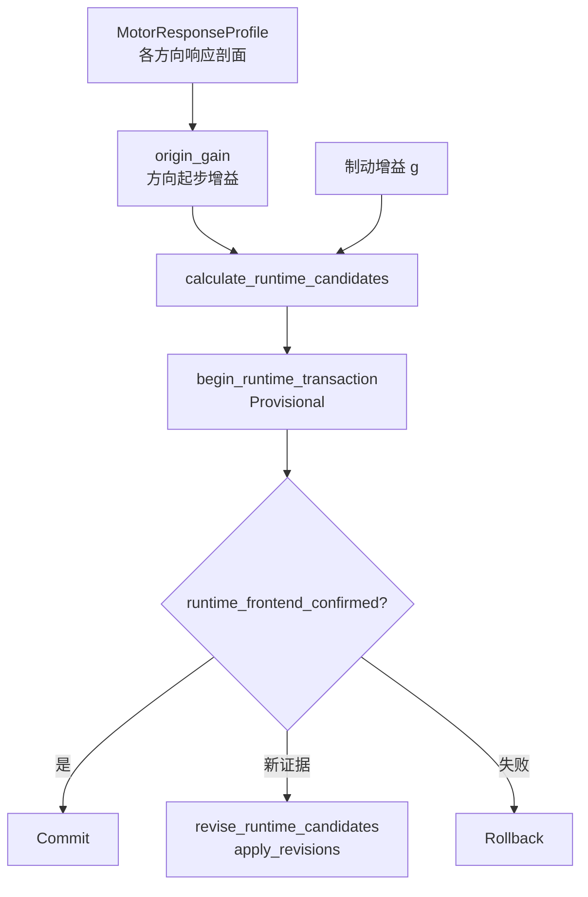

# 阶段深读：RuntimeParameters.cpp

`AutoCalibrationRuntimeParameters.cpp`（163 行）把响应观测转成**运行参数候选**并走事务。

## 函数地图

| 函数 | 职责 | Source |
|------|------|--------|
| `origin_gain`（静态） | 从 MotorResponseProfile 提取某方向起步增益 | [RuntimeParameters.cpp:14](https://github.com/a1600778959/H743_FreeRTOS/blob/main/Dima/rover/modes/auto_calibration/AutoCalibrationRuntimeParameters.cpp#L14) |
| `calculate_runtime_candidates` | 汇总生成运行参数候选 | [RuntimeParameters.cpp:44](https://github.com/a1600778959/H743_FreeRTOS/blob/main/Dima/rover/modes/auto_calibration/AutoCalibrationRuntimeParameters.cpp#L44) |
| `begin_runtime_transaction` | 开启 Runtime 事务 | [RuntimeParameters.cpp:99](https://github.com/a1600778959/H743_FreeRTOS/blob/main/Dima/rover/modes/auto_calibration/AutoCalibrationRuntimeParameters.cpp#L99) |
| `runtime_frontend_confirmed` | 前端确认判据 | [RuntimeParameters.cpp:129](https://github.com/a1600778959/H743_FreeRTOS/blob/main/Dima/rover/modes/auto_calibration/AutoCalibrationRuntimeParameters.cpp#L129) |
| `revise_runtime_candidates` | 修订候选（apply_revisions 路径） | [RuntimeParameters.cpp:140](https://github.com/a1600778959/H743_FreeRTOS/blob/main/Dima/rover/modes/auto_calibration/AutoCalibrationRuntimeParameters.cpp#L140) |

## 候选流水线

<!-- Sources: Dima/rover/modes/auto_calibration/AutoCalibrationRuntimeParameters.cpp:14, Dima/rover/modes/auto_calibration/AutoCalibrationRuntimeParameters.cpp:44 -->

## 语义要点

- **起步下限来自实测**：`origin_gain` 只从有效响应剖面提取（起步增益=实测平台），不从理论推——对应 `MOT_THR_MIN` 语义（[params yaml](https://github.com/a1600778959/H743_FreeRTOS/blob/main/Dima/middleware/parameters/definitions/module_rover_actuator_params.yaml)）。
- **revise 路径**：同会话内新证据到达时用 `apply_revisions` 修订而非重新开事务——候选代次连续，前端确认不重置。
- 事务身份由调度器统一登记（`TransactionKind::Runtime`），本文件只提供候选与确认判据。

## Related Pages

| Page | Relationship |
|------|-------------|
| [事务与组调度](./transactions-groups.md) | 事务机本体 |
| [辨识与 PI 公式](./identification-pi.md) | 候选数学 |
| [差速驱动与控制环](../03-rover-domain/differential-drive.md) | 起步下限的消费方 |
