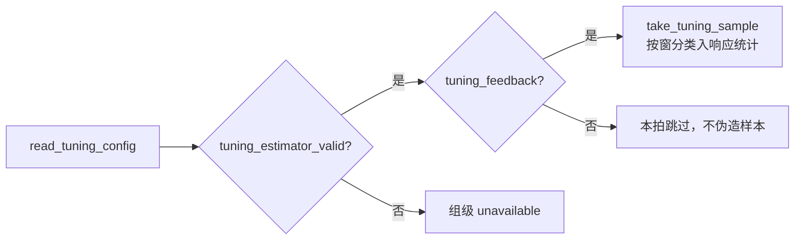

# 阶段深读：Tuning.cpp

`AutoCalibrationTuning.cpp`（104 行）承载调参实验的反馈通路：读配置 → 验估计器 → 采样。

## 函数地图

| 函数 | 职责 | Source |
|------|------|--------|
| `read_tuning_config` | 读取本轮调参实验配置 | [Tuning.cpp:17](https://github.com/a1600778959/H743_FreeRTOS/blob/main/Dima/rover/modes/auto_calibration/AutoCalibrationTuning.cpp#L17) |
| `body_yaw` | 车体偏航角提取 | [Tuning.cpp:55](https://github.com/a1600778959/H743_FreeRTOS/blob/main/Dima/rover/modes/auto_calibration/AutoCalibrationTuning.cpp#L55) |
| `tuning_estimator_valid` | 估计器有效性门（新鲜度/状态） | [Tuning.cpp:62](https://github.com/a1600778959/H743_FreeRTOS/blob/main/Dima/rover/modes/auto_calibration/AutoCalibrationTuning.cpp#L62) |
| `tuning_feedback` | 反馈有效性（速度/角速度可观测） | [Tuning.cpp:81](https://github.com/a1600778959/H743_FreeRTOS/blob/main/Dima/rover/modes/auto_calibration/AutoCalibrationTuning.cpp#L81) |
| `take_tuning_sample` | 逐拍采样（区分速度/角速度窗） | [Tuning.cpp:92](https://github.com/a1600778959/H743_FreeRTOS/blob/main/Dima/rover/modes/auto_calibration/AutoCalibrationTuning.cpp#L92) |

## 采样通路

<!-- Sources: Dima/rover/modes/auto_calibration/AutoCalibrationTuning.cpp:17 -->

**跳过而非伪造**：估计器或反馈无效的拍不产生样本——这与"观测不足不进入搜索收缩"的官方调参原则一致（[OFFICIAL_TUNING_PLAN](https://github.com/a1600778959/H743_FreeRTOS/blob/main/docs/AUTO_CALIBRATION_OFFICIAL_TUNING_PLAN_ZH.md)）。

## 与 GainValidation 的接力

调参实验产生的观测由增益验证阶段消费（[GainValidation.cpp](https://github.com/a1600778959/H743_FreeRTOS/blob/main/Dima/rover/modes/auto_calibration/AutoCalibrationGainValidation.cpp) 的 inner/heading 分窗闭环验证）；`body_yaw` 等公共提取函数保持与导航实验同一坐标合同。

## Related Pages

| Page | Relationship |
|------|-------------|
| [辨识与 PI 公式](./identification-pi.md) | 候选生成 |
| [激励与剖面观测](./excitation-profiling.md) | 窗口机制 |
| [事务与组调度](./transactions-groups.md) | 验证失败的处理 |
