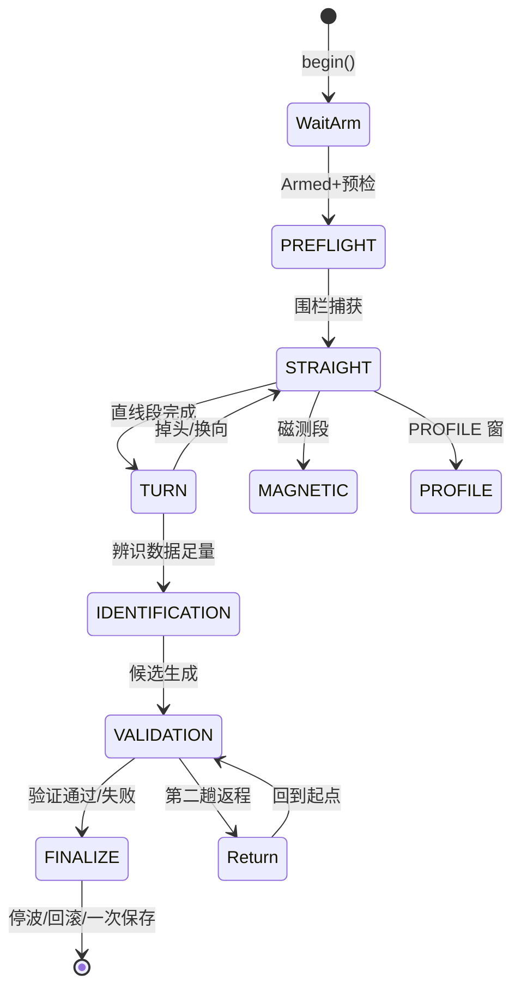
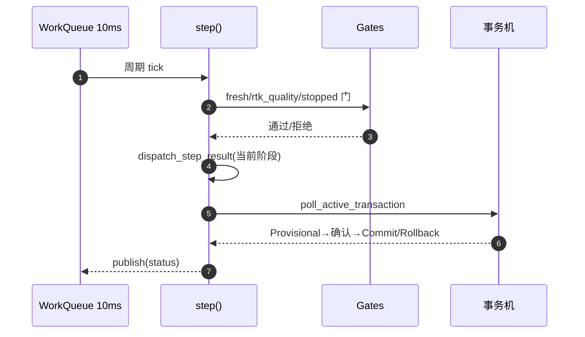
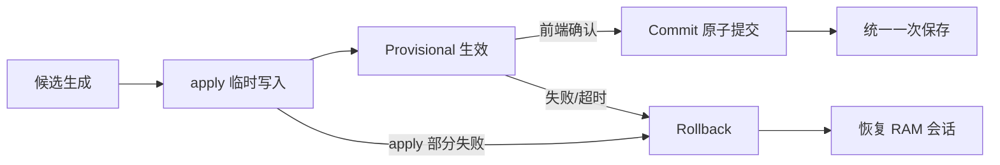
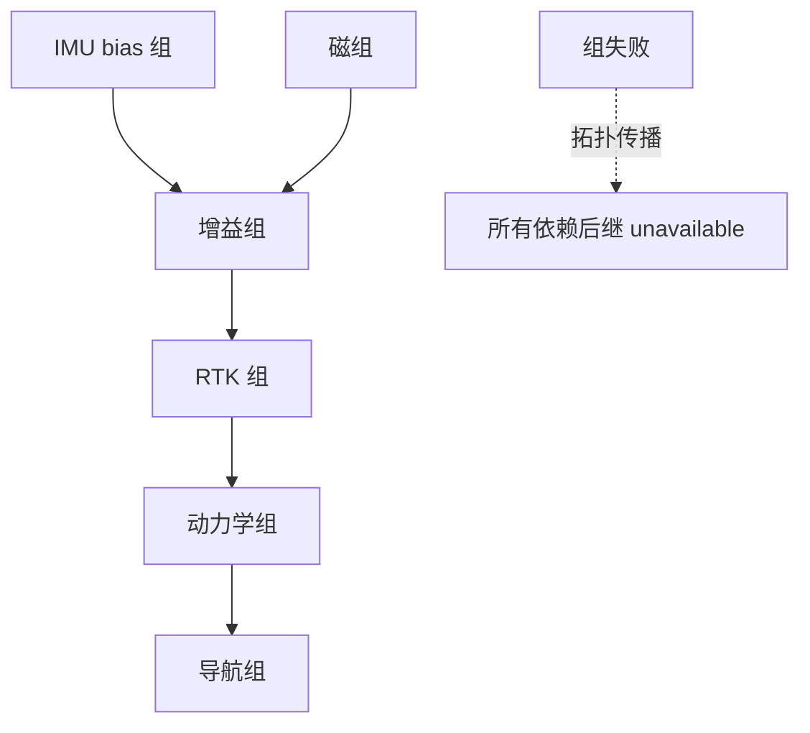

# 自动校准状态机

这是全仓库复杂度中心。历史上它经历过从 47 状态到 11 状态的整体替换（v4），再拆分为职责文件；本页描述当前形态。

## 结构总览

| 文件 | 职责 | Source |
|------|------|--------|
| `AutoCalibrationMode.cpp/.hpp` | 调度器主循环、状态属主 `SessionController` | [AutoCalibrationMode.hpp:94](https://github.com/a1600778959/H743_FreeRTOS/blob/main/Dima/rover/modes/auto_calibration/AutoCalibrationMode.hpp#L94) |
| `AutoCalibrationTransactions.cpp` | 统一事务机（apply/poll/rollback） | [Transactions.cpp:14](https://github.com/a1600778959/H743_FreeRTOS/blob/main/Dima/rover/modes/auto_calibration/AutoCalibrationTransactions.cpp#L14) |
| `AutoCalibrationGates.cpp` | 测量/安全门谓词（fresh/rtk_quality/stopped…） | [Gates.cpp:16](https://github.com/a1600778959/H743_FreeRTOS/blob/main/Dima/rover/modes/auto_calibration/AutoCalibrationGates.cpp#L16) |
| `AutoCalibrationGroupScheduler.cpp` | 组依赖与失败会计 | [GroupScheduler.cpp:8](https://github.com/a1600778959/H743_FreeRTOS/blob/main/Dima/rover/modes/auto_calibration/AutoCalibrationGroupScheduler.cpp#L8) |
| `AutoCalibrationReturn.cpp` | 返场阶段（按围栏圆心返回） | [Return.cpp:13](https://github.com/a1600778959/H743_FreeRTOS/blob/main/Dima/rover/modes/auto_calibration/AutoCalibrationReturn.cpp#L13) |
| `AutoCalibrationBraking.cpp` | 制动观测 helper | [Braking.cpp:14](https://github.com/a1600778959/H743_FreeRTOS/blob/main/Dima/rover/modes/auto_calibration/AutoCalibrationBraking.cpp#L14) |
| `AutoCalibrationFinalize.cpp` | FINALIZE 族（停波/回滚/保存） | [Finalize.cpp:15](https://github.com/a1600778959/H743_FreeRTOS/blob/main/Dima/rover/modes/auto_calibration/AutoCalibrationFinalize.cpp#L15) |
| `AutoCalibrationDiagnostics.cpp` | 失败现场捕获与 STATUSTEXT 报告 | [Diagnostics.cpp:13](https://github.com/a1600778959/H743_FreeRTOS/blob/main/Dima/rover/modes/auto_calibration/AutoCalibrationDiagnostics.cpp#L13) |
| `CalibrationParameters.cpp/.hpp` | 候选参数事务机（Provisional→Commit/Rollback） | [CalibrationParameters.hpp:1](https://github.com/a1600778959/H743_FreeRTOS/blob/main/Dima/rover/modes/auto_calibration/CalibrationParameters.hpp#L1) |

权威合同正文在 [Dima/rover/modes/README.md](https://github.com/a1600778959/H743_FreeRTOS/blob/main/Dima/rover/modes/README.md)（调度合同一节）；头文件只保留声明。

## 状态模型

<!-- Sources: Dima/rover/modes/auto_calibration/AutoCalibrationMode.hpp:1, Dima/rover/modes/auto_calibration/AutoCalibrationMode.cpp:1 -->

外层是 11 个 uORB 状态（`AutoCalibrationStatus.msg`）；内层由 `SessionController` 管理 `PhaseSubstate{WaitArm, Running, TurnAround, Return, Braking, WaitStop, Evaluate}` 与 `StepResult{Busy, Advance, WantTurn, WantBrake, WantReturn, WantStop, Failed, Abort}`——**阶段文件只返回 StepResult，禁止自行 transition()**（调度合同核心条款）。

## 调度节奏

<!-- Sources: Dima/rover/modes/auto_calibration/AutoCalibrationMode.hpp:94, Dima/rover/modes/auto_calibration/AutoCalibrationTransactions.cpp:14 -->

调度周期 20ms→10ms（[AutoCalibrationMode.hpp:94](https://github.com/a1600778959/H743_FreeRTOS/blob/main/Dima/rover/modes/auto_calibration/AutoCalibrationMode.hpp#L94)），为制动观测提供足够历元密度。

## 事务机（候选参数的生死路径）

<!-- Sources: Dima/rover/modes/auto_calibration/AutoCalibrationTransactions.cpp:14, Dima/middleware/parameters/flashfs.cpp:434 -->

关键不变量：候选先登记身份再写入（apply 可能部分失败进 Rollback）；`saved=0` 是统一保存设计不是 bug；FAILURE_STORAGE 不降级。

## 组调度与失败会计

<!-- Sources: Dima/rover/modes/auto_calibration/AutoCalibrationGroupScheduler.cpp:8 -->

`group_dependents` 按拓扑序单遍扫描：依赖失败组的后继全部计入失败，不允许"假装可独立完成"。

## 与安全链的握手

校准启停由 Commander 仲裁（[CommanderAutoCalibration.cpp:34](https://github.com/a1600778959/H743_FreeRTOS/blob/main/Dima/modules/safety/CommanderAutoCalibration.cpp#L34)）：Level 型校准允许在 Armed 状态进入停波窗口（[Flash.hpp:59](https://github.com/a1600778959/H743_FreeRTOS/blob/main/Dima/platform/api/Flash.hpp#L59)），但要求 PWM 后端确认物理停波；回滚收尾期间 BootHealth 维持运行健康判定（[BootHealthService.cpp:305](https://github.com/a1600778959/H743_FreeRTOS/blob/main/Dima/modules/boot_health/BootHealthService.cpp#L305)）。

## 两类门公理（设计原则）

- **动力学量是被测对象**：速度/角速度/加速度上限不允许先验硬门，只允许行为调整——否则校准器把探测判据当成了工作点。
- **硬门只留车辆无关物理量**：位置（围栏）、IMU 质量、操作者输入，且测量源必须不振铃。

## Related Pages

| Page | Relationship |
|------|-------------|
| [差速控制栈](../03-rover-domain/control-stack.md) | 制动观测的执行层 |
| [中间件服务](../06-middleware/middleware.md) | 候选事务的存储路径 |
| [Capability 契约与组合根](../07-platform/platform.md) | ArmedFlash 停波窗口 |
