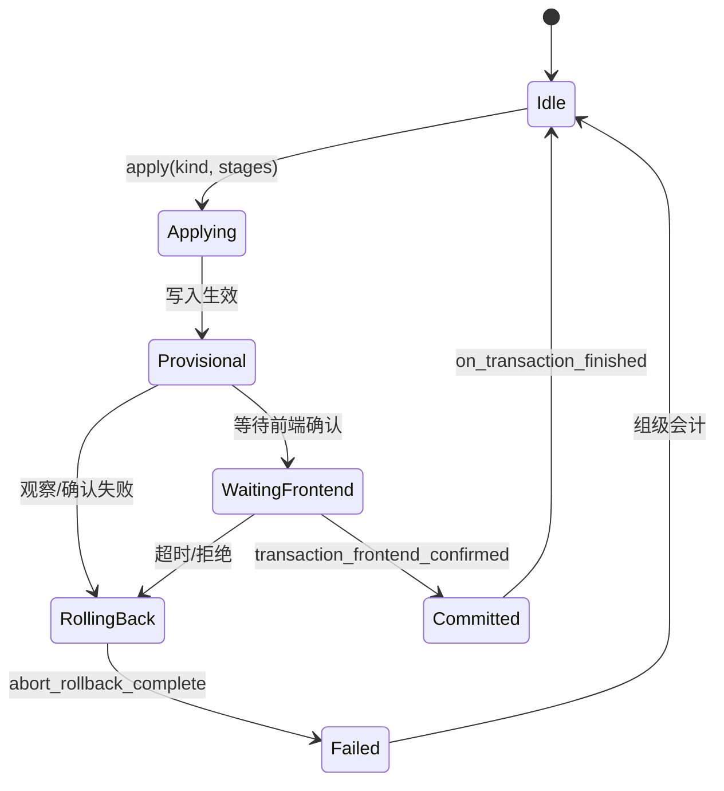
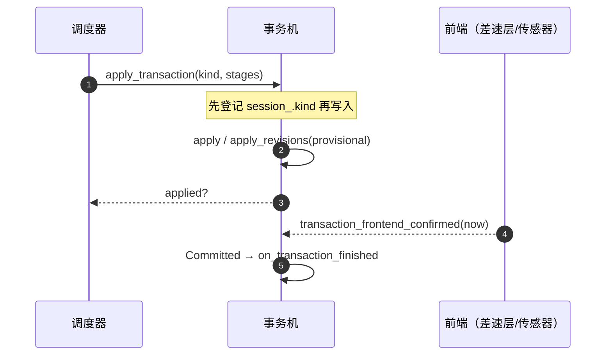
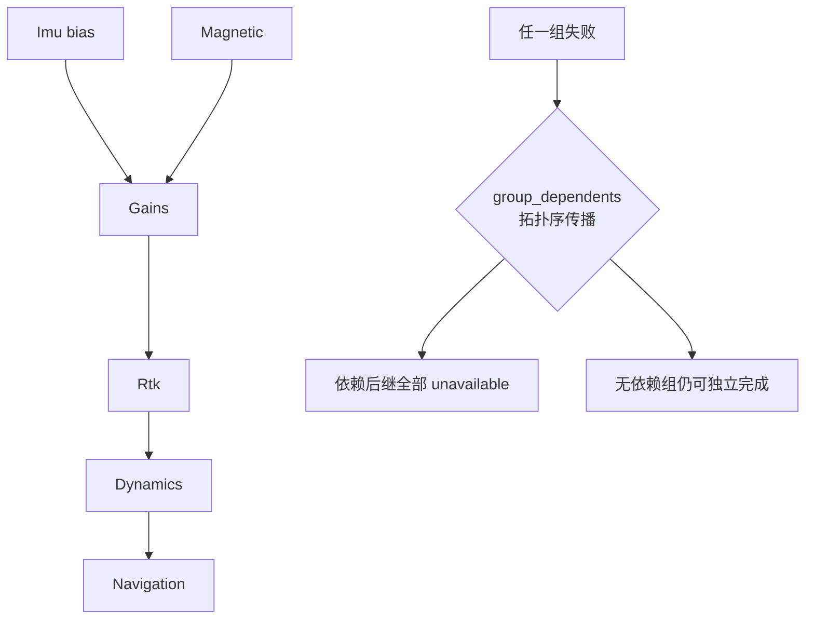

# 事务与组调度

## 事务机：候选参数的生死合同

校准产出的参数**永远不直接写**——走 `CalibrationParameters` 事务机：临时写入（Provisional）→ 生效观察 → 前端确认 → 原子提交；任何失败统一回滚。

<!-- Sources: Dima/rover/modes/auto_calibration/CalibrationParameters.hpp:20, Dima/rover/modes/auto_calibration/AutoCalibrationTransactions.cpp:14 -->

## 身份先行

<!-- Sources: Dima/rover/modes/auto_calibration/AutoCalibrationTransactions.cpp:14 -->

关键细节：**候选准备好后先登记身份再写入**——apply 可能部分失败进 Rollback，等返回成功才登记会让回滚按旧 kind 确认错误的前端。

## 四套轮询合一

历史上 `poll_transaction` / `poll_gain` / `poll_imu` / `step_magnetic_transaction` 四套轮询并存；现收敛为 `poll_active_transaction` + 差异化回调（on_transaction_provisional / on_transaction_finished），`switch(phase)` 全模块仅一份。

## 组调度与失败会计

<!-- Sources: Dima/rover/modes/auto_calibration/AutoCalibrationGroupScheduler.cpp:10 -->

- `group_entry_available`：依赖组未完成/unavailable 都不许本组入场——**不能假装可独立完成**。
- `group_dependents`：拓扑序单遍扫描，直接或链式引用失败组的后继全部计入（含失败组自身位）。
- 两类门公理的落地：动力学量无先验硬门；固定加速度门滤波器已删（[Gates.cpp:16](https://github.com/a1600778959/H743_FreeRTOS/blob/main/Dima/rover/modes/auto_calibration/AutoCalibrationGates.cpp#L16)）。

## deferred_save_ 的删除

旧设计里存在会话中途的延迟保存挂起；现在 **Phase::Saving 只属于 FINALIZE 的 session_save**——保存是收尾的一次性动作，不是过程中的状态。

## Related Pages

| Page | Relationship |
|------|-------------|
| [收尾与失败分类](./finalize-failures.md) | 回滚后的最终处置 |
| [参数 / uORB / 存储域](../06-middleware/middleware.md) | 事务底层的参数写入 |
| [磁校准](./magnetic-calibration.md) | 事务身份统一登记的案例 |
