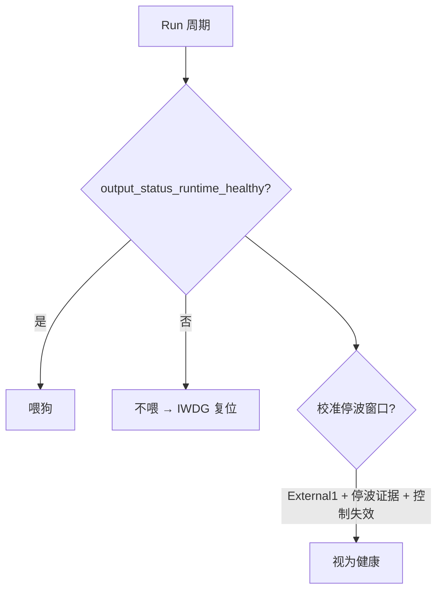
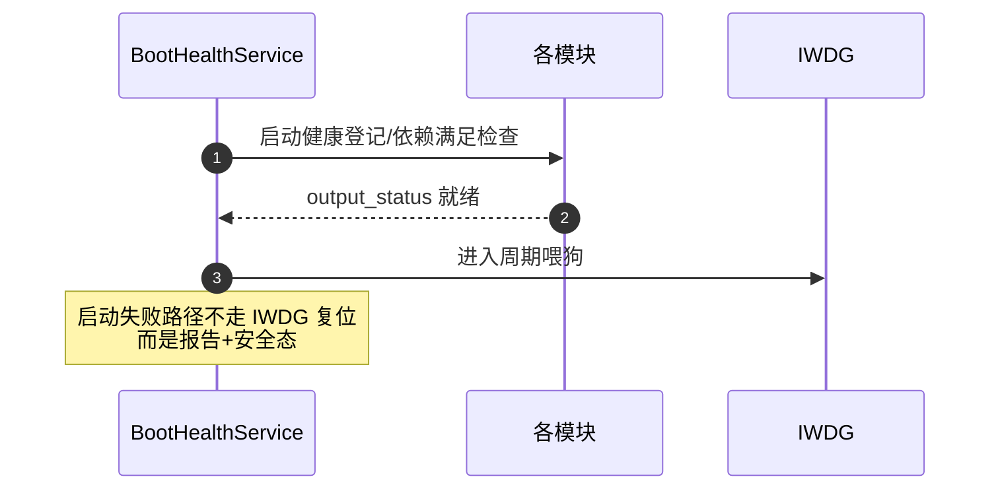

# BootHealth 喂狗策略

## 第一性约束

IWDG 超时 2048ms。任何设计都不得让"模块自己的等待"超过它——这是 MotorOutput 参数应用 defer 250ms、租约超时、校准例外窗等全部设计的硬上界。

## 运行健康判定

<!-- Sources: Dima/modules/boot_health/BootHealthService.cpp:78, Dima/modules/boot_health/BootHealthService.cpp:305 -->

`output_status_runtime_healthy`（[BootHealthService.cpp:305](https://github.com/a1600778959/H743_FreeRTOS/blob/main/Dima/modules/boot_health/BootHealthService.cpp#L305)）的三条校准例外：

| 例外 | 条件 | 上限 |
|------|------|------|
| 停波窗口健康 | External1 + calibration 新鲜 + motion_inhibited + 后端停波确认 | 20s（维护近期）/ 200ms |
| 回滚收尾健康 | !armed + Manual + 停波锁有效 + Hard Safe Off 证据 | 30s，且禁 Kill/Termination |
| 过渡窗 | calibration_output_transition 200ms 内 + stopped_frame | kActuatorArmTransitionUs |

## 两条铁律

1. **例外绝不允许 Disarmed Neutral 或任何 PWM 恢复**——喂狗例外≠输出例外。
2. **模块合同：电机侧问题不得阻塞 BootHealth/USB/MAVLink**——某模块故障不能拖垮喂狗链（[MotorOutput.cpp:15](https://github.com/a1600778959/H743_FreeRTOS/blob/main/Dima/modules/motor/MotorOutput.cpp#L15)）。

## 启动健康

<!-- Sources: Dima/modules/boot_health/BootHealthService.cpp:78 -->

## 与其他模块的耦合

| 模块 | 交互 | Source |
|------|------|--------|
| MotorOutput | 输出健康证据 + 参数 defer 上限 | [MotorOutput.cpp:15](https://github.com/a1600778959/H743_FreeRTOS/blob/main/Dima/modules/motor/MotorOutput.cpp#L15) |
| 校准模式 | 停波/回滚窗口的发起方 | [Finalize.cpp:15](https://github.com/a1600778959/H743_FreeRTOS/blob/main/Dima/rover/modes/auto_calibration/AutoCalibrationFinalize.cpp#L15) |
| Commander | External1/Manual 状态投影 | [Commander.cpp:143](https://github.com/a1600778959/H743_FreeRTOS/blob/main/Dima/modules/safety/Commander.cpp#L143) |

## Related Pages

| Page | Relationship |
|------|-------------|
| [MotorOutput 输出链](./motor-output.md) | 健康证据来源 |
| [收尾与失败分类](../04-auto-calibration/finalize-failures.md) | 回滚窗口的发起方 |
| [构建、签名与 OTA](../09-build-release/build-release.md) | mcuboot watchdog 链验证 |
