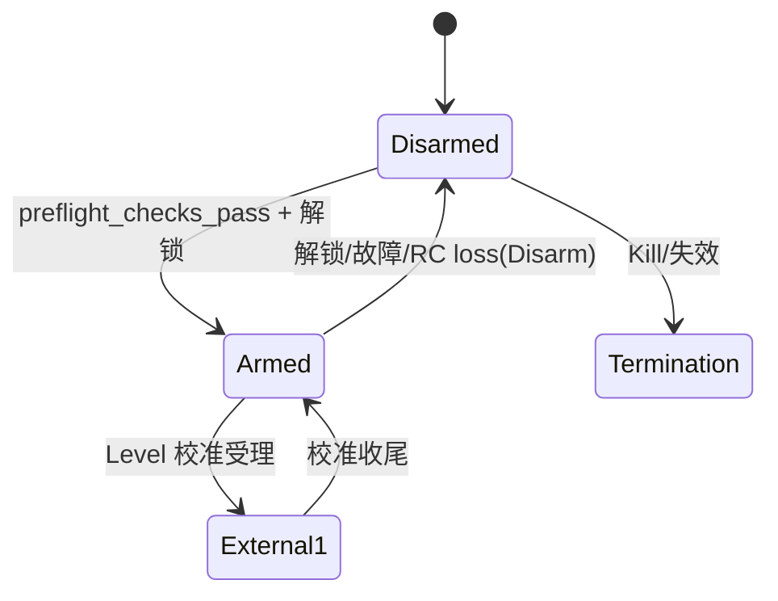
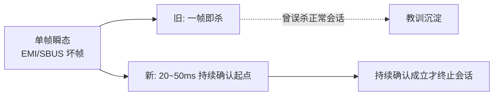
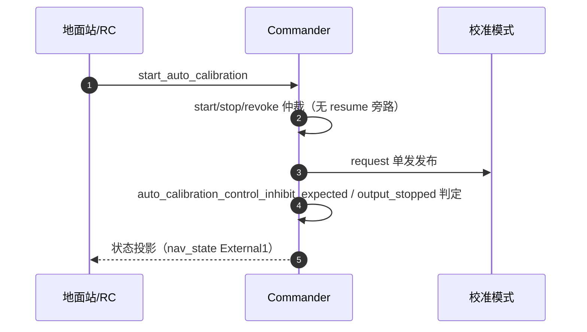

# Commander 安全链

## 定位

Commander 是安全状态的最终处置者：RC、Kill、Failsafe、参数与执行器故障都在这里收敛为 `vehicle_status`/`armed` 投影。其余模块**只观察、不处置**（校准模式的门谓词明确声明这一点，[Gates.cpp:16](https://github.com/a1600778959/H743_FreeRTOS/blob/main/Dima/rover/modes/auto_calibration/AutoCalibrationGates.cpp#L16)）。

## 解锁状态机

<!-- Sources: Dima/modules/safety/Commander.cpp:143, Dima/modules/safety/CommanderSafety.cpp:137 -->

## 预检

`preflight_checks_pass` 检查左右电机功能分配等基础项（[CommanderSafety.cpp:80](https://github.com/a1600778959/H743_FreeRTOS/blob/main/Dima/modules/safety/CommanderSafety.cpp#L80)）；摇杆居中、传感器标定、实际电机方向属于操作员确认项（上车指南边界：**Manual 解锁不替代上车检查**）。

## 强制解锁消抖

<!-- Sources: Dima/modules/safety/Commander.cpp:143 -->

单帧瞬态（电机堵转 EMI 让 SBUS 坏一帧、控制链单帧无效）历史上一帧即杀会话与解锁；现在强制解锁需要持续确认窗。

## 校准握手

<!-- Sources: Dima/modules/safety/CommanderAutoCalibration.cpp:34 -->

握手重构要点：`resume_auto_calibration`/`revoke_auto_calibration` 旁路已移除——Arm/Disarm 不再携带校准续跑参数，消除 REQUEST_EXIT 自取消竞态；COMMANDER 判定 `control_inhibit_expected`/`output_stopped` 与 ArmedFlash 证据对齐。

## Failsafe

| 触发 | 处置 | Source |
|------|------|--------|
| RC loss | Disarm（当前合同） | [CommanderSafety.cpp:137](https://github.com/a1600778959/H743_FreeRTOS/blob/main/Dima/modules/safety/CommanderSafety.cpp#L137) |
| 数据链 loss | 不触发自动返航（RC 才是主链） | [commissioning](https://github.com/a1600778959/H743_FreeRTOS/blob/main/docs/H743_VEHICLE_COMMISSIONING_ZH.md) |
| 执行器故障 | Disarm + 事件 | [CommanderSafety.cpp:137](https://github.com/a1600778959/H743_FreeRTOS/blob/main/Dima/modules/safety/CommanderSafety.cpp#L137) |
| 动作执行 | `execute_action`（[CommanderActions.cpp](https://github.com/a1600778959/H743_FreeRTOS/blob/main/Dima/modules/safety/CommanderActions.cpp)） | |

## Related Pages

| Page | Relationship |
|------|-------------|
| [MotorOutput 输出链](./motor-output.md) | 停波证据生产者 |
| [自动校准状态机](../04-auto-calibration/state-machine.md) | 握手的对端 |
| [手动模式语义](../03-rover-domain/manual-mode.md) | 手动链路的状态门 |
