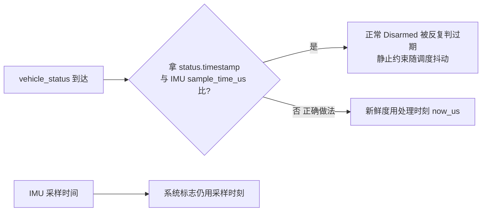

# EKF2 输入

## 定位

`Ekf2Inputs` 把传感器话题打包成 EKF2 输入并维护系统标志（armed/静止/地面检测等）。它消费 uORB、产出估计器输入，**不做传感器业务**。

## 时间语义（修过的真实 bug）

<!-- Sources: Dima/modules/ekf2/Ekf2Inputs.cpp:113 -->

合同（源码注释+README）：**状态新鲜度按当前处理时刻的单调时钟判断**；`vehicle_status` 可以晚于当前 IMU 样本到达，二者直接比较会把正常状态反复判成过期，导致静止约束和地面 GNSS 检查随任务调度抖动。未来时间戳或 >3s 仍按未知运动处理。

## 系统标志

| 标志 | 判据 | Source |
|------|------|--------|
| 静止约束 | vehicle_status 新鲜（≤3s）+ 状态投影 | [Ekf2Inputs.cpp:113](https://github.com/a1600778959/H743_FreeRTOS/blob/main/Dima/modules/ekf2/Ekf2Inputs.cpp#L113) |
| 地面检测 | 静止 + GNSS 检查 | 同上 |
| Armed 投影 | Commander 状态 | [Commander.cpp:143](https://github.com/a1600778959/H743_FreeRTOS/blob/main/Dima/modules/safety/Commander.cpp#L143) |

## 输入清单

| 输入 | 来源 | 备注 |
|------|------|------|
| IMU | VehicleImu | 多实例 |
| GNSS | sensor_gps / rtk_heading_status | 位置/速度/航向 |
| 磁力计 | VehicleMagnetometer | 校准后数据 |
| 状态 | vehicle_status | 见时间语义 |

## 与校准的关系

校准模式大量消费 EKF 风格的车辆参考点数据（如 jerk 观测直接用 EKF NED 加速度逐历元投影——[OFFICIAL_TUNING_PLAN](https://github.com/a1600778959/H743_FreeRTOS/blob/main/docs/AUTO_CALIBRATION_OFFICIAL_TUNING_PLAN_ZH.md)），**不**自建私有滤波器（导航私有 0.5s 滤波器已删，复用 EKF 滤波与 200ms 失鲜合同）。

## Related Pages

| Page | Relationship |
|------|-------------|
| [话题与数据流](../02-architecture/data-flow.md) | 输入 Topic 全集 |
| [RTK 与校准导航](../04-auto-calibration/rtk-navigation.md) | jerk/加速度的下游消费 |
| [线程与调度](../02-architecture/threading-scheduling.md) | 失鲜判定的调度背景 |
