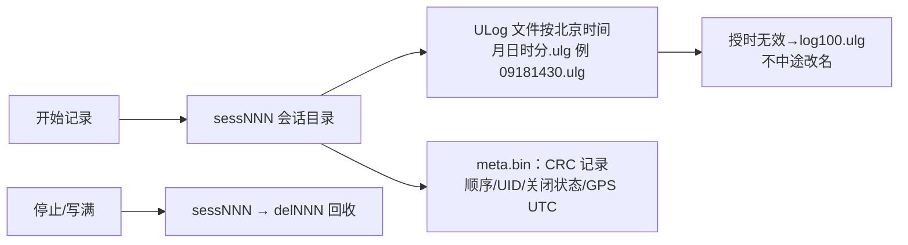
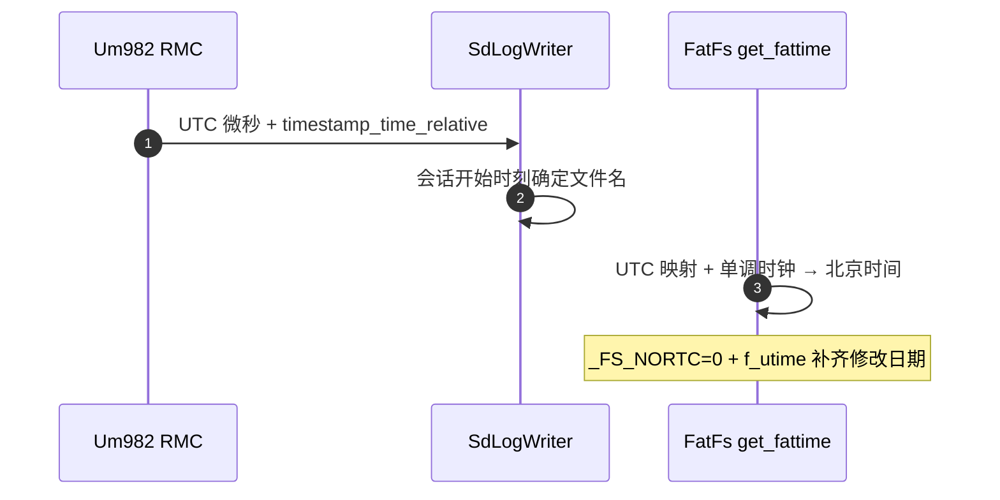

# 日志系统

## 结构

| 组件 | 职责 | Source |
|------|------|--------|
| SdLogWriter | ULog 写入主循环（存储队列） | [SdLogWriter.cpp:292](https://github.com/a1600778959/H743_FreeRTOS/blob/main/Dima/modules/logging/SdLogWriter.cpp#L292) |
| LogWriter | 写接口 + 存储失败处置 | [LogWriter.cpp:332](https://github.com/a1600778959/H743_FreeRTOS/blob/main/Dima/modules/logging/LogWriter.cpp#L332) |
| logger_topics.yaml | Topic 登记（49 Topics） | [logger_topics.yaml](https://github.com/a1600778959/H743_FreeRTOS/blob/main/Dima/modules/logging/logger_topics.yaml) |
| generate_logger_contract.py | 从 uORB 元数据推导格式缓存容量 | [generate_logger_contract.py](https://github.com/a1600778959/H743_FreeRTOS/blob/main/tools/logging/generate_logger_contract.py) |

## 会话与命名

<!-- Sources: Dima/platform/api/LogFileStore.hpp, Dima/modules/logging/SdLogWriter.cpp:292 -->

双名识别兼容老卡；命名规则固化在 [LogFileStore.hpp](https://github.com/a1600778959/H743_FreeRTOS/blob/main/Dima/platform/api/LogFileStore.hpp)（含 UTC+8 偏移常量）。

## 授时链

<!-- Sources: Dima/modules/logging/SdLogWriter.cpp:292, Middlewares/Third_Party/FatFs/src/ffconf.h, Boards/H743/Src/fatfs_diskio.cpp -->

FatFs 侧改动：`_USE_CHMOD=1`（启用 f_utime）、`_FS_NORTC=0`（get_fattime 从已确认 UTC 映射生成北京时间，无须硬件 RTC）；`dima_sdmmc_get_io_stats` 加 `used` 属性防 LTO 内部化。

## 格式缓存容量推导

| 旧 | 新 |
|----|----|
| 把上游 `ulog_message_format_s::format[1600]` 当协议上限 | 从 uORB 生成元数据推导最大压缩/展开字段长度与 Topic 名 |
| 长消息卡死 Definitions 阶段 | 独立输出缓存展开 `name:fields`，容量超 uint16 边界时**生成期失败** |

无别名的格式组跳过字符串展开，有输出组背压重试（[SdLogWriter.cpp:558](https://github.com/a1600778959/H743_FreeRTOS/blob/main/Dima/modules/logging/SdLogWriter.cpp#L558)）。

## 空间策略

| 项 | 值 |
|----|----|
| 停止线 | 10 MiB（曾 50 MiB） |
| 回收目标 | 与停止线同值，写满卡滚动 |
| SDLOG_DIRS_MAX | 默认 50 先于空间触发；写满卡场景调 999 |
| 恢复 | wq:storage 分步推进 sessNNN→delNNN |

存储失败经 `handle_storage_failure` 统一处置（[LogWriter.cpp:332](https://github.com/a1600778959/H743_FreeRTOS/blob/main/Dima/modules/logging/LogWriter.cpp#L332)）。

## Related Pages

| Page | Relationship |
|------|-------------|
| [MAVLink 链路](./mavlink.md) | 日志下载的对端 |
| [UM982 链路](../08-drivers/um982.md) | 授时来源 |
| [参数 / uORB / 存储域](../06-middleware/middleware.md) | SD 介质会话共享 |
