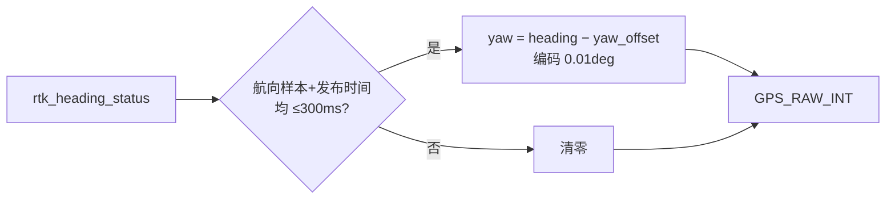
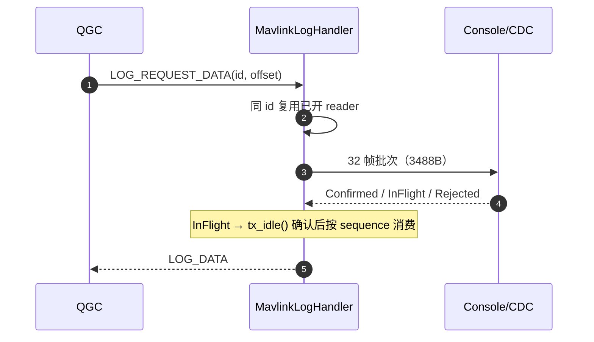

# MAVLink 链路

## 结构

| 组件 | 职责 | Source |
|------|------|--------|
| MavlinkService / Endpoint | 端点生命周期与发送节拍 | [MavlinkService.cpp:176](https://github.com/a1600778959/H743_FreeRTOS/blob/main/Dima/modules/mavlink/MavlinkService.cpp#L176) |
| MavlinkSensorStreams | 13 路传感器/估计器遥测流 | [MavlinkSensorStreams.cpp:481](https://github.com/a1600778959/H743_FreeRTOS/blob/main/Dima/modules/mavlink/MavlinkSensorStreams.cpp#L481) |
| MavlinkLogHandler | 日志列表/下载/擦除 | [MavlinkLogHandler.cpp:730](https://github.com/a1600778959/H743_FreeRTOS/blob/main/Dima/modules/mavlink/MavlinkLogHandler.cpp#L730) |
| MavlinkIdentity / Manager | 身份与组件管理 | [MavlinkManager.cpp](https://github.com/a1600778959/H743_FreeRTOS/blob/main/Dima/modules/mavlink/MavlinkManager.cpp) |

## 方言裁剪原则

MAVLink C 库是**生成物不入库**（权威位置 `build/generated/mavlink/`），从锁定 XML + 受校验的 pymavlink 缓存生成；按当前系统实际能力裁剪，禁止全量引入（[AGENTS.md](https://github.com/a1600778959/H743_FreeRTOS/blob/main/AGENTS.md#L63)）。

## GPS_RAW_INT 航向合同

<!-- Sources: Dima/modules/mavlink/MavlinkSensorStreams.cpp:481, Dima/modules/mavlink/README.md -->

要点：`sensor_gps.heading = NaN` 表示本拍无新航向观测，**不能**用来决定遥测是否显示航向；RTK 速度重配不延长航向寿命；正北编码 36000、0 保留不可用。

## 日志下载三态协议

<!-- Sources: Dima/modules/mavlink/MavlinkLogHandler.cpp:730, Dima/modules/mavlink/README.md -->

| 设计点 | 值 | 理由 |
|--------|-----|------|
| 批次 | 32 帧 | 恰好一个 QGC chunk 完整响应 |
| 三态消费 | Confirmed 立即弹 / InFlight 保留 / Rejected 重试 | "提交即超时"批次不能重发也不能丢（迟到 IRQ 会把已提交批次变空闲） |
| 提交判定 | 取自本次 transmit 结果，**不能用超时后 tx_idle() 推断** | 否则重复发送 |
| reader 复用 | 同 id 连续请求 | 避免每 2880B 重开 ULog |
| QGC written 字段 | 累计量含重传，超 size 不代表文件变大 | 需核对实际文件长度 |

## 退役项

`MavlinkDriveDiagnostics`（手动模式 STATUSTEXT 电机诊断流）已删除；诊断回归日志与遥测流。

## Related Pages

| Page | Relationship |
|------|-------------|
| [USB Console](../07-platform/usb-console.md) | 底层 CDC 写语义 |
| [日志系统](./logging.md) | 被下载的 ULog 结构 |
| [话题与数据流](../02-architecture/data-flow.md) | 遥测流的数据源 |
