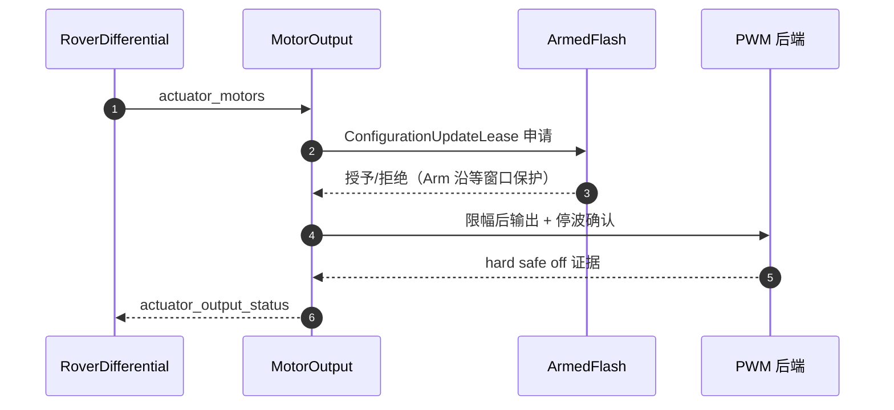
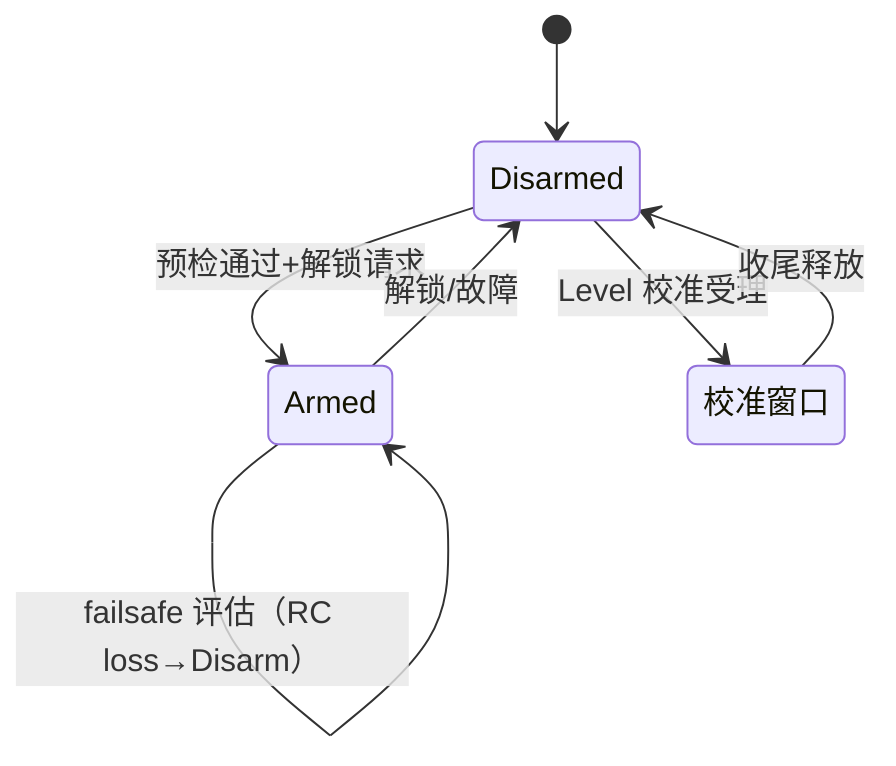
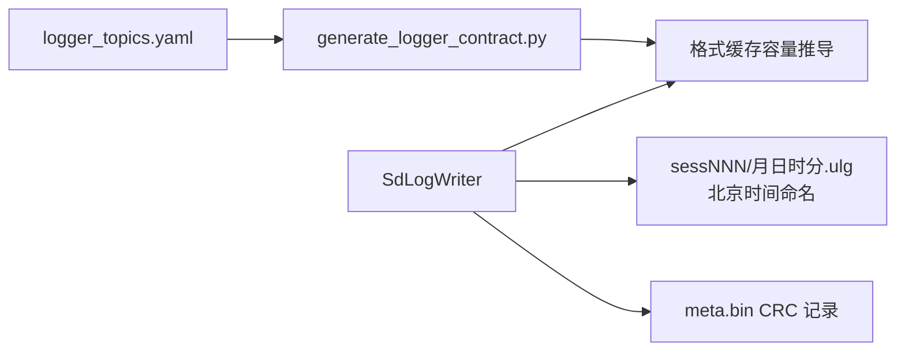

# 模块全景

## 模块清单

| 模块 | 职责 | 关键合同 | Source |
|------|------|----------|--------|
| motor/MotorOutput | PWM 输出后端、安全限幅、ArmedFlash 租约 | 参数应用经租约；故障不阻塞喂狗链 | [MotorOutput.cpp:15](https://github.com/a1600778959/H743_FreeRTOS/blob/main/Dima/modules/motor/MotorOutput.cpp#L15) |
| safety/Commander | 解锁/导航状态/failsafe/校准握手 | 强制解锁需持续确认；RC 是安全主链 | [CommanderAutoCalibration.cpp:34](https://github.com/a1600778959/H743_FreeRTOS/blob/main/Dima/modules/safety/CommanderAutoCalibration.cpp#L34) |
| boot_health | IWDG 喂狗策略与启动健康 | 校准停波/回滚窗口的例外判定 | [BootHealthService.cpp:305](https://github.com/a1600778959/H743_FreeRTOS/blob/main/Dima/modules/boot_health/BootHealthService.cpp#L305) |
| mavlink | 地面站链路：遥测/参数/日志下载 | 32 帧批次 + 三态消费 | [MavlinkService.cpp](https://github.com/a1600778959/H743_FreeRTOS/blob/main/Dima/modules/mavlink/MavlinkService.cpp) |
| logging | ULog 飞行日志 | 格式缓存按生成元数据推导；北京时间授时 | [SdLogWriter.cpp:558](https://github.com/a1600778959/H743_FreeRTOS/blob/main/Dima/modules/logging/SdLogWriter.cpp#L558) |
| sensors/imu + mag | IMU/磁力计数据通路 | 状态新鲜度按处理时刻单调时钟 | [VehicleImu.cpp](https://github.com/a1600778959/H743_FreeRTOS/blob/main/Dima/modules/sensors/imu/VehicleImu.cpp) |
| sensors/calibration | 传感器校准（含自动 Level） | AUTO 校准可在停波窗口执行 | [SensorCalibration.cpp](https://github.com/a1600778959/H743_FreeRTOS/blob/main/Dima/modules/sensors/calibration/SensorCalibration.cpp) |
| ekf2 | EKF2 输入打包 | 静止约束与地面 GNSS 检查 | [Ekf2Inputs.cpp](https://github.com/a1600778959/H743_FreeRTOS/blob/main/Dima/modules/ekf2/Ekf2Inputs.cpp) |
| parameters | 参数服务与持久化 | 多域存储 + 慢就绪恢复 | [ParameterServicePersistence.cpp](https://github.com/a1600778959/H743_FreeRTOS/blob/main/Dima/modules/parameters/ParameterServicePersistence.cpp) |
| rc | SBUS 遥控输入 | RC 是安全主链路 | [rc/README.md](https://github.com/a1600778959/H743_FreeRTOS/blob/main/Dima/modules/rc/README.md) |

## MotorOutput：执行链的枢轴

<!-- Sources: Dima/modules/motor/MotorOutput.cpp:15, Dima/platform/api/Flash.hpp:59 -->

参数更新在 Armed 或校准停波窗口的处理是本模块的核心难点：租约冲突只延迟（250ms 超时上限），**绝不演变为复位循环**（[MotorOutput.cpp:15](https://github.com/a1600778959/H743_FreeRTOS/blob/main/Dima/modules/motor/MotorOutput.cpp#L15) 的注释合同）。

## Commander 安全状态机

<!-- Sources: Dima/modules/safety/Commander.cpp, Dima/modules/safety/CommanderSafety.cpp -->

强制解锁（kill 类）带持续确认窗：RC/执行器判定在 20~50ms 粒度存在单帧瞬态，一帧即杀会误伤正常会话。

## MAVLink 日志下载吞吐

| 设计点 | 值 | 理由 |
|--------|-----|------|
| 批次大小 | 32 帧（3488 B） | 恰好一个 QGC chunk 的完整响应 |
| 消费协议 | Confirmed/InFlight/Rejected 三态 | "提交即超时"的批次不能重发也不能丢 |
| reader 复用 | 同 id 连续请求复用 | 避免每 2880B 重新打开 ULog |
| 理想预算 | 288000 B/s | 实际速度由主机 CDC 轮询节奏决定 |

见 [MavlinkLogHandler.cpp](https://github.com/a1600778959/H743_FreeRTOS/blob/main/Dima/modules/mavlink/MavlinkLogHandler.cpp) 与模块 README。`MavlinkDriveDiagnostics`（手动模式 STATUSTEXT 诊断流）已退役删除。

## 日志链路

<!-- Sources: Dima/modules/logging/SdLogWriter.cpp:558, tools/logging/generate_logger_contract.py -->

格式缓存容量从 uORB 生成元数据推导（不再把上游 1600 字节当协议上限），长消息不再卡死 Definitions 阶段；`_FS_NORTC=0` + `f_utime` 补齐文件修改时间（北京时间 UTC+8）。

## Related Pages

| Page | Relationship |
|------|-------------|
| [Capability 契约与组合根](../07-platform/platform.md) | ArmedFlash 协调器细节 |
| [自动校准状态机](../04-auto-calibration/state-machine.md) | 停波窗口的最大用户 |
| [驱动与传感器链路](../08-drivers/drivers.md) | 传感器数据来源 |
