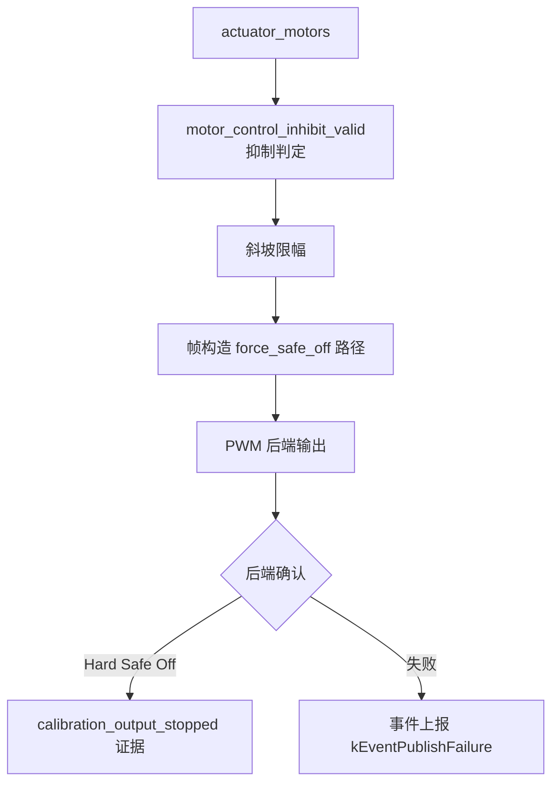
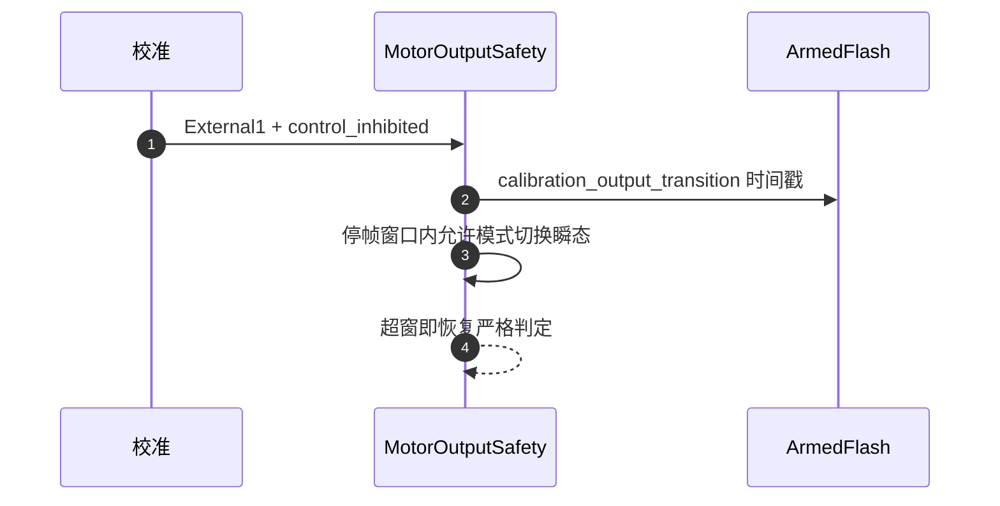

# MotorOutput 输出链

## 定位

MotorOutput 是控制意图到物理 PWM 的最后一级，也是**停波证据的唯一产出者**——它说的"已经停了"就是安全链的事实。

## 输出管线

<!-- Sources: Dima/modules/motor/MotorOutput.cpp:15, Dima/modules/motor/MotorOutputSafety.cpp:206, Dima/modules/motor/MotorOutputFrames.cpp:96 -->

## 参数应用：租约与等待

| 场景 | 行为 | Source |
|------|------|--------|
| Disarmed 快照新鲜 | 正常应用参数快照 | [MotorOutput.cpp:15](https://github.com/a1600778959/H743_FreeRTOS/blob/main/Dima/modules/motor/MotorOutput.cpp#L15) |
| 校准停波窗口（External1） | 允许应用（会话持有存储保护） | 同上 |
| 租约冲突（Arm 沿等瞬态） | **defer 250ms**，不阻塞喂狗链；超时放弃并报 Error 事件 | 同上 |
| 应用失败 | enter_parameter_safe_off（原路径保留） | 同上 |

设计合同（源码注释）：**电机侧问题不得演变为复位循环**——BootHealth/USB/MAVLink 不能被未应用参数拖垮；放弃时限（250ms）远小于 IWDG 2048ms。

## 校准过渡窗口

<!-- Sources: Dima/modules/motor/MotorOutputSafety.cpp:206, Dima/platform/api/Flash.hpp:59 -->

`calibration_transition` 判定覆盖"进入停波"的模式切换瞬态：窗口内要求 stopped_frame 才放行，超窗恢复严格安全判定。

## force_safe_off 与停波证据

[MotorOutputFrames.cpp:96](https://github.com/a1600778959/H743_FreeRTOS/blob/main/Dima/modules/motor/MotorOutputFrames.cpp#L96) 的 `force_safe_off` 是**后端级物理停波**：Kill、故障、校准停波窗口统一走这里；`calibration_output_stopped` 证据由 PWM owner 写入，校准链的停波确认全部以此为事实源。

## 历史修复存档

| 事件 | 修复 | Source |
|------|------|--------|
| 租约失败 pending 永挂 → IWDG 循环（USB 不枚举） | defer 250ms + 事件报告 | [MotorOutput.cpp:15](https://github.com/a1600778959/H743_FreeRTOS/blob/main/Dima/modules/motor/MotorOutput.cpp#L15) |
| 停止中位 vs 无信号差异 | CENT 输出/停脉冲分离（上车指南验证项） | [commissioning](https://github.com/a1600778959/H743_FreeRTOS/blob/main/docs/H743_VEHICLE_COMMISSIONING_ZH.md) |

## Related Pages

| Page | Relationship |
|------|-------------|
| [Commander 安全链](./commander.md) | 请求停波的上游 |
| [Capability 契约与组合根](../07-platform/platform.md) | ArmedFlash 协调器 |
| [BootHealth 喂狗策略](./boot-health.md) | 喂狗链的约束来源 |
