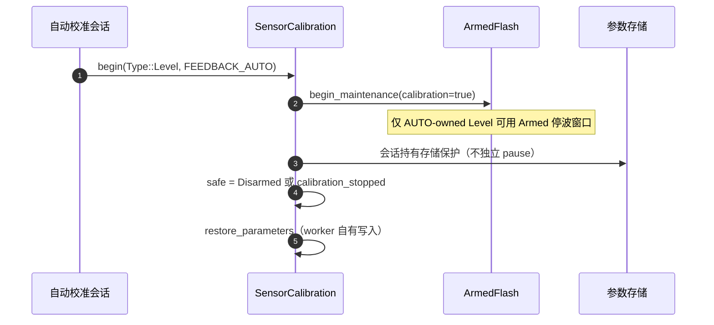
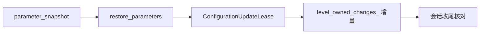

# 传感器校准

## 两种校准来源

| 来源 | 反馈通道 | 停波要求 | Source |
|------|----------|----------|--------|
| 手动（QGC 发起） | `FEEDBACK_MANUAL` | 必须先 Disarmed（合同不变） | [SensorCalibration.cpp:249](https://github.com/a1600778959/H743_FreeRTOS/blob/main/Dima/modules/sensors/calibration/SensorCalibration.cpp#L249) |
| 自动（AUTO-owned Level） | `FEEDBACK_AUTO` | **可在 Armed 停波窗口执行** | 同上 |

## Armed 停波窗口适配

<!-- Sources: Dima/modules/sensors/calibration/SensorCalibration.cpp:249, Dima/modules/sensors/calibration/SensorCalibrationParameters.cpp -->

关键合同：
- `safe = fresh(armed) && (!armed || calibration_stopped) && !kill`——**外部 QGC 校准仍要求 Disarmed**，只有 AUTO-owned Level 享受停波窗口。
- 自动 Level 的存储保护由整场会话持有，worker 只拥有维护锁；手动校准保持独立事务。
- 恢复参数时只累计本原子段增量（`level_owned_changes_`），不把外部修改吸收进计数，供会话收尾核对完整应用/回滚历史。

## 参数恢复

<!-- Sources: Dima/modules/sensors/calibration/SensorCalibrationParameters.cpp, Dima/platform/api/Flash.hpp:59 -->

## 与 VehicleMagnetometer 的配合

VehicleMagnetometer 同样经配置租约应用参数（Armed 校准必须已锁存并确认停波；普通行驶冻结）——[VehicleMagnetometer.cpp](https://github.com/a1600778959/H743_FreeRTOS/blob/main/Dima/modules/sensors/magnetometer/VehicleMagnetometer.cpp)；磁场来源节点由首个合法广播推断（`MAG1_CAN_NODE` 已删）。

## Related Pages

| Page | Relationship |
|------|-------------|
| [Capability 契约与组合根](../07-platform/platform.md) | 租约与维护锁 |
| [磁校准](../04-auto-calibration/magnetic-calibration.md) | 校准会话的磁阶段 |
| [MotorOutput 输出链](./motor-output.md) | 停波证据生产者 |
