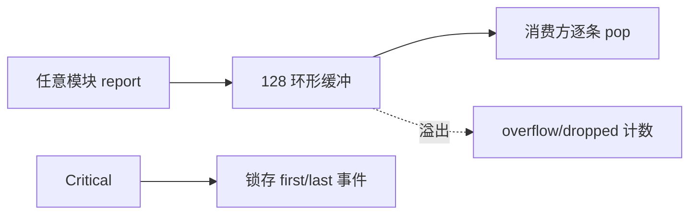
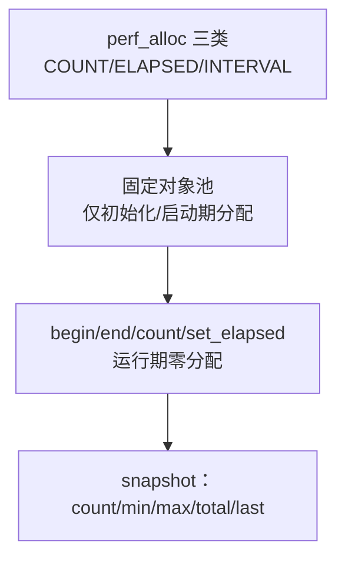

# 事件系统与性能计数器

## events：结构化事件总线

| 合同 | 内容 | Source |
|------|------|--------|
| 容量 | 128 条环形，参数最多 4 个 | [events.hpp](https://github.com/a1600778959/H743_FreeRTOS/blob/main/Dima/middleware/events/events.hpp) |
| 级别 | Debug/Info/Warning/Error/**Critical**（CriticalFaultLatch 锁存首末事件） | 同上 |
| 约束 | 不分配内存、不格式化字符串——**任务与 ISR 上下文都可调用** | 同上 |
| 消费 | `pop` 取最旧；统计 published/consumed/overflow/dropped | 同上 |

<!-- Sources: Dima/middleware/events/events.hpp:1, Dima/middleware/events/events.cpp:1 -->

## 事件 ID 全表（按模块前缀）

事件 ID 的 ASCII 前缀即来源模块段；下表为全库扫描结果：

| 前缀 | 模块 | 事件 ID | Source |
|------|------|---------|--------|
| RCS | SbusRc（drivers/rc/sbus） | `ConfigInvalid` 0x52435301、`BackendFailure` …302、`Failsafe` …303、`PublishFailure` …304、`BackendLineError` …305 | [SbusRc.cpp:16](https://github.com/a1600778959/H743_FreeRTOS/blob/main/Dima/drivers/rc/sbus/SbusRc.cpp#L16) |
| RSU | RCUpdate（modules/rc） | `InvalidCalibration` 0x52435501、`InvalidMapping` …502、`SignalState` …503 | [RCUpdate.cpp:18](https://github.com/a1600778959/H743_FreeRTOS/blob/main/Dima/modules/rc/RCUpdate.cpp#L18) |
| RDF | RoverDifferential（rover/control） | `ParameterInvalid` 0x52444601、`PublishFailure` …602、`ScheduleFailure` …603、`ClockRegression` …604 | [RoverDifferential.cpp:22](https://github.com/a1600778959/H743_FreeRTOS/blob/main/Dima/rover/control/RoverDifferential.cpp#L22) |
| RAU | AutoMode（rover/modes/auto） | `ParameterBindingFailure` 0x52415501、`ParameterInvalid` …502、`PublishFailure` …503、`ScheduleFailure` …504 | [AutoMode.cpp:19](https://github.com/a1600778959/H743_FreeRTOS/blob/main/Dima/rover/modes/auto/AutoMode.cpp#L19) |
| RMA | ManualMode（rover/modes/manual） | `ParameterInvalid` 0x524D4101、`PublishFailure` …102、`ScheduleFailure` …103 | [ManualMode.cpp:13](https://github.com/a1600778959/H743_FreeRTOS/blob/main/Dima/rover/modes/manual/ManualMode.cpp#L13) |
| RMO | MotorOutput（modules/motor） | `ParameterInvalid` 0x524D4F01、`BackendFault` …F02、`PublishFailure` …F03、`ScheduleFailure` …F04、`ParameterDeferred` …F05 | [MotorOutput.cpp:15](https://github.com/a1600778959/H743_FreeRTOS/blob/main/Dima/modules/motor/MotorOutput.cpp#L15) |

`kEventParameterDeferred`（RMO…F05）值得点名：参数应用租约冲突超时放弃时上报——**它证明"放弃"被记录了，而不是静默跳过**。

## perf：固定池性能计数器

<!-- Sources: Dima/middleware/perf/perf_counter.h:1 -->

合同（C 接口，`extern "C"`）：`perf_alloc` 只许在初始化或模块启动阶段调用；运行期操作零动态分配——与全仓库静态分配纪律一致。

## 使用纪律

1. 新事件**必须登记到本页表**并在模块 README 声明语义。
2. 事件不替代日志：高频数据走 ULog，事件只承载"需要被看见的状态转移"。
3. Critical 事件要求消费端有明确处置路径（如 FAILURE 锁存）。

## Related Pages

| Page | Relationship |
|------|-------------|
| [MotorOutput 输出链](../05-modules/motor-output.md) | RMO 事件的语义 |
| [日志系统](../05-modules/logging.md) | 高频数据的去向 |
| [收尾与失败分类](../04-auto-calibration/finalize-failures.md) | Critical 的处置案例 |
