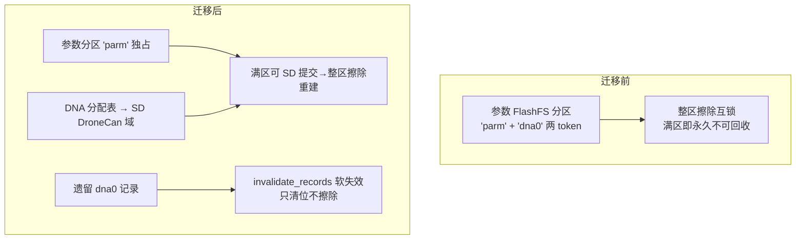
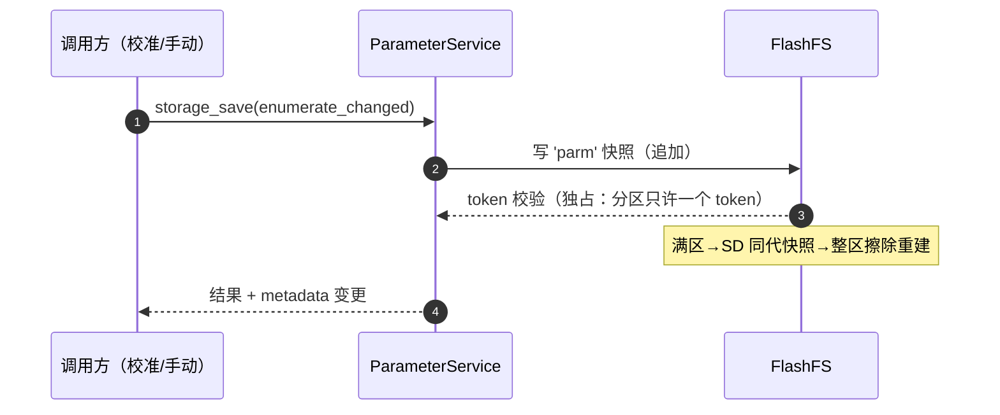
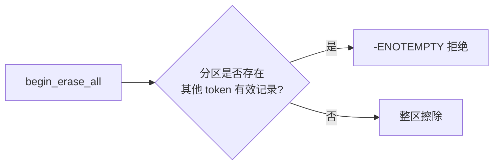

# 参数 / uORB / 存储域

## 三条存储路径

| 域 | 介质 | 内容 | Source |
|----|------|------|--------|
| 参数 FlashFS | 内部 Flash 分区（128 KiB 追加写） | 'parm' token 参数快照 | [flashfs.cpp:434](https://github.com/a1600778959/H743_FreeRTOS/blob/main/Dima/middleware/parameters/flashfs.cpp#L434) |
| SD 原子文件域 | SD 卡三文件轮换（bin/bak/tmp） | Mission 数据、DroneCAN DNA 分配表 | [AtomicFileStore.hpp:14](https://github.com/a1600778959/H743_FreeRTOS/blob/main/Dima/platform/api/AtomicFileStore.hpp#L14) |
| SD 日志 | sessNNN 目录 | ULog 飞行日志 | [SdLogWriter.cpp:558](https://github.com/a1600778959/H743_FreeRTOS/blob/main/Dima/modules/logging/SdLogWriter.cpp#L558) |

`AtomicFileDomain` 枚举现在有三个域：Parameters、Mission、**DroneCan**（第三域为 ADR 0006 新增）。

## DNA 分配表迁移（ADR 0006）

<!-- Sources: Dima/rover/ApplicationContext.cpp:285, docs/adr/0006-dna-allocation-storage-sd-domain.md -->

一次性迁移在应用上下文调用 `FlashFS::invalidate_records(legacy_dna_token)`（[ApplicationContext.cpp:285](https://github.com/a1600778959/H743_FreeRTOS/blob/main/Dima/rover/ApplicationContext.cpp#L285)）：把遗留记录 commit 字编程为全零，掉电中断后幂等续跑。无卡降级语义：`-ENODEV` 映射为合法空表 + 15s 宽限窗，RAM-only 提交并发有界 StorageFailure 事件。

## 参数写入路径

<!-- Sources: Dima/modules/parameters/ParameterServicePersistence.cpp, Dima/middleware/parameters/param_storage.cpp -->

## autosave 与慢就绪

`ParamAutosave` 的存储可用性恢复流程（[autosave.cpp:74](https://github.com/a1600778959/H743_FreeRTOS/blob/main/Dima/middleware/parameters/autosave.cpp#L74)）：SD 慢就绪期间挂起的保存不丢，`resume_after_storage_available` 在介质会话建立后补跑。

## FlashFS 的排他擦除

<!-- Sources: Dima/middleware/parameters/flashfs.cpp:434 -->

排他门槛本身不放宽（ADR 0006 的明确决策）：多 token 联合重建需要跨模块事务协调，收益不抵复杂度；**单主人化**才是直接修复。

## uORB 与消息契约

| Topic 族 | 定义 | 说明 |
|----------|------|------|
| `auto_calibration_*` | [AutoCalibrationStatus.msg](https://github.com/a1600778959/H743_FreeRTOS/blob/main/Dima/messages/schemas/AutoCalibrationStatus.msg) | 11 状态 + session_id + 围栏误差等 |
| `rover_motion_request` | [RoverMotionRequest.msg](https://github.com/a1600778959/H743_FreeRTOS/blob/main/Dima/messages/schemas/RoverMotionRequest.msg) | 队列 8，归一化轴模式 |
| `rover_control_status` | [RoverControlStatus.msg](https://github.com/a1600778959/H743_FreeRTOS/blob/main/Dima/messages/schemas/RoverControlStatus.msg) | speed_integral、采样时间戳 |

消息契约演进规则：优先删减，MESSAGE_VERSION 机制 = 重新生成 hash/logger contract + 注释版本日期。

## Related Pages

| Page | Relationship |
|------|-------------|
| [自动校准状态机](../04-auto-calibration/state-machine.md) | 事务机的最大用户 |
| [模块全景](../05-modules/modules.md) | ParameterService 模块视角 |
| [驱动与传感器链路](../08-drivers/drivers.md) | DroneCAN DNA 的产生方 |
