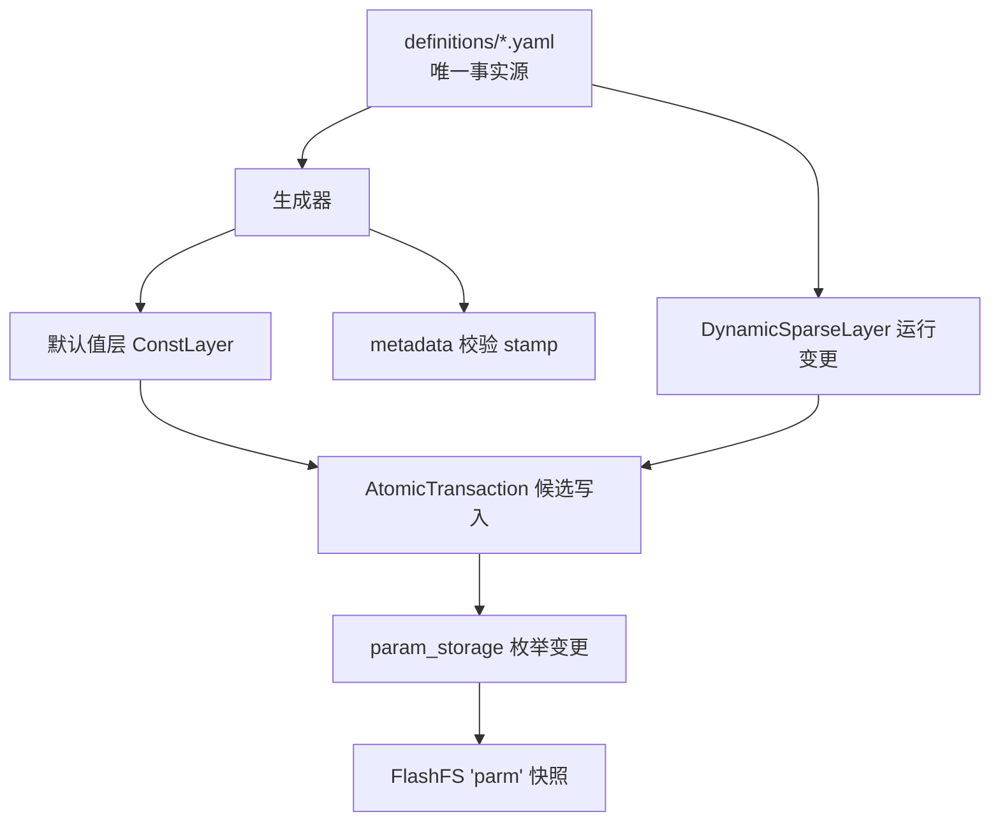
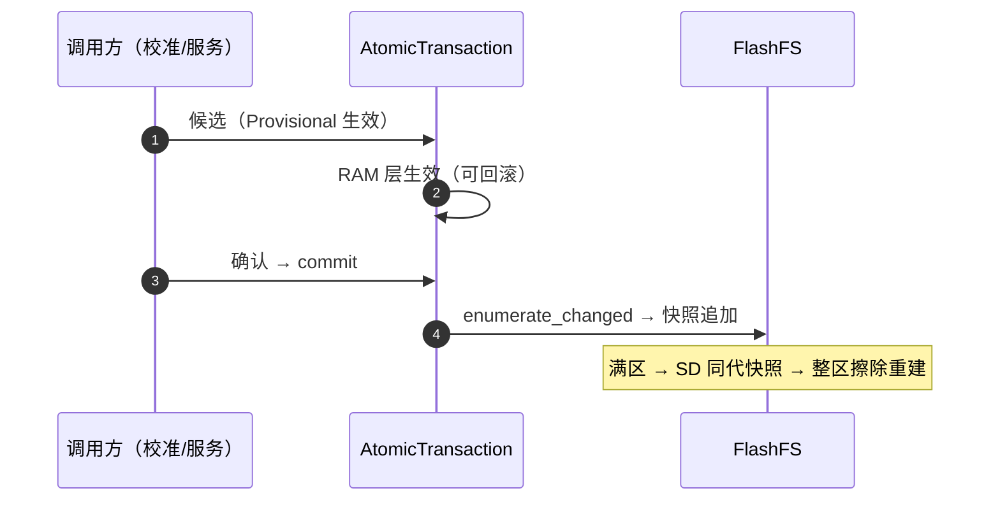
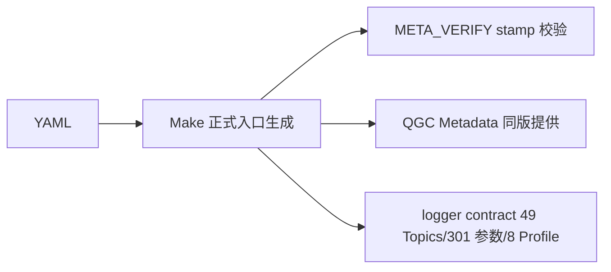

# 参数系统

## 设计哲学

最少参数、自动调整尽量多——能用校准/运行时推导的就不做成参数。参数定义 YAML 是唯一事实源，派生物（生成头、metadata、QGC 契约）全部由工具链生成。

## 分层结构

<!-- Sources: Dima/middleware/parameters/param_storage.cpp, Dima/middleware/parameters/README.md, flashfs.cpp:434 -->

| 层 | 文件 | 职责 |
|----|------|------|
| 定义 | `definitions/module_*_params.yaml` | 名称/类型/默认/范围/枚举/重启要求 |
| 运行 | `param_storage.cpp` / `param.h` | 变更枚举、`param_storage_resume` |
| 服务 | `ParameterService*`（modules/parameters） | 序列化快照、Flash 写、autosave 协作 |
| 持久化 | `flashfs.cpp/.h` | 追加写、token 独占、擦除 |

## 事务写入

<!-- Sources: Dima/middleware/parameters/param_storage.cpp, Dima/modules/parameters/ParameterServicePersistence.cpp -->

`enumerate_changed` 只枚举变更项；`param_save_default` 处理默认值回退；`param_storage_resume` 支持存储恢复（[param.h](https://github.com/a1600778959/H743_FreeRTOS/blob/main/Dima/middleware/parameters/param.h)）。

## 生成链与校验

<!-- Sources: Dima/middleware/parameters/definitions, GNUmakefile:48 -->

规则：改参数定义必须经正式 Make 入口重新生成并核对 Metadata；**禁止手写参数/消息派生列表**；参数名/范围/重启要求以生成目录为准（上车指南 §2.1）。

## 参数治理记录

| 事件 | 结果 |
|------|------|
| 双包络 THR/TURN_MAX 退役 | 冻结 MOT_THR_MAX 包络替代 |
| RO_CAL_VMAX 删除 | 先核对 QGC 兼容契约 |
| RD_REV_STEER 退役 | 手动倒车转向反转开关移除 |
| MAG1_CAN_NODE 删除 | 来源节点由首个合法广播推断 |

## Related Pages

| Page | Relationship |
|------|-------------|
| [存储域](./storage-domains.md) | FlashFS 擦除合同细节 |
| [事务与组调度](../04-auto-calibration/transactions-groups.md) | 校准候选的事务消费者 |
| [工具链](../10-tooling/tooling.md) | 生成器实现 |
