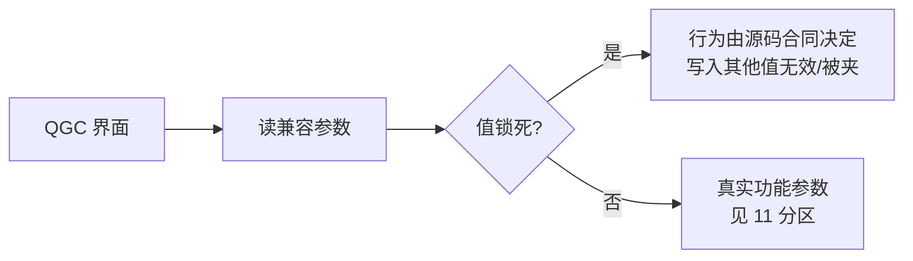

# QGC 兼容契约

## 设计原理

QGC 对 PX4 系设备会显示一批 System 类参数；**固定值也可能是官方 QGC 的直接 Fact 依赖，不能仅按"无可选动作"删除**（[qgc_compat yaml](https://github.com/a1600778959/H743_FreeRTOS/blob/main/Dima/middleware/parameters/definitions/module_qgc_compat_params.yaml) 头注释）。这组参数把"界面兼容"与"真实能力"显式分开：值锁死、描述如实标注当前行为。

## 兼容参数表

| 参数 | 锁定值 | 真实行为 | Source |
|------|--------|----------|--------|
| `NAV_RCL_ACT` | 6（Disarm）唯一可选 | RC 丢失 → Commander 上锁进安全态；其他 PX4 动作依赖未提供的导航/降落能力 | [yaml](https://github.com/a1600778959/H743_FreeRTOS/blob/main/Dima/middleware/parameters/definitions/module_qgc_compat_params.yaml) |
| `NAV_DLL_ACT` | 0（Disabled）唯一可选 | USB/地面站不是控制来源，断链不触发导航动作 | 同上 |
| `COM_LOW_BAT_ACT` | 0（No action） | 界面兼容；**未实现电池检测/低电量动作** | 同上 |
| `MAV_SYS_ID` | 1（min=max=1，重启生效） | 所有协议编码器/目标过滤固定 1/1 | 同上 |
| `SYS_AUTOSTART` | 与 PX4 通用差速车机架一致的兼容值 | Dima 是固定差速车产品 | 同上 |

<!-- Sources: Dima/middleware/parameters/definitions/module_qgc_compat_params.yaml:1 -->

## 为什么这样设计

| 替代方案 | 弃用理由 |
|----------|----------|
| 删掉这些参数 | QGC Fact 依赖缺失会破坏界面/完成流程 |
| 让它们真的可变 | 会暗示存在未实现的能力（低电量返航等）——违背"不冒充"原则 |
| 隐藏 System 分类 | System 分类只整理展示；合法取值/消费者/故障关闭行为保持不变 |

<!-- Sources: Dima/middleware/parameters/definitions/module_qgc_compat_params.yaml:1 -->

## 与上车指南的呼应

指南反复强调的边界在此落地：RC loss 处置是 Disarm（`NAV_RCL_ACT` 锁 6）、数据链断开无自动动作（`NAV_DLL_ACT` 锁 0）、低电量无自动处置（`COM_LOW_BAT_ACT` 锁 0）——**参数界面显示的选项范围 ≠ 产品能力**（[指南 §1](https://github.com/a1600778959/H743_FreeRTOS/blob/main/docs/H743_VEHICLE_COMMISSIONING_ZH.md#L9)）。

## Related Pages

| Page | Relationship |
|------|-------------|
| [参数基线与三类必设](../11-first-run/param-classes.md) | 真实功能参数 |
| [参数系统](./parameter-system.md) | 生成链 |
| [Commander 安全链](../05-modules/commander.md) | RC loss 的实际处置 |
