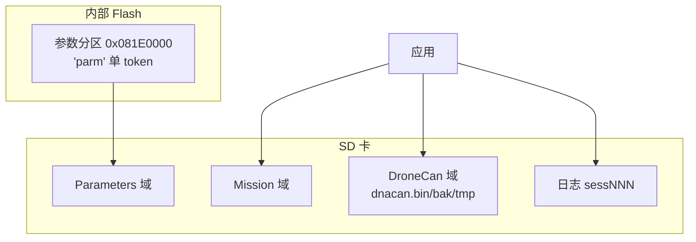
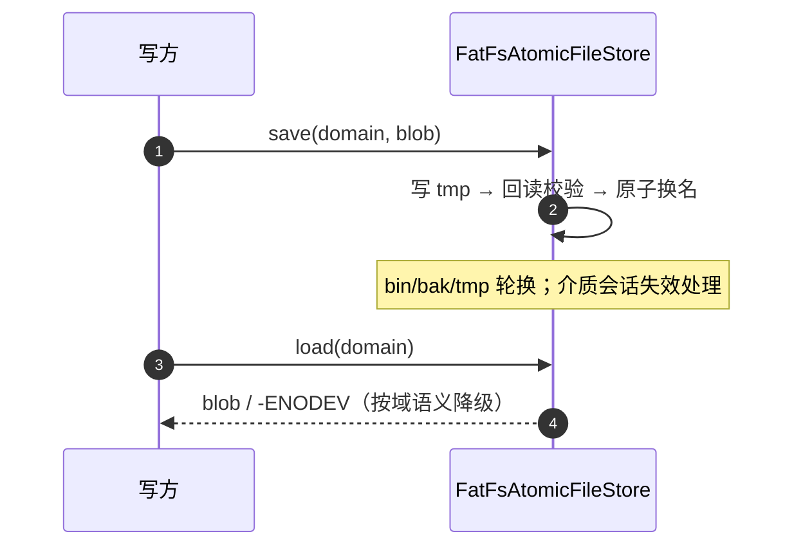

# 存储域

## 三域总览


<!-- Sources: Dima/platform/api/AtomicFileStore.hpp:14, Dima/middleware/parameters/flashfs.cpp:434, docs/adr/0006-dna-allocation-storage-sd-domain.md -->

`AtomicFileDomain{Parameters, Mission, DroneCan}` ——第三域是 ADR 0006 新增，参数/Mission/DroneCan 共享唯一 FatFs owner 但**绝不共用文件名或数据格式**。

## FlashFS 排他擦除

```mermaid
flowchart TB
  E[begin_erase_all(exclusive_token)] --> C{分区存在其他<br>token 有效记录?}
  C -->|是| R[-ENOTEMPTY 拒绝]
  C -->|否| GO[整区擦除]
  FULL[写满] --> SD[SD 同代快照]
  SD --> GO
```
<!-- Sources: Dima/middleware/parameters/flashfs.cpp:434 -->

排他校验是"单 token 独占"的门——曾因 'parm'+'dna0' 双 token 互相锁死整区擦除引发 COMMIT_LEVEL 持久化超时（ADR 0006 的立项原因）。**门槛本身不放宽**（多 token 联合重建需跨模块事务协调，收益不抵复杂度），修法是单主人化。

## DNA 迁移五决策

| # | 决策 | 细节 |
|---|------|------|
| 1 | 分配表迁 SD DroneCan 域 | 三文件轮换（bin/bak/tmp），Mag2 不再注入 FlashFS |
| 2 | 分配语义不变 | 已知 uid 复用不写介质；新 uid 先保存后承诺；加载短读 fail-closed |
| 3 | 无卡降级 | -ENODEV=合法空表；保存遇无卡先等 15s 宽限窗（覆盖开机挂载竞态）；RAM-only 完成提交+有界 StorageFailure 事件 |
| 4 | 一次性迁移 | `invalidate_records('dna0')`：commit 字清零、只清位不擦除；掉电幂等续跑 |
| 5 | 排他门槛不放宽 | 见上 |

<!-- Sources: docs/adr/0006-dna-allocation-storage-sd-domain.md, Dima/rover/ApplicationContext.cpp:285 -->

## SD 原子文件域协议


<!-- Sources: Dima/platform/freertos/storage/FatFsAtomicFileStore.cpp:1087 -->

换卡/无卡启动后的首次保存先重新发现 primary/backup/tmp（驱动自有缓冲承载读回）——这是参数与 Mission 域验证过的成熟基建，DNA 迁移只改适配层接线。

## autosave 与慢就绪

`ParamAutosave` 在存储可用性恢复后补跑挂起保存（[autosave.cpp:74](https://github.com/a1600778959/H743_FreeRTOS/blob/main/Dima/middleware/parameters/autosave.cpp#L74)）；满区挂起与擦除链路静默失败是历史事故组合，现均已结构化。

## Related Pages

| Page | Relationship |
|------|-------------|
| [参数系统](./parameter-system.md) | 参数写入的上层 |
| [DroneCAN 链路](../08-drivers/dronecan.md) | DNA 分配的语义方 |
| [日志系统](../05-modules/logging.md) | SD 的另一租户 |
