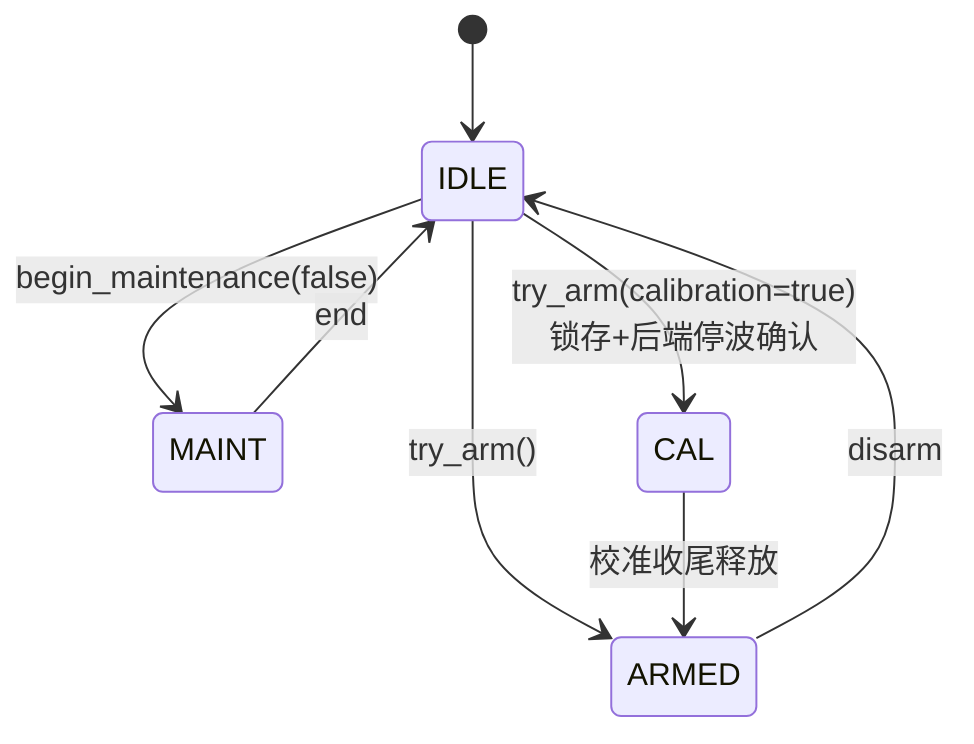
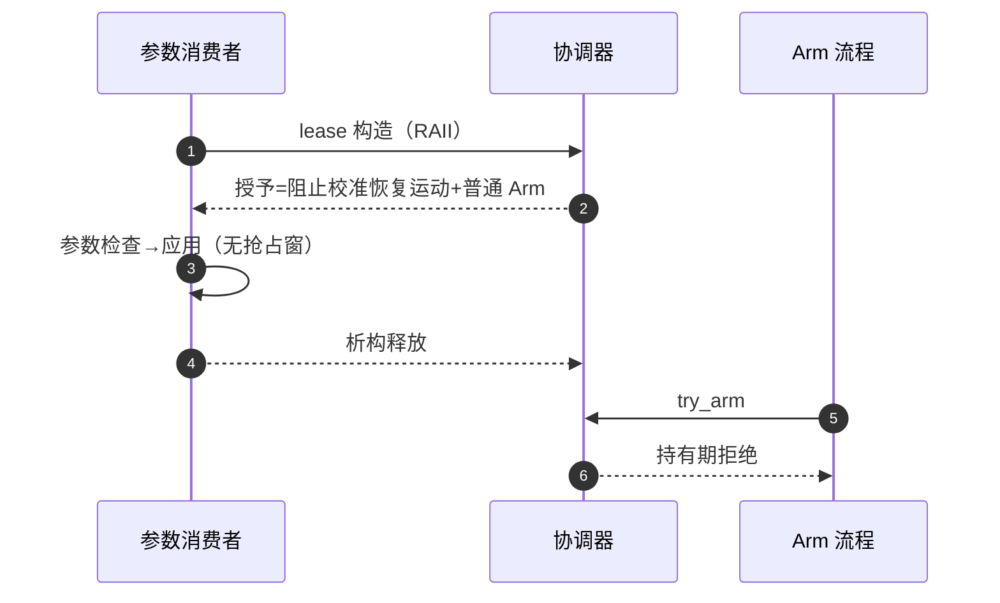
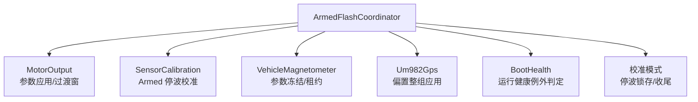

# ArmedFlash 协调器

## 为什么存在

Flash 写入时电机必须停、电机 Armed 时参数必须冻结——这两件事互相要求对方的状态，天然构成互斥矩阵。没有统一协调器时，每个模块各自检查 `armed` 再操作 Flash，检查与应用之间留有抢占窗口（TOCTOU）。`ArmedFlashCoordinator` 把它做成单一状态机 + 短租约。

## 互斥矩阵

<!-- Sources: Dima/platform/common/Flash.cpp:26, Dima/platform/api/Flash.hpp:59 -->

合同（[Flash.hpp:59](https://github.com/a1600778959/H743_FreeRTOS/blob/main/Dima/platform/api/Flash.hpp#L59)）：普通 Armed 与 Flash/维护互斥；**自动校准单独锁住物理输出，不伪造 Disarmed**；停波确认只由 PWM owner 写入；临界区只保护状态转移，不包围实际 Flash 操作、不屏蔽长时间中断。

## ConfigurationUpdateLease

<!-- Sources: Dima/platform/common/Flash.cpp, Dima/modules/motor/MotorOutput.cpp:15 -->

覆盖"检查到应用之间"的抢占窗——传感器校准、磁参数、MotorOutput、UM982 偏置全部经此租约（[Um982Gps.cpp:532](https://github.com/a1600778959/H743_FreeRTOS/blob/main/Dima/drivers/gps/um982/Um982Gps.cpp#L532)）。

## 校准停波窗口状态

| 状态查询 | 语义 | Source |
|----------|------|--------|
| `calibration_output_inhibited()` | 停波锁存中 | [Flash.hpp:59](https://github.com/a1600778959/H743_FreeRTOS/blob/main/Dima/platform/api/Flash.hpp#L59) |
| `calibration_output_stopped()` | 后端确认物理停波 | 同上 |
| `calibration_output_transition()` | 停波沿时间戳（过渡窗判定用） | 同上 |
| `calibration_maintenance_recent()` | 维护锁近期活动（20s 窗） | 同上 |
| `configuration_allowed()` | 配置类操作许可 | 同上 |

## 消费者一览

<!-- Sources: Dima/modules/motor/MotorOutput.cpp:15, Dima/modules/sensors/calibration/SensorCalibration.cpp:249, Dima/modules/boot_health/BootHealthService.cpp:305, Dima/drivers/gps/um982/Um982Gps.cpp:532 -->

## Related Pages

| Page | Relationship |
|------|-------------|
| [Capability 契约与组合根](./platform.md) | 本页的上级 |
| [MotorOutput 输出链](../05-modules/motor-output.md) | 停波证据的生产 |
| [收尾与失败分类](../04-auto-calibration/finalize-failures.md) | 校准侧的状态机 |
