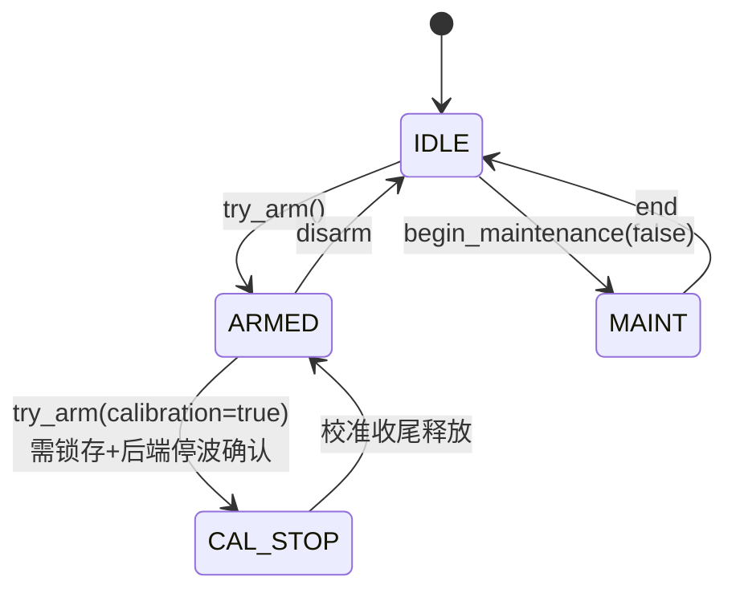
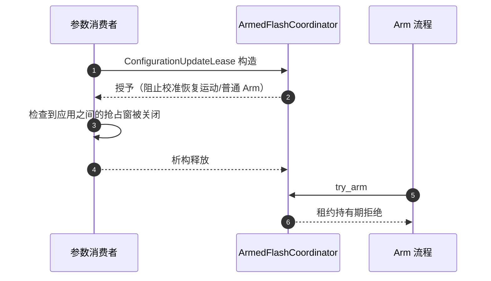
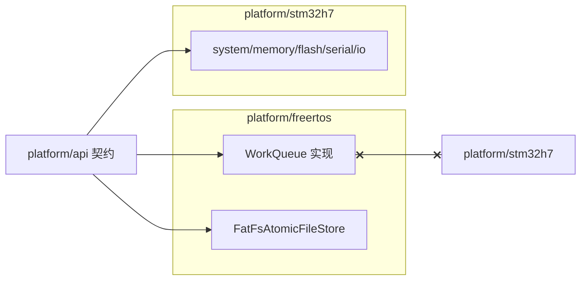

# Capability 契约与组合根

## 设计原理

上层（rover/modules/middleware）**永远不 include HAL**。硬件能力抽象为 `platform/api` 纯虚契约，具体后端在 `platform/stm32h7`（真实 MCU）与 `platform/freertos`（RTOS 服务），两者互不依赖；唯一的装配点是 `Boards/H743/Src/platform_composition.cpp`。

| 契约 | 能力 | Source |
|------|------|--------|
| `Flash.hpp` | ArmedFlash 协调器（Armed/维护/校准互斥） | [Flash.hpp:59](https://github.com/a1600778959/H743_FreeRTOS/blob/main/Dima/platform/api/Flash.hpp#L59) |
| `AtomicFileStore.hpp` | 原子文件三域（Parameters/Mission/DroneCan） | [AtomicFileStore.hpp:14](https://github.com/a1600778959/H743_FreeRTOS/blob/main/Dima/platform/api/AtomicFileStore.hpp#L14) |
| `Console.hpp` | 控制台写（在途批次语义） | [Console.hpp](https://github.com/a1600778959/H743_FreeRTOS/blob/main/Dima/platform/api/Console.hpp) |
| `LogFileStore.hpp` | 日志会话/回收 + UTC+8 偏移 | [LogFileStore.hpp](https://github.com/a1600778959/H743_FreeRTOS/blob/main/Dima/platform/api/LogFileStore.hpp) |

## ArmedFlash 协调器：安全链的枢轴

三个互斥面：**普通 Armed**（电机活着）、**Flash 维护**（擦写中）、**校准停波窗口**（Level 校准持锁写参数，物理输出已停）。校准是第三态的来源——不伪造 Disarmed，停波确认只由 PWM owner 写入。

<!-- Sources: Dima/platform/api/Flash.hpp:59, Dima/platform/common/Flash.cpp -->

### 配置更新租约

<!-- Sources: Dima/platform/common/Flash.cpp, Dima/modules/motor/MotorOutput.cpp:15 -->

租约覆盖"检查到应用之间"的抢占窗口——这是传感器校准、磁参数写入、MotorOutput 参数应用共用的机制。

## 双后端边界

<!-- Sources: Dima/platform/freertos/storage/FatFsAtomicFileStore.cpp, AGENTS.md:52 -->

FatFs 原子文件域实现（三文件轮换、回读校验、介质会话失效处理）是参数与 Mission 域验证过的成熟基建——DNA 迁移只改适配层接线，不动协议（ADR 0006 决策 3）。

## 校准停波窗口的消费者

| 消费者 | 用途 | Source |
|--------|------|--------|
| SensorCalibration | AUTO-owned Level 校准在 Armed 停波窗执行 | [SensorCalibration.cpp](https://github.com/a1600778959/H743_FreeRTOS/blob/main/Dima/modules/sensors/calibration/SensorCalibration.cpp) |
| MotorOutput | 参数应用容忍校准窗口；过渡期停帧判定 | [MotorOutput.cpp:15](https://github.com/a1600778959/H743_FreeRTOS/blob/main/Dima/modules/motor/MotorOutput.cpp#L15) |
| BootHealthService | 校准回滚收尾维持 IWDG 健康判定 | [BootHealthService.cpp:305](https://github.com/a1600778959/H743_FreeRTOS/blob/main/Dima/modules/boot_health/BootHealthService.cpp#L305) |
| Um982Gps | 航向偏置整组应用经同一租约 | [Um982Gps.cpp:532](https://github.com/a1600778959/H743_FreeRTOS/blob/main/Dima/drivers/gps/um982/Um982Gps.cpp#L532) |

## Related Pages

| Page | Relationship |
|------|-------------|
| [分层架构与依赖规则](../02-architecture/layered-architecture.md) | 组合根在合同中的位置 |
| [自动校准状态机](../04-auto-calibration/state-machine.md) | 停波窗口的发起方 |
| [模块全景](../05-modules/modules.md) | 各消费者的模块视角 |
