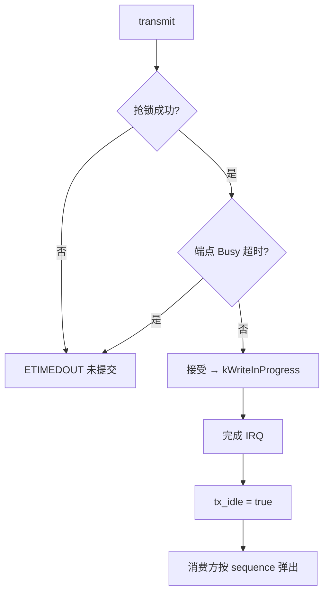
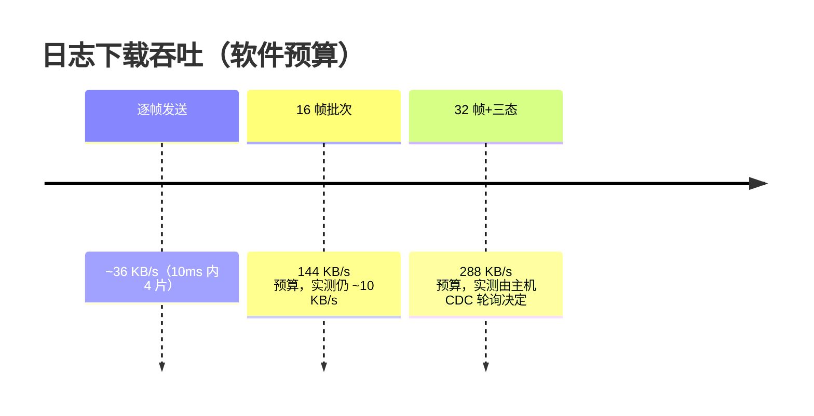

# USB Console

## 在途批次语义（kWriteInProgress）

Console 的 `transmit` 是等待 CDC 完成的同步接口。MAVLink 日志下载把它当批量通道用，于是产生了"提交即超时"的歧义批次——修复引入独立在途状态：

| 返回 | 语义 | 消费规则 | Source |
|------|------|----------|--------|
| 完成 | 本批已提交 | 正常 | [UsbConsole.cpp:53](https://github.com/a1600778959/H743_FreeRTOS/blob/main/Dima/adapters/usb_console/UsbConsole.cpp#L53) |
| `kWriteInProgress` | **本次 transmit 已接受**，完成 IRQ 可能紧随其后 | 等待 `tx_idle()` 确认后按 sequence 消费 | 同上 |
| `ETIMEDOUT` | 抢锁/等上一笔/Busy 超时 | 本批**未提交**，可重试 | 同上 |

<!-- Sources: Dima/platform/api/Console.hpp, Dima/modules/mavlink/MavlinkLogHandler.cpp:730 -->

关键判据（[Console.hpp](https://github.com/a1600778959/H743_FreeRTOS/blob/main/Dima/platform/api/Console.hpp) 注释）：**批次是否已提交必须取自本次写入结果，不能用超时后的 `tx_idle()` 推断**——迟到 IRQ 会把已提交批次变为空闲，导致重复发送。

## newlib 移植

`_write` 只接收字节数或 -1；Console 的在途状态留在内部接口（`kWriteInProgress` 对 newlib 映射为 -1/EINPROGRESS），不通过共享 errno 传递提交状态——[UsbConsole.cpp:53](https://github.com/a1600778959/H743_FreeRTOS/blob/main/Dima/adapters/usb_console/UsbConsole.cpp#L53)。

## 吞吐演进史

<!-- Sources: Dima/modules/mavlink/README.md, Dima/platform/api/Console.hpp -->

16 片批次时代实测 ~10KB/s 的根因：一批 CDC 排空常超 5ms 截止，"提交即超时"批次既不能消费也不能立即重发，多数轮次空转。32 片 + 待确认协议让线路连续排空。

## 边界

- Console 与日志组包共用 4096-byte 静态容量（无动态分配）。
- USB 响应复制到固定 Ring，不引用 FatFs 文件缓冲。
- USB 物理断开只重置发送节拍；代次检查与样本复制仍由 uORB 保护。

## Related Pages

| Page | Relationship |
|------|-------------|
| [MAVLink 链路](../05-modules/mavlink.md) | 三态消费协议的对端 |
| [日志系统](../05-modules/logging.md) | 被下载的数据 |
| [Capability 契约与组合根](./platform.md) | Console 契约位置 |
