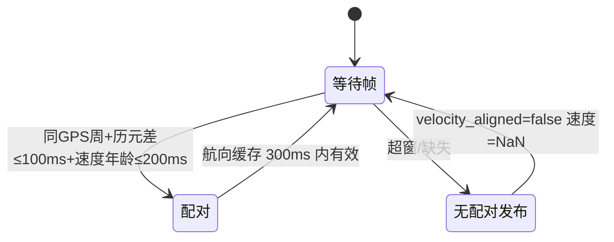
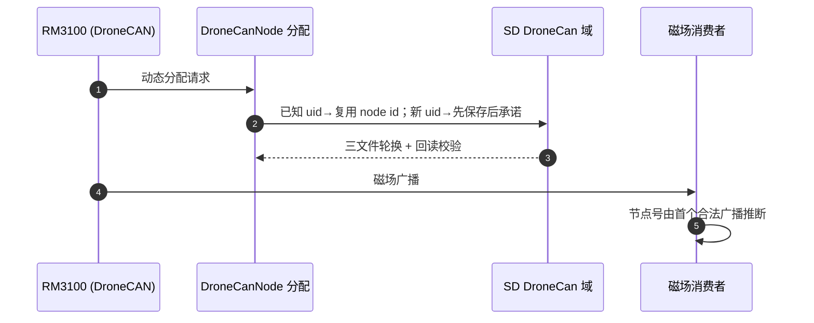

# UM982 与 DroneCAN 链路

## UM982 GNSS（定位 + 双天线定向）

| 能力 | 实现 | Source |
|------|------|--------|
| 位置 | GGA 最低输入；quality=0/status=V 接受为"在线无定位" | [Um982Gps.cpp](https://github.com/a1600778959/H743_FreeRTOS/blob/main/Dima/drivers/gps/um982/Um982Gps.cpp) |
| 速度 | AGRICA 完整 NED 速度；缺 AGRICA 用新鲜 RMC 水平速度 | [Um982Protocol.cpp](https://github.com/a1600778959/H743_FreeRTOS/blob/main/Dima/drivers/gps/um982/Um982Protocol.cpp) |
| 定向 | UNIHEADINGA + `rtk_heading_status` 原始基线航向 | [Um982Gps.cpp:532](https://github.com/a1600778959/H743_FreeRTOS/blob/main/Dima/drivers/gps/um982/Um982Gps.cpp#L532) |
| 授时 | RMC UTC + `timestamp_time_relative` 对齐日志授时 | [Um982Gps.cpp](https://github.com/a1600778959/H743_FreeRTOS/blob/main/Dima/drivers/gps/um982/Um982Gps.cpp) |

### 航向/速度配对（制动观测的关键）

<!-- Sources: Dima/drivers/gps/um982/Um982Gps.cpp:532, Dima/drivers/gps/um982/README.md -->

不再等待两帧完全同历元：无配对照常发布航向；`timestamp_sample` 保留航向真实到达时间，速度重配不续航向年龄。**制动消费者只保守计龄，不把领先速度外推为未来时间**——这是 9/29 实车"急停振铃"误判的修复面。

### 偏置应用

航向偏置与期望基线经**配置租约**整组应用：普通 Armed 行驶冻结；组合校准持锁时必须已锁存并由 PWM 后端确认停波才允许更新（[Um982Gps.cpp:532](https://github.com/a1600778959/H743_FreeRTOS/blob/main/Dima/drivers/gps/um982/Um982Gps.cpp#L532)）。

## DroneCAN 磁力计（RM3100）

| 环节 | 行为 | Source |
|------|------|--------|
| 节点发现 | 动态节点 ID 分配（DNA） | [DroneCanDynamicNodeId.cpp](https://github.com/a1600778959/H743_FreeRTOS/blob/main/Dima/lib/dronecan/DroneCanDynamicNodeId.cpp) |
| 分配表存储 | SD DroneCan 原子文件域（ADR 0006） | [DroneCanNode.hpp](https://github.com/a1600778959/H743_FreeRTOS/blob/main/Dima/lib/dronecan/DroneCanNode.hpp) |
| 设备配置 | operating mode 支持性探测 | [DroneCanMag2Configuration.cpp](https://github.com/a1600778959/H743_FreeRTOS/blob/main/Dima/drivers/magnetometer/dronecan_mag2/DroneCanMag2Configuration.cpp) |
| 磁场来源 | 来源节点号由首个合法磁场广播推断（`MAG1_CAN_NODE` 已删） | [middleware/parameters/README.md](https://github.com/a1600778959/H743_FreeRTOS/blob/main/Dima/middleware/parameters/README.md) |

<!-- Sources: Dima/lib/dronecan/DroneCanDynamicNodeId.cpp, docs/adr/0006-dna-allocation-storage-sd-domain.md -->

分配语义（ADR 0006 决策 2）：已知 uid 直接复用不写介质；新 uid **先保存成功再对外承诺绑定**；加载短读/格式不符 fail-closed；无卡 `-ENODEV` 降级为合法空表（绑定不跨上电，由下次上电确定性重分配恢复）。

## 磁场与电机的联合观测

`MagMotorOutputHistory` 维护 32 条后端输出历史，供两个方向消费：磁油门补偿观测 + **制动反向冲量积分**（[MagMotorOutputHistory.hpp:17](https://github.com/a1600778959/H743_FreeRTOS/blob/main/Dima/modules/sensors/magnetometer/MagMotorOutputHistory.hpp#L17)）。

## Related Pages

| Page | Relationship |
|------|-------------|
| [参数 / uORB / 存储域](../06-middleware/middleware.md) | DroneCan 存储域协议 |
| [差速控制栈](../03-rover-domain/control-stack.md) | RTK 速度龄期与制动 |
| [模块全景](../05-modules/modules.md) | EKF2/日志对 GNSS 的消费 |
