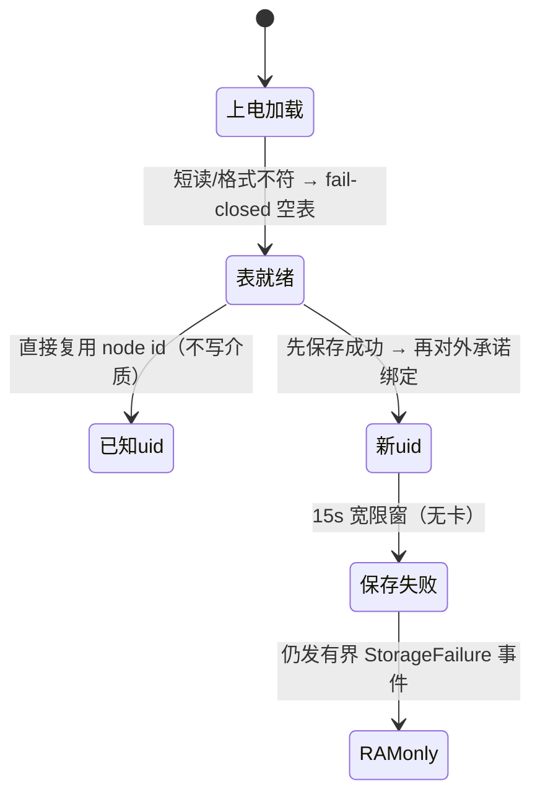
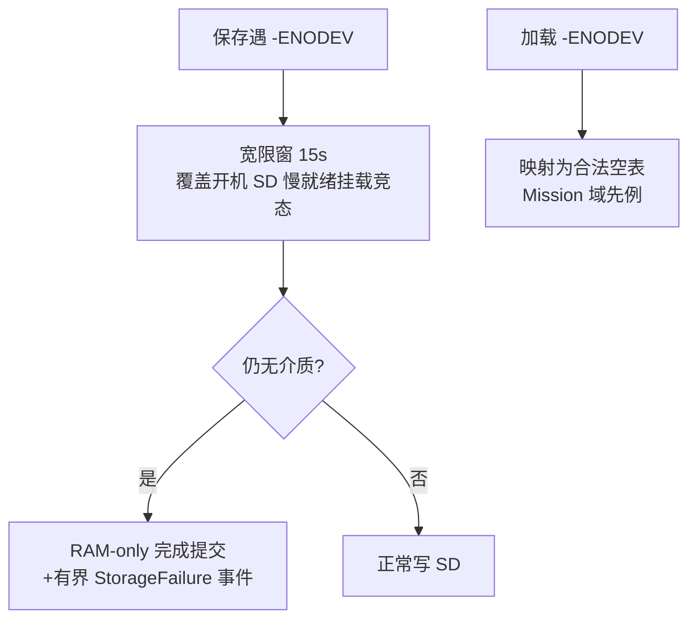

# DroneCAN 链路

## DNA 分配语义

<!-- Sources: Dima/lib/dronecan/DroneCanDynamicNodeId.cpp, docs/adr/0006-dna-allocation-storage-sd-domain.md -->

| 语义点 | 合同 | Source |
|--------|------|--------|
| 存储 | SD DroneCan 域三文件轮换（ADR 0006） | [DroneCanNode.hpp](https://github.com/a1600778959/H743_FreeRTOS/blob/main/Dima/lib/dronecan/DroneCanNode.hpp) |
| stage_commit | 分配提交原子化 | [DroneCanDynamicNodeId.cpp](https://github.com/a1600778959/H743_FreeRTOS/blob/main/Dima/lib/dronecan/DroneCanDynamicNodeId.cpp) |
| 服务分配 | `service_allocation_storage` 响应分配请求 | 同上 |
| reset_allocation | 重新进入发现 | 同上 |

## 无卡降级

<!-- Sources: docs/adr/0006-dna-allocation-storage-sd-domain.md, Dima/platform/freertos/storage/FatFsAtomicFileStore.cpp:1087 -->

绑定不跨上电——由下次上电的确定性重分配（preferred/max 向下选择）恢复；单 RM3100 总线上通常仍获得同一 node id。

## RM3100 磁力计

| 环节 | 实现 | Source |
|------|------|--------|
| 构造 | 不再注入 FlashFS（ADR 0006 后） | [DroneCanMag2.cpp](https://github.com/a1600778959/H743_FreeRTOS/blob/main/Dima/drivers/magnetometer/dronecan_mag2/DroneCanMag2.cpp) |
| 协议启动 | `start_protocol` 分步 + operating mode 支持性探测 | [DroneCanMag2Configuration.cpp](https://github.com/a1600778959/H743_FreeRTOS/blob/main/Dima/drivers/magnetometer/dronecan_mag2/DroneCanMag2Configuration.cpp) |
| 磁场消费 | 来源节点由首个合法磁场广播推断 | [middleware/parameters/README.md](https://github.com/a1600778959/H743_FreeRTOS/blob/main/Dima/middleware/parameters/README.md) |

## 遗留迁移

组合根在参数服务初始化后调用 `FlashFS::invalidate_records('dna0')` 把参数分区遗留记录软失效（commit 字清零、不擦除、掉电幂等）——[ApplicationContext.cpp:285](https://github.com/a1600778959/H743_FreeRTOS/blob/main/Dima/rover/ApplicationContext.cpp#L285)。全部失效后为空操作。

## Related Pages

| Page | Relationship |
|------|-------------|
| [存储域](../06-middleware/storage-domains.md) | SD DroneCan 域协议 |
| [磁校准](../04-auto-calibration/magnetic-calibration.md) | 磁场数据的下游 |
| [UM982 链路](./um982.md) | 并行的定向来源 |
