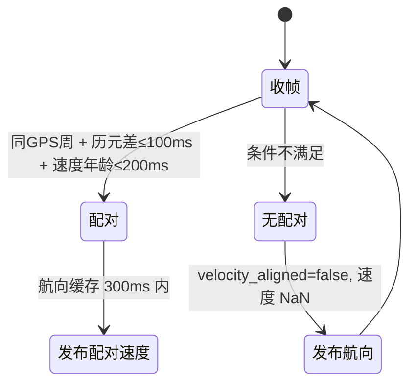
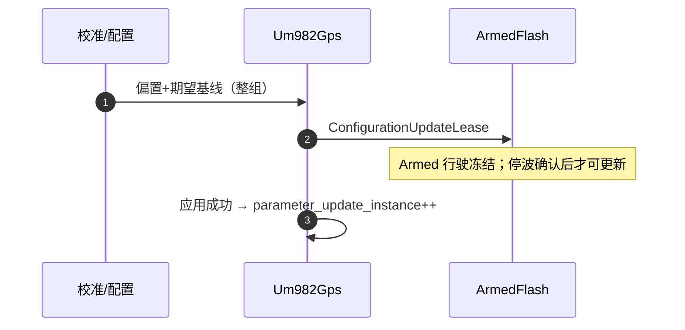
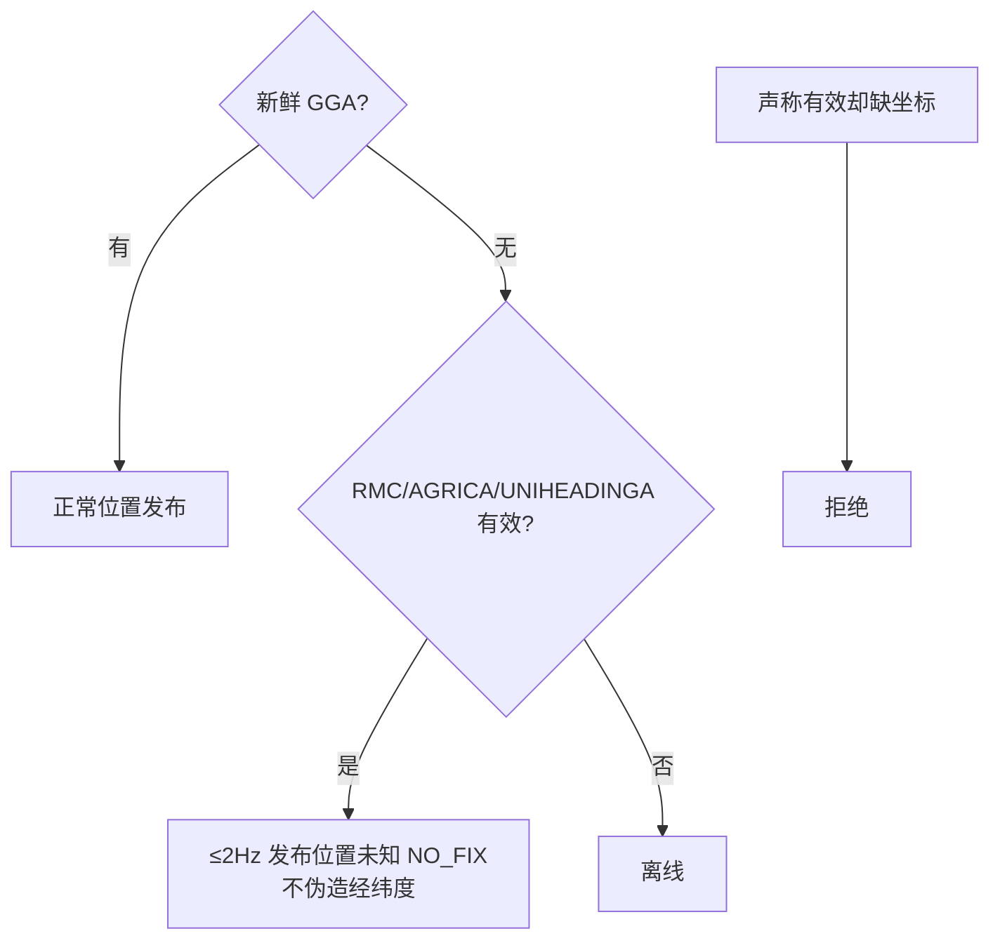

# UM982 链路

## 协议解析

| 帧 | 内容 | 解析要点 | Source |
|----|------|----------|--------|
| GGA | 位置（最低输入） | quality=0 仍作为"在线无定位"接受 | [Um982Protocol.cpp](https://github.com/a1600778959/H743_FreeRTOS/blob/main/Dima/drivers/gps/um982/Um982Protocol.cpp) |
| AGRICA | 完整 NED 速度 | 分号后首字段为索引 0：速度幅值 22、N/E/U 23..25、σ 26..28，≥29 字段；与上游 `extractAgrica()` 对齐 | 同上 |
| RMC | 时间/状态 | 有效日期时刻→UTC 微秒；status=V 接受 | 同上 |
| UNIHEADINGA | 基线航向 | 航向缓存 300ms | [Um982Gps.cpp:532](https://github.com/a1600778959/H743_FreeRTOS/blob/main/Dima/drivers/gps/um982/Um982Gps.cpp#L532) |

速度分量允许负数、标准差必须非负——与锁定上游实现逐字段核对过。

## 航向/速度配对

<!-- Sources: Dima/drivers/gps/um982/Um982Gps.cpp:532 -->

放宽配对的原因：等两帧完全同历元会让制动消费者拿不到速度龄期证据。合同：`timestamp_sample` 保留航向真实到达时间；速度重配不续航向年龄；**制动消费者只保守计龄，不把领先速度外推为未来时间**。

## 偏置与基线配置

<!-- Sources: Dima/drivers/gps/um982/Um982Gps.cpp:532, Dima/platform/api/Flash.hpp:59 -->

整组应用（偏置+基线一起）避免半套配置生效；成功才推进 `rtk_heading_status.parameter_update_instance`，供 RTK 提交/回滚确认。

## NO_FIX 在线状态

<!-- Sources: Dima/drivers/gps/um982/README.md -->

## 授时合同

`timestamp_time_relative` = RMC 接收时刻 − 合成消息发布时间，使日志授时不受缓存重用与 GGA 延迟影响；中国时区只在日志文件名与 ULog 时区说明转换，**原始 `time_utc_usec` 保持 UTC**（[um982 README](https://github.com/a1600778959/H743_FreeRTOS/blob/main/Dima/drivers/gps/um982/README.md)）。

## Related Pages

| Page | Relationship |
|------|-------------|
| [RTK 与校准导航](../04-auto-calibration/rtk-navigation.md) | 最大消费者 |
| [制动接管](../03-rover-domain/braking-takeover.md) | 速度龄期消费 |
| [日志系统](../05-modules/logging.md) | 授时下游 |
