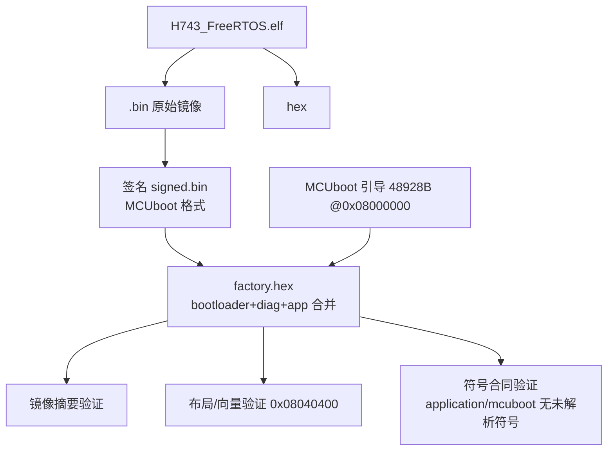
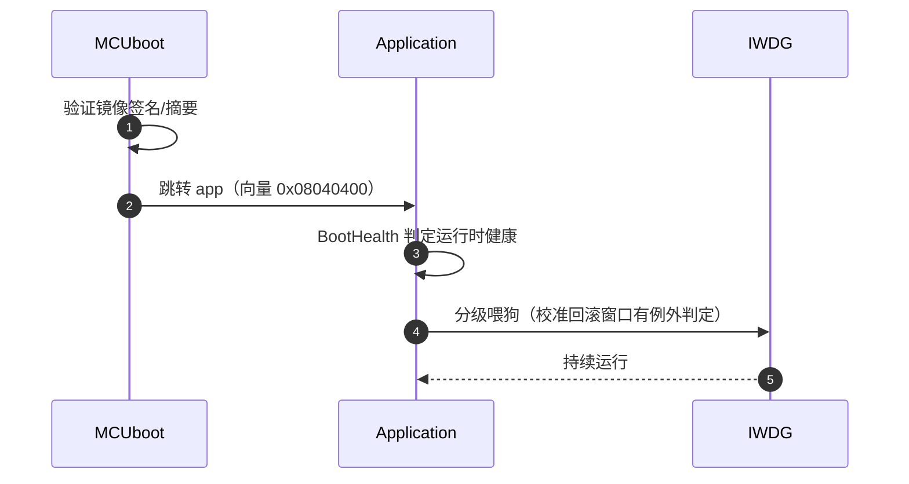

# 构建、签名与 OTA

## 发布产物链

<!-- Sources: make/release.mk:57, tools/elf_support/layout.py -->

当前基线：signed app 587,703 B @ `0x08040000`；Flash 总占用 75.0%。

## Flash 布局

| 区域 | 地址 | 用途 |
|------|------|------|
| 0x08000000 | MCUboot 引导 | 48,928 B |
| 0x08020000–0x0803FFFF | boot diagnostics | 引导诊断区 |
| 0x08040000 | signed application | 向量在 +0x400 |
| 0x081E0000 | 参数 FlashFS 分区 | 128 KiB 单扇区追加写 |

## 安全启动链

<!-- Sources: make/release.mk:57, Dima/modules/boot_health/BootHealthService.cpp:305 -->

mcuboot watchdog prepare/feed 链在 ELF 验证中有符号级检查（`mcuboot watchdog prepare/feed chain: linked`）。

## OTA 上传

| 参数 | 值 | Source |
|------|-----|--------|
| 协议 | mcumgr（SMP） | [make/release.mk](https://github.com/a1600778959/H743_FreeRTOS/blob/main/make/release.mk) |
| 窗口 | `MCUMGR_MAX_WINDOW=3` | [release.mk:57](https://github.com/a1600778959/H743_FreeRTOS/blob/main/make/release.mk#L57) |
| 入口 | `make upload` | [GNUmakefile](https://github.com/a1600778959/H743_FreeRTOS/blob/main/GNUmakefile) |
| 恢复 | USB DFU 流程 | [docs/MCUBOOT_USB_RECOVERY_ZH.md](https://github.com/a1600778959/H743_FreeRTOS/blob/main/docs/MCUBOOT_USB_RECOVERY_ZH.md) |

上传 HOST 阶段三段拆分（pinned upload tools / MAVLink codec / mcumgr runtime），工具全部锁版本。

## 构建性能工具链

| 组件 | 作用 | Source |
|------|------|--------|
| bootstrap_ccache.py | ccache 解析与版本锁定；`on` 失败即终止 | [tools/bootstrap_ccache.py](https://github.com/a1600778959/H743_FreeRTOS/blob/main/tools/bootstrap_ccache.py) |
| build_support/session.py | 构建会话状态（HOST_TOOLS_ID 复用） | [tools/build_support/session.py](https://github.com/a1600778959/H743_FreeRTOS/blob/main/tools/build_support/session.py) |
| project.mk LTO | `-flto` 全量启用，`DIMA_LTO=off` 逃生门 | [make/project.mk:1141](https://github.com/a1600778959/H743_FreeRTOS/blob/main/make/project.mk#L1141) |
| elf_support/layout.py | LTO 下符号合同（lto_priv 匹配、used 属性） | [tools/elf_support/layout.py](https://github.com/a1600778959/H743_FreeRTOS/blob/main/tools/elf_support/layout.py) |

## 升级注意事项

1. 参数分区（0x081E0000）不在 OTA 镜像内——升级保留参数，但 `parm` 快照格式演进需前向兼容。
2. 升级失败恢复走 USB DFU（无 BOOT0 拆机要求）。
3. 首次烧录用 `factory.hex`（含引导 + 诊断 + 应用）。

## Related Pages

| Page | Relationship |
|------|-------------|
| [构建与验证](../01-getting-started/build-and-verify.md) | 日常构建入口 |
| [参数 / uORB / 存储域](../06-middleware/middleware.md) | 参数分区的擦除合同 |
| [模块全景](../05-modules/modules.md) | BootHealth 喂狗策略 |
