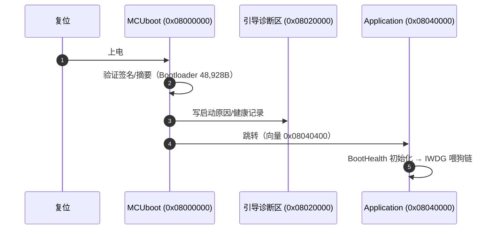
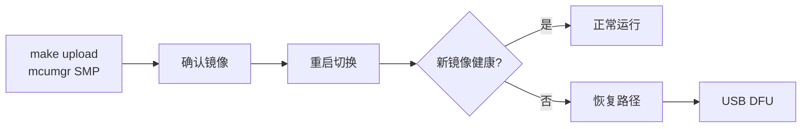

# MCUboot 与恢复

## 启动链

<!-- Sources: make/release.mk:57, docs/MCUBOOT_USB_RECOVERY_ZH.md:1, Dima/modules/boot_health/BootHealthService.cpp:78 -->

`verify` 的镜像验证输出逐项核对：bootloader 字节数、诊断区、signed app 位置、**application/mcuboot 无未解析符号**、mcuboot watchdog prepare/feed 链已链接。

## Bootloader 构建

| 项 | 说明 | Source |
|----|------|--------|
| 独立固件 | `make mcuboot`（Bootloader/ 目录） | [Bootloader/Makefile](https://github.com/a1600778959/H743_FreeRTOS/blob/main/Bootloader/Makefile) |
| ccache 继承 | 官方入口继承应用同一缓存会话；仅 C 对象过 ccache | [Bootloader/Makefile](https://github.com/a1600778959/H743_FreeRTOS/blob/main/Bootloader/Makefile) |
| 缓存键 | 包含 MCUboot 自己的编译选项与头文件 | 同上 |

## OTA 与回滚

<!-- Sources: make/release.mk:57, docs/MCUBOOT_USB_RECOVERY_ZH.md:1 -->

`MCUMGR_MAX_WINDOW=3` 为生产默认（板测未完可回退 1）；上传 HOST 三段解析（mcumgr runtime / MAVLink codec / pinned tools）全部锁版本。

## USB DFU 恢复

| 场景 | 动作 | Source |
|------|------|--------|
| 应用无法启动/变砖 | BOOT0 或引导诊断进入 DFU | [MCUBOOT_USB_RECOVERY_ZH.md](https://github.com/a1600778959/H743_FreeRTOS/blob/main/docs/MCUBOOT_USB_RECOVERY_ZH.md) |
| 刷 factory.hex | bootloader+诊断+应用一体 | [release.mk:17](https://github.com/a1600778959/H743_FreeRTOS/blob/main/make/release.mk#L17) |

历史案例：USB 不枚举 = MotorOutput 租约失败 pending 永挂 → IWDG 循环；修复后 defer 250ms + 事件上报（[MotorOutput.cpp:15](https://github.com/a1600778959/H743_FreeRTOS/blob/main/Dima/modules/motor/MotorOutput.cpp#L15)），实车恢复。

## FatFs 层的相关约束

日志/存储对文件时间的合同由 FatFs 配置支撑：`_USE_CHMOD=1`、`_FS_NORTC=0`（get_fattime 生成北京时间）——[ffconf.h](https://github.com/a1600778959/H743_FreeRTOS/blob/main/Middlewares/Third_Party/FatFs/src/ffconf.h)、[fatfs_diskio.cpp](https://github.com/a1600778959/H743_FreeRTOS/blob/main/Boards/H743/Src/fatfs_diskio.cpp)。

## Related Pages

| Page | Relationship |
|------|-------------|
| [构建、签名与 OTA](./build-release.md) | 产物链与上传 |
| [BootHealth 喂狗策略](../05-modules/boot-health.md) | 应用侧健康 |
| [日志系统](../05-modules/logging.md) | FatFs 合同细节 |
