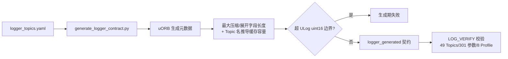
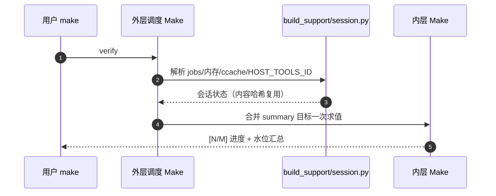

# 生成链与会话工具

## logger contract 生成

<!-- Sources: tools/logging/generate_logger_contract.py, Dima/modules/logging/SdLogWriter.cpp:558 -->

原则：**不把上游 `format[1600]` 当 ULog 协议上限**；容量不足在构建期失败而不是运行期丢日志。

## 参数生成链

| 步骤 | 工具 | Source |
|------|------|--------|
| YAML → 头/表 | 参数生成器（Make 正式入口） | [definitions](https://github.com/a1600778959/H743_FreeRTOS/blob/main/Dima/middleware/parameters/definitions) |
| metadata | stamp 校验（META_VERIFY） | [GNUmakefile:48](https://github.com/a1600778959/H743_FreeRTOS/blob/main/GNUmakefile#L48) |
| QGC | 同版 Metadata 提供 | [calibration_suggest.py](https://github.com/a1600778959/H743_FreeRTOS/blob/main/tools/calibration_suggest.py) 配套 |

`calibration_suggest.py`：从 QGC 导出生成**只读**校准建议——建议工具不回写参数。

## 构建会话

<!-- Sources: tools/build_support/session.py, tools/build_support/state.py, GNUmakefile:48 -->

要点：`HOST_TOOLS_ID` 已求值则导出复用，避免每个嵌套 Make 重复启动 Python 做同一份内容哈希；`firmware/dima_rover/verify` 的汇总并入同次内层 Make（`__dima_summary` 以发布产物为前置，保证汇总在镜像落盘后执行）。

## ccache 门控

| 档 | 行为 | Source |
|----|------|--------|
| `on`（默认） | 缓存不可用**立即终止**并提示 | [bootstrap_ccache.py](https://github.com/a1600778959/H743_FreeRTOS/blob/main/tools/bootstrap_ccache.py) |
| `auto` | 明确允许降级 | 同上 |
| `off` | 完全关闭 | 同上 |

二进制可运行 + 缓存目录可写才算启用；无编译调用时如实报告"Make 复用既有对象"（不虚报命中率）。

## ELF/上传工具

| 工具 | 职责 | Source |
|------|------|--------|
| `elf_support/layout.py` | 向量/DMA/符号合同（含 LTO lto_priv 匹配、used 属性） | [layout.py](https://github.com/a1600778959/H743_FreeRTOS/blob/main/tools/elf_support/layout.py) |
| `upload/cli.py` + `models.py` | pinned 工具解析、SMP 上传 | [upload/cli.py](https://github.com/a1600778959/H743_FreeRTOS/blob/main/tools/upload/cli.py) |
| `build_support/cli.py` | 子命令入口（--ccache on/auto/off） | [cli.py](https://github.com/a1600778959/H743_FreeRTOS/blob/main/tools/build_support/cli.py) |

## Related Pages

| Page | Relationship |
|------|-------------|
| [架构门禁与验证工具](./tooling.md) | 检查项本体 |
| [构建与验证](../01-getting-started/build-and-verify.md) | 用户视角的构建 |
| [参数系统](../06-middleware/parameter-system.md) | 参数生成链的下游 |
