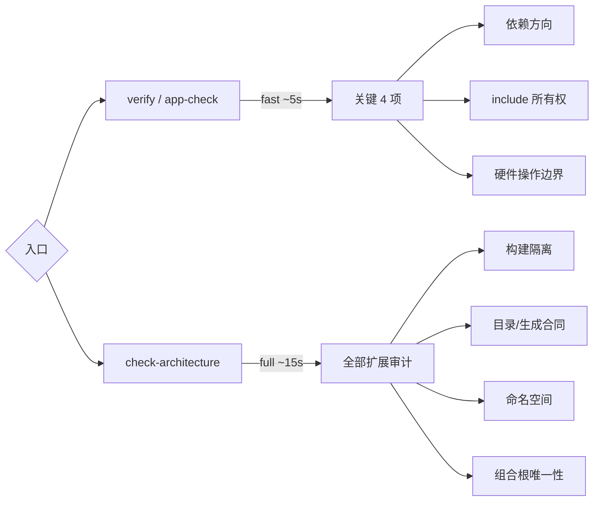
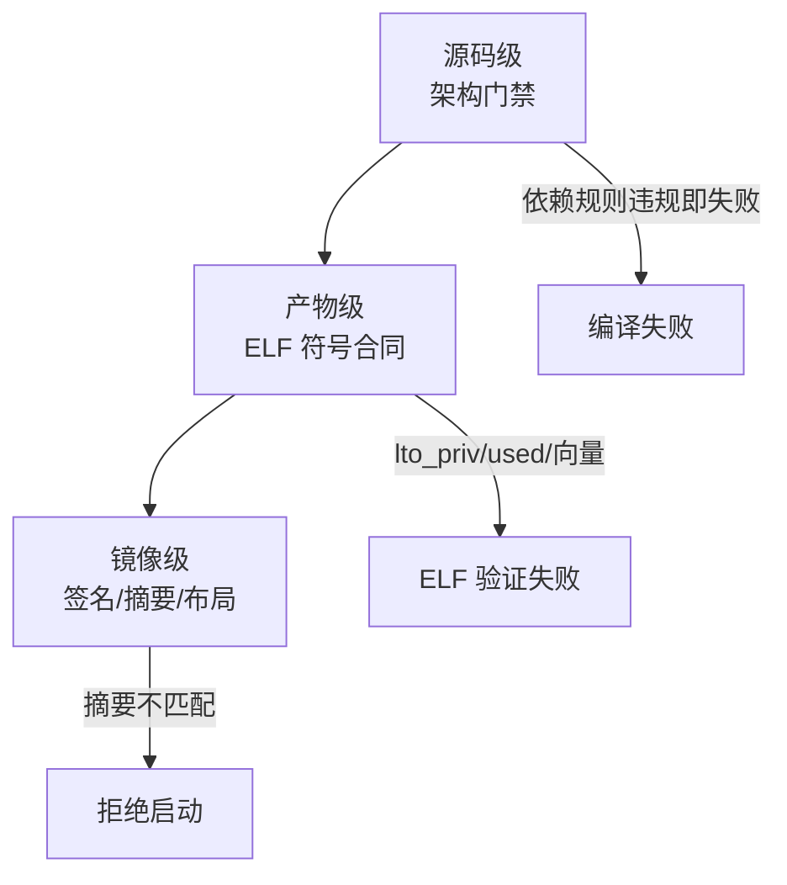
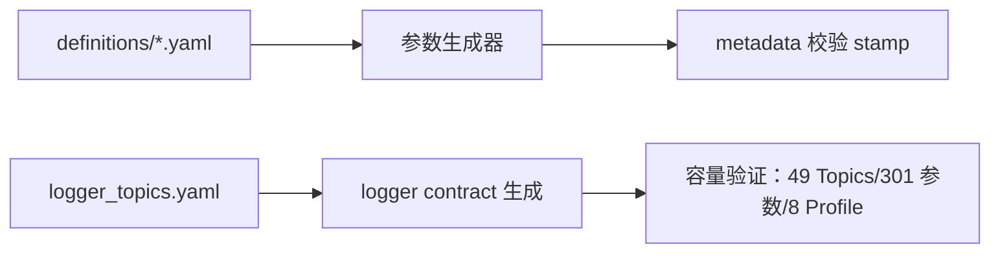

# 架构门禁与验证工具

## 工具清单

| 工具 | 职责 | Source |
|------|------|--------|
| `tools/check_architecture.py` | 架构门禁入口，`--profile fast/full` 两档 | [check_architecture.py:4](https://github.com/a1600778959/H743_FreeRTOS/blob/main/tools/check_architecture.py#L4) |
| `tools/architecture/dependency.py` | 依赖方向图检查 | [dependency.py](https://github.com/a1600778959/H743_FreeRTOS/blob/main/tools/architecture/dependency.py) |
| `tools/elf_support/layout.py` | ELF 布局/符号合同（DMA 区、向量、used 属性） | [layout.py](https://github.com/a1600778959/H743_FreeRTOS/blob/main/tools/elf_support/layout.py) |
| `tools/logging/generate_logger_contract.py` | logger_topics.yaml → 格式缓存容量推导 | [generate_logger_contract.py](https://github.com/a1600778959/H743_FreeRTOS/blob/main/tools/logging/generate_logger_contract.py) |
| `tools/calibration_suggest.py` | QGC 导出生成只读校准建议 | [calibration_suggest.py](https://github.com/a1600778959/H743_FreeRTOS/blob/main/tools/calibration_suggest.py) |
| `tools/upload/` | 上传工具解析与模型 | [upload/cli.py](https://github.com/a1600778959/H743_FreeRTOS/blob/main/tools/upload/cli.py) |
| `tools/build_support/` | 构建会话状态（jobs/ccache/会话哈希） | [build_support/session.py](https://github.com/a1600778959/H743_FreeRTOS/blob/main/tools/build_support/session.py) |

## 门禁两档

<!-- Sources: tools/check_architecture.py:4, GNUmakefile:48 -->

fast 档内嵌在 `verify` 里每次都跑（~5 秒，504 个第一方源文件）；full 档只在显式请求时跑（~15 秒）。**修改模块边界或构建规则后必须显式跑 full**。

## 三层验证哲学

<!-- Sources: tools/elf_support/layout.py, make/release.mk:57 -->

源码门禁防"写错"，ELF 验证防"链接错"（尤其 LTO 时代的符号内部化），镜像验证防"传输/烧写错"。三层各自独立，任何一层绿都不代表其他层可跳过。

## 参数与日志生成链

<!-- Sources: tools/logging/generate_logger_contract.py, GNUmakefile:48 -->

参数定义是唯一事实源：改 YAML → 经正式 Make 入口生成 → metadata stamp 校验 → QGC Metadata 同版提供。**禁止手写参数/消息派生列表**。

## 已知边界

- Git Bash 直跑检查器会有 `make -pn` 伪违规 → 走 `make.cmd`。
- 架构白名单是显式登记制（如 `FatFsAtomicFileStore.cpp` 因 `get_fattime` 的全局 C ABI 例外）。
- 工具全部锁定在仓库内，随构建自动解析，无全局安装。

## Related Pages

| Page | Relationship |
|------|-------------|
| [构建与验证](../01-getting-started/build-and-verify.md) | 门禁在构建中的位置 |
| [构建、签名与 OTA](../09-build-release/build-release.md) | 产物级验证的延续 |
| [分层架构与依赖规则](../02-architecture/layered-architecture.md) | 被检查的规则本体 |
