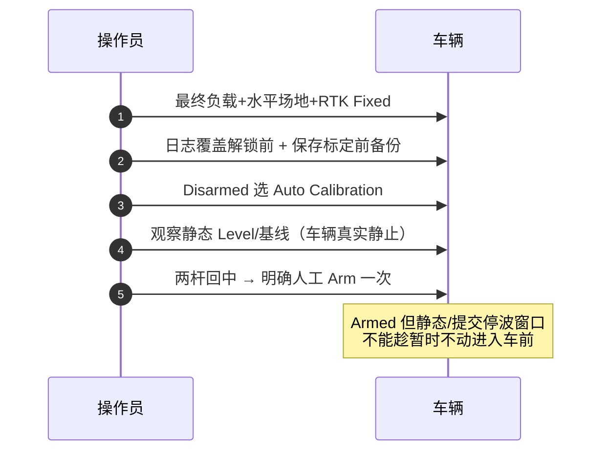
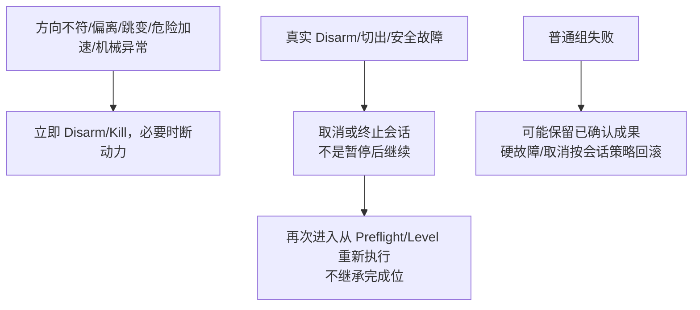
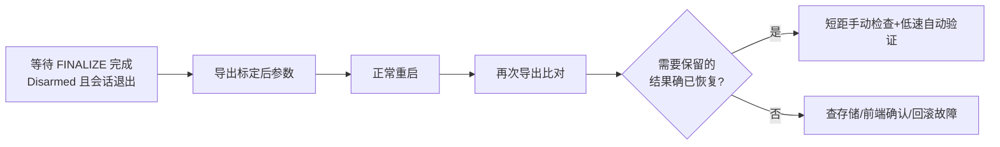

# 自动校准现场指南

权威出处：[部署指南 §9](https://github.com/a1600778959/H743_FreeRTOS/blob/main/docs/H743_VEHICLE_COMMISSIONING_ZH.md#L254)；机制细节见[自动校准状态机](../04-auto-calibration/state-machine.md)。

## 前置：定义本轮实验范围

| 参数 | 首次运行建议 | Source |
|------|--------------|--------|
| `RO_SPEED_LIM` | 已完成手动验证的低巡航速度；必须有限正值（0 无效） | [指南 §9.1](https://github.com/a1600778959/H743_FreeRTOS/blob/main/docs/H743_VEHICLE_COMMISSIONING_ZH.md#L256) |
| `MOT_THR_MAX` | 再核全输出车速与停车空间 | 同上 |
| `RO_CAL_DIST` / `RO_CAL_RADIUS` | 场地容纳直线往返+掉头+顺逆转动+二维路径 | 同上 |
| `RO_DECEL_LIM` | 首次可 -1/0 由流程探测，不填未测量的大值 | [指南 §9.1](https://github.com/a1600778959/H743_FreeRTOS/blob/main/docs/H743_VEHICLE_COMMISSIONING_ZH.md#L262) |

**场地铁律**：正式制动观测去程/返程两次证据、含 >3s 全输出过程，需要比低速直行更长的场地；软件几何约束只覆盖定位参考点，不替代围挡与人员隔离——无制动模型时"允许开始"≠"证明能刹停"。

## 启动操作序列

<!-- Sources: docs/H743_VEHICLE_COMMISSIONING_ZH.md:266 -->

要点：进入模式**不会自行解锁**；流程推进不要求反复上锁/解锁；之后可能自动继续运动，Arm 后操作员持续准备 Kill/Disarm。

## 执行中看什么

- 实际动作合理性、是否在预留区域、前进方向、停止后是否漂移、定位/航向跳变、`[autocal]` 当前原因与最终结果。
- 详细核对用 ULog——**不存在专用完整标定面板**，QGC 不一定展示全部内部字段。
- **中途禁改**：PWM、RC、轮距、安装姿态、巡航限速、输出上限、增益；不同时开 QGC Sensors/Radio 校准——会话冻结入口配置并核对参数代次，外部写入可能使候选失效并触发回滚。

## 中止与失败

<!-- Sources: docs/H743_VEHICLE_COMMISSIONING_ZH.md:284 -->

不能简单断言"失败必定一个参数没改"或"做过的都保存了"——**等待收尾后导出实际参数与前一份比较**。

## 成功/部分/失败判定

| 结果 | 判定与后续 | Source |
|------|------------|--------|
| `SUCCESS` | 仍需检查哪些导航项被明确跳过；不等于通过全部 Mission 工况 | [指南 §9.5](https://github.com/a1600778959/H743_FreeRTOS/blob/main/docs/H743_VEHICLE_COMMISSIONING_ZH.md#L291) |
| `PARTIAL` | 核查已保存组与缺失组，**不直接投入自动任务** | 同上 |
| `FAILED`/`CANCELLED` | 结合原因、回滚状态、参数回读判断；存储/确认/回滚故障保持上锁，不用强制解锁绕过锁存 | 同上 |

## 重启复查（保存判定的最后一步）

<!-- Sources: docs/H743_VEHICLE_COMMISSIONING_ZH.md:291 -->

provisional/RAM 候选、进度条、单阶段成功**都不是已持久化**；最终保存成功才登记 completed——不能在 FINALIZE 中拔电当正常结束。

## Related Pages

| Page | Relationship |
|------|-------------|
| [分阶段验收标准](./stage-standard.md) | 前置阶段判据 |
| [状态机与调度合同](../04-auto-calibration/state-machine.md) | 机制视角 |
| [收尾与失败分类](../04-auto-calibration/finalize-failures.md) | FINALIZE 机制细节 |
