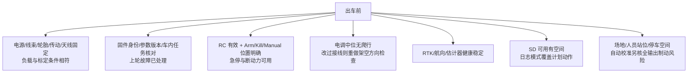

# 现场速查与清单

出处：[部署指南 §12–§14](https://github.com/a1600778959/H743_FreeRTOS/blob/main/docs/H743_VEHICLE_COMMISSIONING_ZH.md#L343)。

## 常见现象速查（节选）

| 现象 | 优先核对与下一步 |
|------|------------------|
| 参数缺失/描述陈旧 | 核对固件身份，等 Metadata 下载重连；不补写旧参数名 |
| 解锁后立即上锁/没动力 | RC 新鲜度、接收机 failsafe、Kill、PWM 合法配置、维护/存储忙原因 |
| 松杆慢慢爬行 | RC 回中值 vs 死区 → PWM CENT → 电调停止区；不先加大电机零阈值 |
| 前进变旋转/左右相反 | 车尾视角核 FUNC；RC 符号与每侧 REV 分别验证再组合 |
| 单轮只抖不转 | 查堵转/传动/电调/供电，测最小起步输出；避免长时间维持抖动 |
| GPS 有卫星但校准不动 | 区分 RTK Fixed、双天线固定航向、同历元速度、EKF 融合——不凭卫星数判断 |
| 正式制动前就报空间不足 | 全输出观测需要更长场地；降低本轮输出或换场地，**不降质量门槛** |
| braking observations=0 / decel=NaN | 无有效制动证据；对齐运动阶段、后端输出、速度历元、停车确认 |
| 校准 Armed 但轮子不动 | 先判断是否静态/提交停波窗口及就绪条件，**不绕过停波锁** |
| Mission 切入成功但不动 | 已应用控制参数、请求有效性、执行器状态——模式门与控制有效性是两回事 |
| 一直原地转难切直行 | 真实方向、航向/角速度、转向滞回与死区关系式 |
| 参数回显正确重启恢复旧值 | 最终保存结果、unsaved/存储错误、SD 可用性；不重复写同一值替代定位 |
| 数据链断开车仍走 | 当前无 GCS loss 自动导航动作；RC 接管或 Disarm/Kill |

<!-- Sources: docs/H743_VEHICLE_COMMISSIONING_ZH.md:343 -->

排查总法：按 **物理现象 → 输入 → 运动请求 → 后端接受输出 → 传感器测量 → 状态/原因** 对齐时间；后端已接受 PWM ≠ 引脚实测。

## 出车前清单

<!-- Sources: docs/H743_VEHICLE_COMMISSIONING_ZH.md:365 -->

## 收车时清单

- 确认实际停车、Disarmed，关电机动力。
- 刚结束自动校准：已看到 FINALIZE 最终结果且无保存/回滚故障。
- 等日志与存储操作完成再关控制器；**不带电拔正在写入的 SD**。
- 保存 ULog、参数导出、任务、现场记录，标注"通过/未通过/未执行"。
- 未解决的方向/制动/定位/存储/失联问题 → **登记为禁止自动运行**。

<!-- Sources: docs/H743_VEHICLE_COMMISSIONING_ZH.md:377 -->

## 首车验收记录模板

| 阶段 | 通过依据 | 结果/日期/证据 |
|------|----------|----------------|
| 部署 | 目标固件启动、身份正确、参数可下载 | |
| 参数持久化 | 正常重启后关键配置回读一致 | |
| 通信 | USB、SBUS、GNSS、可选数传/CAN 分别正常 | |
| 架空中位/方向 | 侧别、前后/转向、零输入与实测波形正确 | |
| 故障动作 | Disarm/Kill/RC 丢失恢复/重启无非预期动力 | |
| 传感器 | 安装轴向、六面/水平标定、双天线与融合 | |
| 手动落地 | 起步/直行/转向/倒车/实际停车距离 | |
| 自动校准 | 最终结果、各组完成/跳过、保存及重启回读 | |
| 简单 Mission | 任务回读、跟踪、转弯、末端停车、人工接管 | |
| 工况扩展 | 实际负载/供电/路面下重复验证 | |

<!-- Sources: docs/H743_VEHICLE_COMMISSIONING_ZH.md:385 -->

规则：每项填日期、操作员、证据文件和实测结果；**未执行写"未执行"**——不能用源码支持替代通过证据。更新影响车辆行为的源码/参数/硬件后，重新核对对应章节及现场记录。

## Related Pages

| Page | Relationship |
|------|-------------|
| [首次运行总流程](./first-run-flow.md) | 十阶段总图 |
| [分阶段验收标准](./stage-standard.md) | 每阶段判据 |
| [自动校准现场指南](./autocal-field-guide.md) | 校准阶段细则 |
