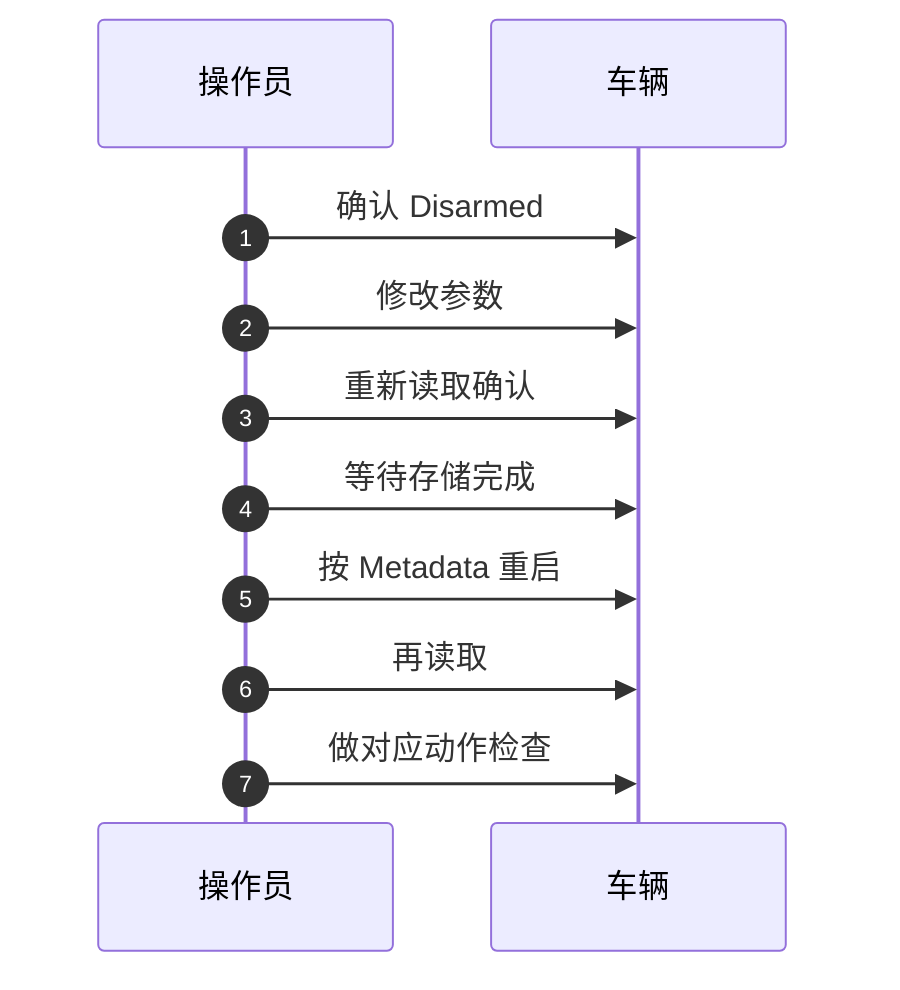

# 首次运行总流程

权威出处：[上车部署与操作指南](https://github.com/a1600778959/H743_FreeRTOS/blob/main/docs/H743_VEHICLE_COMMISSIONING_ZH.md)（核对日期 2026-09-28，基线 HEAD=8ccfc4e + 当时尚未提交的修改）。本页是其结构化摘要，冲突处以原文为准。

## 十阶段顺序（前一阶段未通过，不进入下一阶段）

<!-- Sources: docs/H743_VEHICLE_COMMISSIONING_ZH.md:11 -->

## "必须设置"的三种含义

| 类别 | 含义 | 例子 | 详见 |
|------|------|------|------|
| 人工必配/必核对 | 涉及本车接线、方向、几何、实验范围，逐项核对 | `PWM_Sx_FUNC`、`RD_WHEEL_TRACK`、`RC_MAP_*` | [参数基线](./param-classes.md) |
| 由校准产生 | 不可手填非零值消除提示 | 传感器 offset/scale、动力学与控制增益、设备 ID | [参数基线](./param-classes.md) |
| 有默认值但须验证效果 | 是否适合本车由实测决定 | 超时、换向等待、输出斜率、航点半径 | [分阶段验收标准](./stage-standard.md) |

<!-- Sources: docs/H743_VEHICLE_COMMISSIONING_ZH.md:41 -->

## 参数修改纪律（每轮）

<!-- Sources: docs/H743_VEHICLE_COMMISSIONING_ZH.md:49 -->

两条红线：**MAVLink 回显只证明 RAM 已接受，不证明掉电持久化**；车辆 Armed 或校准过程中不要批量修改参数。

## 关键边界（开始前必须明确）

1. **自动校准会真实开车**：正式制动观测达到 `MOT_THR_MAX` 全输出（含 >3s 全输出观测），允许超过 `RO_SPEED_LIM`——把巡航设低不等于整场低速。
2. 直线与转圈空间约束不同：`RO_CAL_DIST` 管直线，`RO_CAL_RADIUS` 管转圈/二维路径，均参考入场固定 GNSS 点；**半径不是全程物理围栏**。
3. Manual 解锁不替代上车检查；运行期 RC loss 处置是 **Disarm**（无自动返航）。
4. 上锁 ≠ 急停：普通 Disarmed 输出 CENT 中位；Kill/故障/停波窗口停止脉冲——电调须分别验证"中位停止"和"无信号停止"。
5. 默认参数不是调校结果：轮距、若干速度/转向增益为零，可能保持停波。

<!-- Sources: docs/H743_VEHICLE_COMMISSIONING_ZH.md:9 -->

## 固件部署与首连

| 步骤 | 要点 | Source |
|------|------|--------|
| 构建 | `make.cmd NO_COLOR=1 dima_rover`（发布验收另跑 `verify`） | [指南 §4.1](https://github.com/a1600778959/H743_FreeRTOS/blob/main/docs/H743_VEHICLE_COMMISSIONING_ZH.md#L72) |
| OTA 部署 | `upload MCUMGR_PORT=COMx`（先核实端口）；上锁+断动力 | [指南 §4.2](https://github.com/a1600778959/H743_FreeRTOS/blob/main/docs/H743_VEHICLE_COMMISSIONING_ZH.md#L91) |
| 空板/恢复 | `factory.hex` 走 USB DFU（HEX 自带地址；全片擦除先备份） | [MCUboot 与恢复](../09-build-release/mcuboot-recovery.md) |
| QGC 首连 | 等参数/Metadata 下载完成 → **先导出现有参数** → 确认 Manual/Disarmed → 核对模式目录 | [指南 §4.3](https://github.com/a1600778959/H743_FreeRTOS/blob/main/docs/H743_VEHICLE_COMMISSIONING_ZH.md#L104) |

## Related Pages

| Page | Relationship |
|------|-------------|
| [参数基线与三类必设](./param-classes.md) | 每阶段要设什么 |
| [分阶段验收标准](./stage-standard.md) | 每阶段过不过的判据 |
| [自动校准现场指南](./autocal-field-guide.md) | 第 7 阶段的展开 |
| [现场速查与清单](./field-checklists.md) | 现象速查/出车收车/验收模板 |
